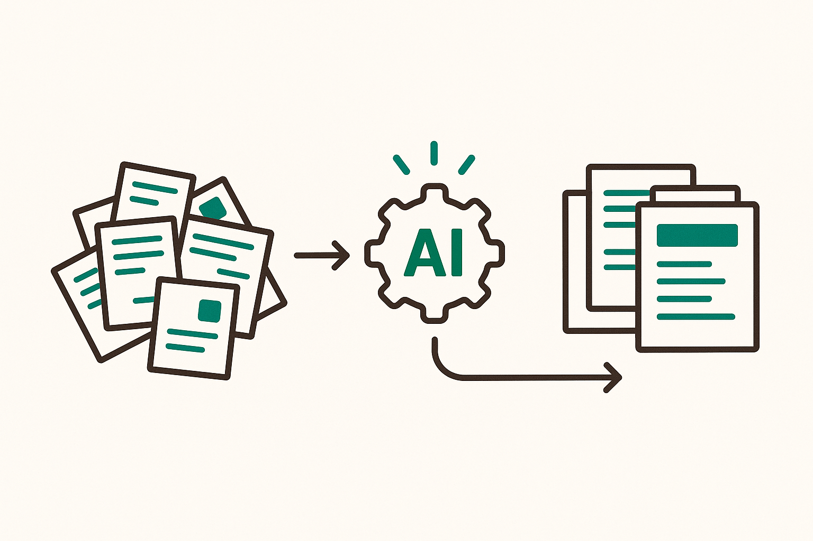

# 슬라이드 1: Claude Code 업무 자동화 부트캠프

<!-- 패턴: A -->

**입문자 과정 · 1회차 / 11회차**

ICTK 임직원을 위한 실습 중심 부트캠프 (비개발자 포함)

| 구분 | 내용 |
|------|------|
| 학습 골격 | Prompt 단계 (1~2회차) |
| 1회차 주제 | Claude Code 설치·기본 사용·업무 자동화 프롬프트 |
| 운영 방식 | 1회 3시간 · 격주 진행 |
| 선수지식 | 없음 (설치부터 함께 시작) |
| 의뢰 | ICTK — VIA PUF 기반 보안 IC 팹리스 |

> 핵심 메시지: 코딩 경험이 없어도 됩니다. 오늘 설치부터 시작해 "내 업무를 도와주는 AI 비서"를 손에 넣습니다.

> 노트: 첫 슬라이드에서 "입문자 과정"임을 명확히 안내해 비개발자의 부담을 낮춘다. ICTK가 보안 IC 팹리스 기업임을 언급하되, 오늘 다룰 내용은 누구나 따라올 수 있는 기초임을 강조한다. 11회차 중 1회차이며 격주 3시간 운영임을 공유한다. 이번 회차는 검은 명령창(터미널)이 아니라 친숙한 데스크톱 앱 화면으로 진행함을 미리 안내한다. 출처: 의뢰 커리큘럼(내부 자료).

---

# 슬라이드 2: WHY — 왜 업무 자동화인가

<!-- 패턴: B -->

**반복 작업이 하루를 갉아먹습니다. AI에게 맡기고, 사람은 판단에 집중합니다.**

매일 반복되는 일 (좌측):
- 긴 자료를 읽고 핵심만 추리기
- 회의 메모를 보고서 형식으로 정리하기
- 같은 형식의 문서를 매번 새로 작성하기

→ 이런 일을 Claude Code에게 자연어로 요청 (우측):
- 사람은 "무엇을, 왜"를 정하고 (판단)
- AI는 "어떻게"를 빠르게 실행하고 (작업)
- 사람이 결과를 최종 확인·승인 (게이트)

> 핵심 메시지: 자동화의 목적은 "사람을 대체"가 아니라 "사람이 더 중요한 일에 집중"하게 만드는 것.

> 노트: 골든서클의 WHY에 해당. 청중에게 "내 업무 중 매번 반복하는 일이 무엇인지" 떠올리게 한다(2주 과제 복선). 자동화는 일자리 위협이 아니라 단순 반복에서 벗어나 판단·창의에 집중하는 도구임을 강조. 보안 IC 기업 특성상 "사람 최종 승인"이 자동화의 기본 전제임을 미리 암시. 출처: Anthropic 프롬프트 베스트 프랙티스(https://platform.claude.com/docs/en/build-with-claude/prompt-engineering/claude-prompting-best-practices).

---

# 슬라이드 3: Claude Code란? — HOW

<!-- 패턴: D -->

**Claude Code = 내 컴퓨터에서 일하는 AI 작업 도우미 (에이전틱 코딩 도구)**

공식 정의: 코드베이스를 읽고, 파일을 편집하고, 명령을 실행하며, 개발 도구와 통합되는 도구.
쉽게 말하면 → "내 폴더의 파일을 읽고 정리해 주는, 대화로 일 시키는 AI 비서"

오늘 우리가 쓰는 것 — **Claude Code 데스크톱 앱 (GUI)**:

| 환경 | 한 줄 설명 |
|------|-----------|
| 데스크톱 앱 | Claude 앱을 설치하고 상단의 `Code` 탭을 켜서 사용. 검은 명령창 없이 화면으로 클릭·입력하는 가장 친숙한 방식 |

> 이런 것도 있어요(나중에): 터미널(명령창), VS Code 같은 편집기 안(IDE), 웹 브라우저에서도 같은 Claude Code를 쓸 수 있습니다. 모두 같은 엔진을 공유하므로, 오늘은 '데스크톱 앱' 하나만 익히면 충분합니다.

> 용어: 데스크톱 앱 = Anthropic이 제공하는 Claude 프로그램. 대화용 `Chat`, 클라우드 작업용 `Cowork`, 내 파일을 다루는 `Code` 3개 탭으로 구성되며, 이 `Code` 탭이 곧 Claude Code입니다.

> 노트: "에이전틱(agentic) = 스스로 파일을 찾고 작업을 단계별로 수행한다"는 뜻을 한 줄로 풀어준다. 비개발자가 겁먹지 않도록 "코드를 몰라도 자연어로 시키면 된다"와 "검은 명령창이 아니라 친숙한 GUI"를 반복 강조. 1슬라이드 1메시지 원칙에 따라 오늘 쓰는 '데스크톱 앱'만 표로 남기고, 터미널·IDE·웹 3종은 '나중에' 박스로 축소. 데스크톱 앱은 별도 빌드가 아니라 Claude 앱(Chat·Cowork·Code)의 Code 탭이며, CLI와 동일 엔진·설정(CLAUDE.md·MCP·skills)을 공유함은 구두로 보충. 출처: https://code.claude.com/docs/en/overview, https://code.claude.com/docs/en/desktop-quickstart.

---

# 슬라이드 4: 설치하기 (Windows 기준)

<!-- 패턴: D -->

**검은 명령창은 필요 없습니다. 설치 파일을 내려받아 실행하면 끝입니다.**

설치 흐름 (3단계):
1. 공식 다운로드 페이지에서 **Windows용 설치 파일**을 내려받기 (x64 PC는 'Download for Windows')
2. 내려받은 **설치 파일(setup)을 더블클릭**해 실행 → 안내대로 설치 (관리자 권한 불필요)
3. 설치 후 **Windows 시작 메뉴**에서 'Claude'를 실행

| 항목 | 내용 |
|------|------|
| 설치 방식 | 설치 파일 다운로드 → 더블클릭 실행 (GUI, 명령어 입력 없음) |
| 선행 준비 | Git for Windows 설치 (내 PC 파일 작업에 필요) · 설치 후 앱 재시작 |
| 별도 설치 | Node.js·CLI 불필요 (데스크톱 앱에 Claude Code 포함) |
| 칩셋 안내 | ARM64 PC는 'ARM64 installer'를 받기 / 데스크톱 앱은 Windows·Mac 전용 |

> 시작 전 꼭 확인: 유료 계정(Pro·Max·Team·Enterprise)이 필요합니다. 무료 claude.ai 플랜으로는 `Code` 탭을 사용할 수 없으며, 켤 때 업그레이드 안내가 뜨면 먼저 유료 플랜을 구독해야 합니다.

> 노트: 터미널 PowerShell 설치 명령(irm install.ps1 등)을 전면 제거하고, 공식 데스크톱 설치 절차(다운로드→설치 파일 실행→시작 메뉴 실행)로 교체. 입문자에게 "명령어를 입력하지 않는다"는 점이 가장 큰 안심 포인트이므로 본문 첫 줄로 끌어올림. Windows 로컬 세션 동작에 Git for Windows가 필수이고 설치 후 앱 재시작이 필요함을 명시(공식 전제 조건). 무료 플랜 불가·유료 계정 필요는 유지. Node.js·CLI 별도 설치 불필요(데스크톱 앱에 Claude Code 포함)와 ARM64 별도 인스톨러·Linux 미지원은 표로 보충. 출처: https://code.claude.com/docs/en/desktop, https://code.claude.com/docs/en/desktop-quickstart.

---

# 슬라이드 5: 로그인과 Code 탭 열기

<!-- 패턴: C -->

**로그인은 처음 한 번이면 끝. 앱에서 계정으로 로그인하고 `Code` 탭만 누르면 준비 완료입니다.**

로그인 흐름:
1. 시작 메뉴에서 **Claude 앱 실행**
2. **Anthropic 계정으로 로그인** (Sign in 버튼)
3. 상단 중앙의 **`Code` 탭 클릭** → 코딩 세션 시작
4. '업그레이드' 안내가 뜨면 유료 구독, '온라인 로그인' 안내가 뜨면 로그인 후 앱 재시작

| 탭 | 역할 |
|------|------|
| `Chat` | 파일 접근 없는 일반 대화 (claude.ai와 유사) |
| `Cowork` | 클라우드에서 자율로 도는 백그라운드 작업 |
| `Code` | 내 PC 파일을 직접 다루는 코딩 보조 (← 오늘 사용) |

> 안전 메시지: 로그인은 앱이 기억하므로 매번 다시 할 필요가 없습니다. 오늘 모든 실습은 내 파일을 직접 다루는 `Code` 탭에서 진행합니다. `Chat`은 파일을 건드리지 않는 일반 대화용입니다.

> 노트: 터미널의 'c키로 URL 복사' 흐름을 제거하고, 데스크톱 앱 계정 로그인 흐름으로 교체. 좌측 세로 단계(패턴 C 스텝 바)로 4단계를 시각화. Claude 앱이 Chat·Cowork·Code 3개 탭으로 구성되며 오늘 쓰는 것은 Code 탭임을 표로 명확히 구분(입문자가 Chat과 혼동하지 않도록). 무료 플랜 불가는 슬라이드 4에서 강조했으므로 여기서는 '업그레이드/재로그인 안내' 분기만 한 줄로 보충. 출처: https://code.claude.com/docs/en/desktop-quickstart.

---

# 슬라이드 6: 첫 실행과 기본 사용 흐름

<!-- 패턴: C -->

**폴더 열기 → 요청 → 결과 확인 → 수정. 이 대화 반복이 전부입니다.**

기본 흐름 (좌측 세로 단계):
1. `Code` 탭에서 **작업 폴더(프로젝트) 선택** ('Select folder' 클릭, 환경은 Local)
2. 프롬프트 박스에 **자연어로 요청** (예: "이 폴더에 무슨 파일이 있는지 알려줘")
3. Claude가 변경안을 보여주면 **diff 화면에서 Accept/Reject로 승인·거절**
4. 결과 확인 후 추가 요청으로 다듬기 (반복) · `@`로 특정 파일을 대화에 추가

자주 쓰는 슬래시 명령 (우측):

> **외우지 마세요 — 프롬프트 박스에 `/`만 누르면 전체 목록이 뜹니다.**

| 명령 | 역할 |
|------|------|
| `/help` | 도움말·사용 가능한 명령 보기 |
| `/clear` | 빈 컨텍스트로 새 대화 시작 |
| `/model` | 사용할 AI 모델 전환 |
| `/compact` | 대화를 요약해 컨텍스트 공간 확보 |

> 안내: 종료·설정·권한은 명령어가 아니라 화면으로. 세션은 사이드바에서 닫고, 설정·권한 모드는 우상단 설정(⚙️ Settings → Claude Code)에서 관리합니다. `/permissions`·`/config`·`/agents`·`/doctor`는 `Code` 탭에서는 동작하지 않습니다("isn't available in this environment").

> 노트: "폴더 열기→요청→확인→수정"이 데스크톱 Code 탭 사용의 본질임을 각인. 터미널 표현('claude 실행'·'Ctrl+D'·'/exit')을 전면 제거하고, GUI 흐름(Select folder→프롬프트 박스→diff Accept/Reject)으로 교체. 좌측 4단계는 패턴 C 세로 컬러 스텝 바로 시각화. 슬래시 명령표는 Desktop Code 탭에서 실제 동작하는 /help·/clear·/model·/compact만 남김(/exit 제거). 종료·설정·권한은 명령어가 아니라 사이드바·Settings UI로 함을 하단 박스로 명확히 안내. /permissions·/config·/agents·/doctor는 Code 탭 미지원임을 명시. 출처: https://code.claude.com/docs/en/desktop, https://code.claude.com/docs/en/desktop-quickstart.

---

# 슬라이드 7: 작업 폴더·파일·권한 (사람 최종 승인 게이트)

<!-- 패턴: B -->

**Claude는 선택한 폴더 안에서만 일하고, 파일을 바꾸기 전 항상 화면으로 사람에게 묻습니다.**

작동 경계 — 선택한 폴더가 작업 범위 (좌측):
- 읽기: 선택한 프로젝트 폴더와 하위 파일을 인식
- 쓰기: 그 폴더 범위 안에서 작업 (각 세션은 독립된 폴더·기록을 가짐)
- 변경 전 항상 미리보기: 무엇이 바뀌는지 `diff` 화면으로 먼저 확인

사람 최종 승인 게이트 — 바꾸기 전 항상 묻습니다 (우측):
- 기본 모드 = **Ask permissions(승인형)**: 편집·실행 전 매번 승인 요청
- diff를 보고 변경마다 **Accept(수락) / Reject(거절)** — 수락 전에는 파일이 바뀌지 않음

> ICTK 안전 메시지: 보안 IC 기업에서는 "데이터 격리(선택한 폴더 안에서만 작업)"와 "사람 최종 승인"이 자동화의 기본기입니다. AI가 시키는 대로 무조건 실행하지 않습니다.

> 더 알아두면 좋은 것(나중에): 권한 모드는 전송 버튼 옆 모드 선택기에서 바꿀 수 있고(Auto accept edits·Plan 모드 등), Plan 모드는 변경 없이 계획만 제안합니다. 더 세밀한 권한·환경 설정은 ⚙️ Settings에서 관리하며, 프로젝트 규칙을 적어두는 `CLAUDE.md` 메모도 있습니다. — 1회차에서는 위 핵심 2가지만 기억하면 됩니다.

> 노트: 제약 요구사항인 "사람 최종 승인·데이터 격리"를 이 슬라이드에서 충실히 전달. 터미널 단축키(Esc 두 번 되돌리기·Shift+Tab 모드 전환)를 제거하고, 데스크톱 UI 표현(diff 화면 Accept/Reject, 전송 버튼 옆 모드 선택기, ⚙️ Settings)으로 교체. 기본 권한 모드가 Ask permissions(승인형, 신규 사용자 권장)이며 수락 전에는 파일이 수정되지 않음을 명시. 핵심 2가지(선택 폴더로 작업 범위 한정 + 편집 전 승인)만 크게 남기고, 다른 권한 모드·Plan·CLAUDE.md는 '더 알아두면 좋은 것' 박스로 분리해 1슬라이드 1메시지를 지킴. s7 일러스트(데이터 격리+사람 승인 게이트)는 데스크톱에서도 동일하게 유효하므로 그대로 유지. 출처: https://code.claude.com/docs/en/desktop, https://code.claude.com/docs/en/desktop-quickstart.

---

# 슬라이드 8: 프롬프트가 결과를 좌우한다 (Before / After)

<!-- 패턴: D -->

**같은 일을 시켜도, 어떻게 요청하느냐에 따라 결과가 완전히 달라집니다.**

| 구분 | 막연한 프롬프트 (Before) | 구조화된 프롬프트 (After) |
|------|--------------------------|----------------------------|
| 요청 예 | "회의 내용 정리해줘" | "너는 회의록 담당자야. 아래 메모를 표준 회의록(일시·참석자·결정사항·액션아이템) 형식으로 정리해줘" |
| 결과 | 형식·길이 제각각, 다시 수정 필요 | 원하는 형식 그대로, 재작업 최소 |
| 이유 | AI가 맥락·기준을 모름 | 역할·형식·기준을 명시 |

황금률: "이 업무를 잘 모르는 동료에게 그대로 시켜 보라. 그가 헷갈리면 AI도 헷갈린다."
→ Claude를 "똑똑하지만 우리 회사 규칙을 전혀 모르는 신입 직원"처럼 대하세요.

> 핵심 메시지: 좋은 결과는 좋은 질문에서 나옵니다. 다음 슬라이드의 "5요소"가 구조화의 공식입니다.

> 노트: Before/After 대비로 "구조화"의 효과를 체감시킨다. 공식 비유인 "맥락 없는 신입 직원"과 "황금률(동료 테스트)"을 그대로 인용해 신뢰도를 높인다. 실습 3종 중 '막연 vs 구조화 비교'의 도입부 역할. 출처: https://platform.claude.com/docs/en/build-with-claude/prompt-engineering/claude-prompting-best-practices.

---

# 슬라이드 9: 프롬프트 5요소 — 역할·맥락·입력·출력·제약

<!-- 패턴: D -->

**좋은 프롬프트의 공식: 이 5가지를 채우면 막연함이 사라집니다.**

| 요소 | 무엇을 적나 | 예시 |
|------|------------|------|
| 역할 | AI가 어떤 전문가인지 | "너는 꼼꼼한 회의록 담당자야" |
| 맥락 | 왜·어떤 상황인지(이유 포함) | "주간 팀회의 메모이고 임원 보고용이야" |
| 입력 | 처리할 자료 | "아래 메모를 사용해: [메모 내용]" |
| 출력 | 원하는 형식·분량 | "일시·참석자·결정·액션 4개 항목 표로" |
| 제약 | 지켜야 할 규칙 | "추측 금지, 메모에 없는 내용은 비워둬" |

기억할 팁 (하단 하이라이트 박스):
- "하지 마라"보다 "이렇게 하라"로 (긍정형 지시가 더 잘 따름)
- 이유를 함께 주면 더 정확해짐 (예: "임원 보고용이니 추측은 빼고 메모에 있는 사실만 써줘")
- 형식이 중요하면 예시 3~5개를 보여주기 (출력 일관성 향상)

> 용어: 이 5요소는 "역할 부여 + 명확한 지시 + 맥락 제공 + 출력 형식 지정"이라는 Anthropic 공식 원칙을 입문자용으로 묶은 것입니다.

> 노트: 1회차 학습목표의 핵심 산출물. 5요소를 표로 제시하고 각 행에 ICTK 직원이 바로 쓸 수 있는 예시를 붙인다. '이유 제공' 예시를 공식 문서의 TTS 사례(미설명 용어·청중 무관) 대신 ICTK 업무 맥락의 "임원 보고용이니 추측 빼고 사실만"으로 교체해 학습 전이를 쉽게 함. '긍정형 지시'와 '이유 제공'은 별개 원칙임을 구두로 구분. 팁 3개는 하단 하이라이트 박스(#CCFBF1)로 분리. 이 5요소가 2주 과제의 작성 틀임을 예고. 출처: https://platform.claude.com/docs/en/build-with-claude/prompt-engineering/claude-prompting-best-practices.

---

# 슬라이드 10: WHAT — 실습 3종 (직접 따라하기)

<!-- 패턴: F -->

**WHAT — 오늘 만드는 결과물: 배운 흐름과 5요소를 실제 업무 자료로 직접 실습합니다.**

실습 1 — 긴 문서 핵심 3줄 요약:
- 긴 자료를 주고 "핵심을 3줄로 요약해줘"
- 팁: 긴 자료는 위에, 요청은 맨 아래에 배치하면 품질 향상

실습 2 — 회의 메모 → 표준 회의록:
- 5요소 적용: 역할(회의록 담당) + 출력(일시·참석자·결정·액션) + 제약(추측 금지)

실습 3 — 막연 vs 구조화 비교:
- 같은 요청을 ① 막연하게 ② 5요소로 각각 보내고 결과를 나란히 비교
- "어디가 달라졌는가"를 스스로 확인

실습 공통 안전 수칙 (ICTK):
- 민감/대외비 자료는 사용하지 않음 (실습은 일반·예시 자료로)
- 결과는 사람이 최종 확인 후 사용

> 노트: 골든서클 WHAT 단계를 명시 라벨링해 WHY(슬2)→HOW(슬3)→WHAT(슬10) 흐름을 완결. 강사가 실습 1을 데스크톱 앱 화면으로 먼저 시연한 뒤 참가자가 따라 하는 방식 권장. 실습 3은 5요소 효과를 가장 극적으로 보여주므로 시간을 충분히 배분. 보안 IC 기업 맥락상 "실습에는 대외비 미사용·결과 사람 확인" 수칙을 명시. 출처: 긴 맥락·요약·비교 기법 https://platform.claude.com/docs/en/build-with-claude/prompt-engineering/claude-prompting-best-practices.

---

# 슬라이드 11: 정리 · 2주 과제 · 다음 회차 예고

<!-- 패턴: F -->

**오늘 요약 / 다음 2주 동안 할 일 / 2회차 미리보기**

오늘의 핵심 3가지:
- Claude Code 데스크톱 앱 설치·로그인·기본 사용(폴더 열기→요청→확인→수정)을 익혔다
- "사람 최종 승인·데이터 격리"가 자동화의 기본기다
- 좋은 결과는 "5요소(역할·맥락·입력·출력·제약)" 구조화에서 나온다

2주 과제 (2회차 심화 재료):
- 본인 업무의 반복 작업 3가지를 고른다
- 각각을 5요소 구조 프롬프트로 작성한다
- 막연한 요청과 결과를 비교해 "무엇이 좋아졌는지" 메모한다

다음 회차(2회차) 예고:
- Prompt 단계 심화 — 과제로 만든 프롬프트를 함께 개선
- 더 정확한 결과를 위한 구조화 기법 확장

> 마무리 메시지: 오늘 설치한 도구로, 2주 동안 "내 업무용 프롬프트 3개"를 만들어 오세요. 그것이 여러분의 첫 자동화 자산입니다.

> 노트: 학습목표 달성 여부를 3가지로 정리해 회수. '설치·로그인·기본 사용'을 데스크톱 앱 기준 표현(폴더 열기→요청→확인→수정)으로 정정. 2주 과제는 2회차 심화의 입력물이므로 "반복 작업 3가지 × 5요소 × 비교 메모"라는 구체적 산출 기준을 명확히 전달. 다음 회차가 Prompt 단계 연속임을 안내해 학습 연결성을 확보. 출처: 의뢰 커리큘럼(내부 자료), 프롬프트 원칙 https://platform.claude.com/docs/en/build-with-claude/prompt-engineering/claude-prompting-best-practices.