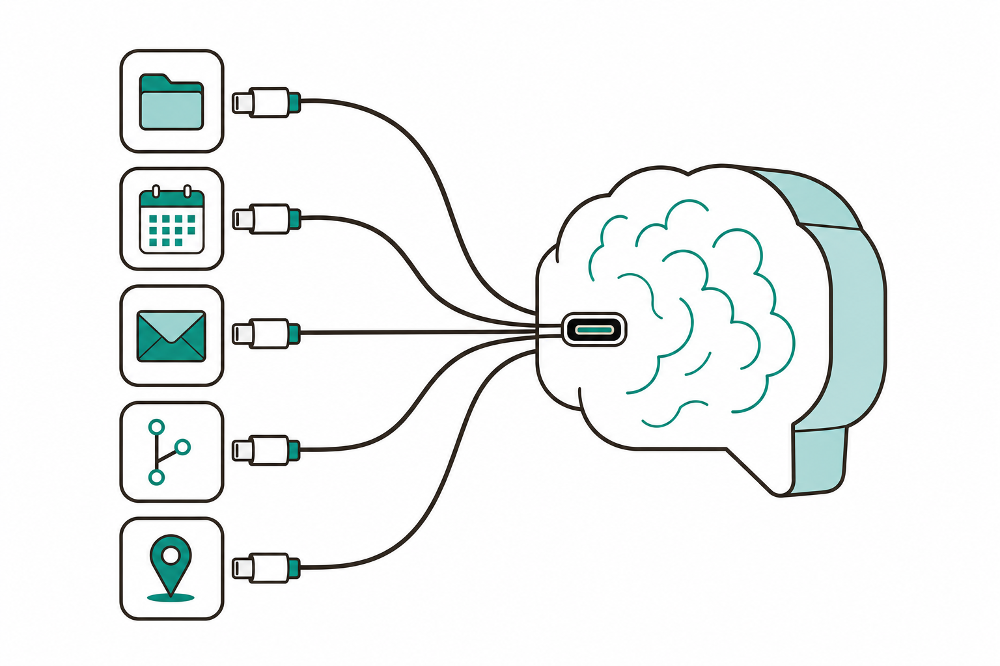
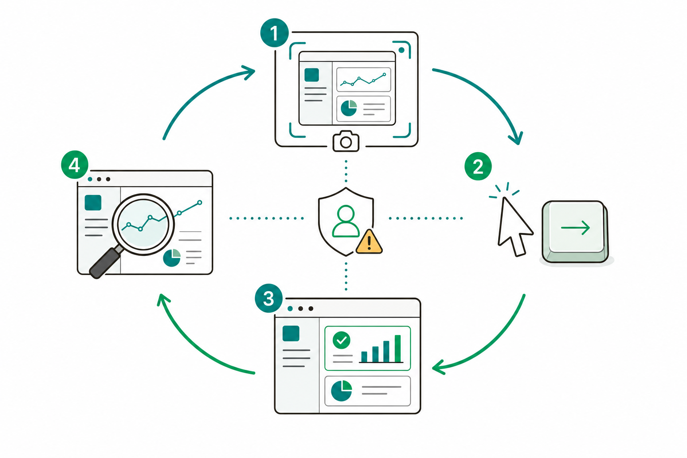

# 슬라이드 2: WHY — "말"에서 "연결·자동화"로
<!-- 패턴: F(멀티 섹션: 골든서클 불릿 + 비교표) -->

**왜 커넥터·루틴·Computer use인가?** (골든서클: WHY → HOW → WHAT)

- **WHY**: 1회차는 프롬프트로 Claude에게 "말"만 했음. 매번 사람이 데이터를 복붙하고, 매번 사람이 직접 실행해야 했음
- **HOW**: ① 외부 도구를 **연결**(커넥터) ② 정해진 시각에 **자동 반복**(루틴) ③ 화면을 직접 **조작**(Computer use)
- **WHAT**: GitHub·지도·캘린더 등에 연결하고, 매일 아침 뉴스레터를 자동으로 받는 자동화

| 구분 | 1회차 | 2회차(오늘) |
|------|-------|-------------|
| 일하는 방식 | 사람이 데이터 복붙 후 지시 | Claude가 도구에 **직접 접근** |
| 실행 시점 | 사람이 그때그때 실행 | **정해진 시각에 자동 실행** |
| 범위 | 내 폴더 안 파일 | 외부 서비스·화면까지 |

> **오늘의 기대치**: 3가지는 **맛보기**까지만 — 산출물은 **커넥터 1건 연결 + 루틴 1건 생성**. Computer use는 **직접 하지 않고 관찰만** 함. 깊은 활용은 다음 회차에서 이어감

> 노트: 골든서클로 동기 부여. "다른 도구의 데이터를 채팅에 복붙하고 있다면, 그때가 커넥터를 연결할 시점"이라는 공식 문서 메시지를 쉽게 전달. WHY(반복·복붙의 비효율) → HOW(연결·자동반복·화면조작) → WHAT(구체 자동화). 비개발자 입문자가 3개 큰 개념을 한 회차에 도약하는 부담을 낮추기 위해 도입부에 기대치 조정 문장 추가(맛보기·산출물 2건 집중·Computer use는 관찰만). 패턴 주석은 다이어그램이 없으므로 B가 아닌 F(멀티 섹션)로 정정. 출처: https://code.claude.com/docs/en/mcp , https://code.claude.com/docs/en/desktop

---
# 슬라이드 3: 커넥터·MCP란? — 외부 도구를 잇는 표준 통로
<!-- 패턴: A(카드 그리드 3열 + 카드별 상세 + 우측 이미지) -->

**한 줄 정의**: **커넥터 = 클릭으로 외부 도구를 잇는 통로** — 검은 명령창 없이 Claude에 연결

**카드 3종(용어 정리)**
- **[카드 1] 커넥터(Connector)**
  화면 클릭만으로 외부 도구를 잇는 통로. 코드·터미널 불필요 — 그래픽 설정 흐름을 갖춤
- **[카드 2] MCP**(Model Context Protocol)
  그 통로의 **기술 표준 이름**. 공식 비유 "AI를 위한 **USB-C 포트**" — 어떤 도구든 같은 방식으로 꽂음
- **[카드 3] MCP 서버 = 연결되는 도구 하나하나**
  Claude에 도구·데이터 접근을 주는 단위(예: GitHub, 지도, Gmail)

- 연결하면 Claude가 캘린더 읽기, 메시지 전송, 이슈 생성 등 **도구를 직접** 다룰 수 있음

> 노트: 가장 중요한 개념 슬라이드. 가이드 패턴 A(동일 크기 카드 3개 + 각 카드 상세)에 맞춰 용어 3종(커넥터/MCP/MCP서버)을 실제 3개 카드로 재구성(초안의 표 구조와 주석 A의 불일치 해소). 핵심 한 줄은 '커넥터=클릭으로 잇는 통로'로 단순화하고 MCP는 '기술 표준 이름'으로 부차화해 입문자 부담 경감. MCP는 modelcontextprotocol.io 원문 "Think of MCP like a USB-C port for AI applications." 비유 사용. 커넥터는 "MCP servers with a graphical setup flow"(GUI 흐름 갖춘 MCP 서버). 초안의 '도구 사용은 자동: 서버 이름 안 불러도 됨' 구현 디테일은 아직 아무것도 연결 안 한 시점이라 이르므로 슬라이드 6(연결 후)/노트로 이동: "연결 후엔 보통 프롬프트에서 서버 이름을 부를 필요 없이 Claude가 알아서 관련 도구를 고름." USB-C 비유 이미지는 카드 하단 우측 1열에 배치. 출처: https://modelcontextprotocol.io/ , https://code.claude.com/docs/en/desktop , https://code.claude.com/docs/en/mcp-quickstart

---
# 슬라이드 4: 커넥터 연결 방법 — '+' 버튼과 ⚙️ Settings
<!-- 패턴: C(플로우 + 위치 표) -->

**Code 탭에서 외부 도구 연결하기** (Google Calendar·Slack·GitHub·Linear·Notion 등)

**연결 플로우(GUI)**
1. 프롬프트 박스 옆 **'+' 버튼** 클릭 → **Connectors** 선택 (세션 시작 전·중 언제든 가능)
2. 추가할 통합 선택 (예: Google Calendar, Slack, GitHub, Linear, Notion 등)
3. **브라우저 로그인 창**이 열리면 해당 서비스에서 연결 **승인**(OAuth) — 토큰은 안전 저장·자동 갱신
4. 연결 완료 → Claude가 그 도구를 직접 사용

| 항목 | 위치 / 방법 |
|------|-------------|
| 연결 추가 | 프롬프트 박스 옆 **'+' → Connectors** (파일·스킬·커넥터·플러그인 통합 진입점) |
| 관리·해제 | **⚙️ Settings → Connectors**, 또는 사이드바 **Customize** |

- **OAuth**(오어스): 비밀번호를 Claude에 직접 주지 않고, 서비스 로그인 창에서 "연결 허용"만 누르는 안전한 인증 방식

> 노트: GUI 동선 중심. '+' 버튼이 핵심 진입점(파일·스킬·커넥터·플러그인). 대표 커넥터 목록은 공식 문서 명시값·명시 순서(Google Calendar, Slack, GitHub, Linear, Notion, and more) — 초안 제목의 'GitHub' 중복 오타 제거. OAuth는 "비밀번호 안 주고 허용만 누르는 방식"으로 쉽게 설명. 가이드 MUST(초안 슬라이드 4 과밀)에 따라 연결 동선/위치(이 슬라이드)와 활용 예·예외·플랜(다음 슬라이드)을 분리해 16pt 기준 각 표 행 높이 0.45~0.55" 확보. 출처: https://code.claude.com/docs/en/desktop , https://code.claude.com/docs/en/mcp , https://code.claude.com/docs/en/mcp-quickstart

---
# 슬라이드 5: 연결 후 — 무엇을 시킬 수 있나 · 예외 · 권한
<!-- 패턴: D(표 + 상세) -->

**연결하면 자연어로 바로 지시** (비개발자 친화 예시 중심)

| 무엇을 시키나 | 자연어 지시 예 |
|---------------|----------------|
| 지도(경로·맛집) | "○○역에서 △△까지 경로와 주변 맛집 추천" |
| 캘린더 | "오늘 내 일정 정리해서 보여줘" |
| 메신저(Slack) | "이 요약을 팀 채널에 보내줘" |
| (개발 직군 보조) GitHub | "PR #456 리뷰", "내게 할당된 열린 PR 보여줘" |

- **연결 예외**: Gmail·Google Calendar·Microsoft 365는 Claude Code 로컬 연결 불가 → **claude.ai의 Settings → Connectors**에서 연결하면 Claude Code에 **자동 표시**
- **첫 호출 권한**: Claude가 도구를 **처음 쓸 때 권한을 물음** → 사람이 승인해야 진행(**사람 최종 승인**)
- 연결 후엔 보통 프롬프트에서 서버 이름을 부를 필요 없이 Claude가 알아서 관련 도구를 고름

> 노트: 초안 슬라이드 4 분리 후반부. 활용 예시를 비개발자 친화 사례(지도·캘린더·메신저)로 교체하고 GitHub는 개발 직군용 보조 예로 축소(슬라이드 8 실습과 일치). Gmail/Calendar/MS365는 claude.ai에서 연결해야 Claude Code에 자동 노출되는 예외를 명확히. 첫 도구 호출 시 권한을 묻는 점이 ICTK 보안 기조(사람 최종 승인)와 연결됨. '서버 이름 안 불러도 됨'(슬라이드 3에서 이동한 디테일)을 여기서 자연스럽게 제시. 출처: https://code.claude.com/docs/en/mcp , https://code.claude.com/docs/en/desktop , https://code.claude.com/docs/en/mcp-quickstart

---
# 슬라이드 6: MCP 검색·상태 확인 — 도구를 찾고 연결 상태 읽기
<!-- 패턴: D(표 + 상세) -->

**도구를 어디서 찾고, 연결 상태를 어떻게 읽나?**

- **검증된 커넥터 찾기**: **Anthropic Directory**(claude.ai/directory)에서 둘러보기 — 신뢰할 수 있는 서버 목록(마켓)
- **claude.ai에서 추가한 커넥터**는 같은 계정 로그인 시 Claude Code에 **자동으로 나타남**
- 역할 분리: **'+' 버튼 = 추가** / **/mcp = 연결 상태 확인하는 점검창**(각 서버 옆 도구 개수 표시)

| 상태(점검창) | 입문자 행동 |
|--------------|-------------|
| ✓ 연결됨(Connected) | 사용 준비 완료 |
| ! 로그인 필요(Needs authentication) | 브라우저 로그인·토큰 인증 |
| ✗ 연결 안 됨(Failed / Connection error) | 잠시 후 재시도·강사 문의 |

> 노트: 입문자가 "원하는 도구를 어디서 찾나?"에 답. Anthropic Directory를 "신뢰할 수 있는 서버 목록"으로 설명. 비개발자 인지부하를 낮추기 위해 /mcp 상태를 실제 행동할 3종(연결됨/로그인 필요/연결 안 됨)으로 축약(공식 5종 전체는 ✓ Connected, ! Needs authentication, ✗ Failed to connect, ✗ Connection error, ⏸ Pending approval). 참고: '⏸ Pending approval'은 일반 원격 OAuth 미인증(! Needs authentication)과 달리, 아직 신뢰 승인하지 않은 프로젝트 범위(.mcp.json) 서버 상태임. '+버튼=추가, /mcp=상태확인'으로 슬라이드 4 동선과 역할 분리. Windows 문제해결(설정의 서버 구성 확인→앱 재시작→작업 관리자에서 서버 프로세스 확인→서버 로그 점검)은 IT 톤이라 본문 제외하고 노트/부록으로 강등. /mcp는 데스크톱 Code 탭에서 사용 가능(/permissions·/config·/agents·/doctor만 Code 탭 미지원). 출처: https://code.claude.com/docs/en/mcp , https://code.claude.com/docs/en/mcp-quickstart , https://code.claude.com/docs/en/desktop

---
# 슬라이드 7: 루틴(Routine) — 정해진 시각에 자동 실행
<!-- 패턴: C(플로우 + 2지선다 표 + 안전 박스) -->

**루틴이란?** 프롬프트 + (저장소) + 커넥터를 한 번 묶어, **정해진 시각에 자동으로 실행**하는 단위

**만드는 흐름(GUI)**: 좌측 사이드바 **Routines → New routine → Remote/Local 선택 → 이름·프롬프트·주기 입력 → Run now로 시험 실행**

**둘 중 무엇을 고를까? — 단 2가지 질문**
| 내 상황 | 선택 |
|---------|------|
| **컴퓨터를 꺼도 자동으로 돌아야 한다** | **Remote**(클라우드 루틴) |
| **내 PC 안의 파일을 직접 다뤄야 한다** | **Local**(데스크톱 예약 작업) |

> ⚠️ **안전 박스**: 클라우드 루틴(Remote)은 실행 중 **승인 프롬프트 없이 자율 실행**됨. 그래서 ICTK 기준으로는 **미리 승인한 신뢰 작업만, 커넥터 범위는 최소로** 설정해 사용함. 데스크톱 루틴(Local)은 작업별 권한 모드(Ask 시 승인 대기)를 따름

- **활용 예**: "매일 아침 캘린더·받은편지함을 끌어오는 아침 브리핑"은 로컬 파일 접근이 필요해 **Local 예시**, "주간 문서 PR·백로그 정비 요약"은 **Remote 예시**
- 필요 플랜: Pro·Max·Team·Enterprise(클라우드 루틴은 'Claude Code on the web' 활성 필요), 무료 불가. 현재 research preview(연구 프리뷰)

> 노트: 비개발자 MUST 반영. 초안의 5차원(실행위치·전원·파일접근·주기프리셋·승인) 비교표를 입문자가 고를 단 2가지 질문(컴퓨터 꺼도 돌아야 하면 Remote / 내 PC 파일 직접 다뤄야 하면 Local)으로 압축. '자율 실행(승인 없음)'이 과정 핵심인 '사람 최종 승인' 원칙과 표 칸에서 충돌하던 문제를 표 밖 별도 안전 박스로 분리해 "미리 승인한 신뢰 작업만·범위 최소"로 명시적 안심. 주기 프리셋·최소 주기(Remote 최소 1시간·Manual 없음 / Local 최소 1분·Manual 포함) 같은 디테일은 첫 학습에 불필요해 본문에서 제거하고 노트로 강등. morning briefing은 공식 문서상 데스크톱 예약 작업(Local) 예시(로컬 데이터 접근 필요)로 귀속, Remote 대표 예시는 Docs drift 주간 문서 PR·Backlog Slack 요약으로 구분. 가이드 RECOMMEND(이미지 과밀)에 따라 시계 이미지는 본문에서 제거. 출처: https://code.claude.com/docs/en/routines , https://code.claude.com/docs/en/desktop-scheduled-tasks

---
# 슬라이드 8: Computer use — 화면을 보고 직접 조작 (개념·왜 조심하나)
<!-- 패턴: B(좌: 에이전트 루프 다이어그램 / 우: 핵심 3 + 주의) -->

**Computer use란?** Claude가 **화면을 스크린샷으로 보고** 마우스·키보드로 GUI를 조작 — 사람이 하듯 앱을 다룸

**동작 방식(좌측 순환 다이어그램)**: ① 화면을 본다(스크린샷) → ② 클릭/타이핑 → ③ 앱이 실행 → ④ 결과 확인, 완료까지 반복

**꼭 기억할 3가지(우측)**
- **사람처럼 화면을 본다**: 스크린샷으로 보고 마우스·키보드로 조작
- **느려서 마지막 수단**: 커넥터처럼 빠르고 정밀한 방법이 먼저 — 그 무엇도 안 될 때만 화면을 직접 조작함
- **위험한 건 사람이·언제든 멈춤**: 로그인·결제·약관 동의는 **사람이 직접**, 어디서든 **Esc**로 즉시 중단

> ⚠️ **주의**: 현재 **연구 프리뷰**·**기본 OFF**·**Pro·Max 전용**(Team·Enterprise 불가). 샌드박스가 아닌 **진짜 데스크톱**에서 동작하므로 신뢰 경계가 다름 → 고위험 조작은 **실습하지 않고 데모·관찰만**

> 노트: 비개발자 MUST 반영. 초안의 '정밀 도구 먼저' 사슬에서 'Bash'·'Claude in Chrome' 등 안 배운 전문 도구명을 삭제하고 "빠르고 정밀한 방법이 먼저, 그 무엇도 안 될 때만 화면 직접 조작"이라는 메시지만 남김(과정이 일관되게 피해온 검은 명령창 두려움 제거). 비개발자 RECOMMEND 반영: 이 슬라이드를 '개념·왜 조심하나'로 한정하고 핵심 3가지(사람처럼 본다 / 느려서 최후 수단 / 로그인·결제는 사람이·Esc 중단)만 크게. 켜는 법(⚙️ Settings → General 토글, 앱별 Allow/Deny)·제어 등급(브라우저=보기만, 터미널·IDE=클릭만, 그 외 완전제어)은 실습/데모 시연에서 다루므로 본문 제외. research preview·기본 OFF·Pro·Max 전용(Team/Enterprise 불가)·실제 데스크톱(샌드박스 아님)·Esc 중단은 정확 팩트. '에이전트' 용어는 "목표를 받아 스스로 여러 단계를 수행하는 AI"로 구두 보충. 출처: https://code.claude.com/docs/en/computer-use , https://code.claude.com/docs/en/desktop , https://platform.claude.com/docs/en/agents-and-tools/tool-use/computer-use-tool , https://code.claude.com/docs/en/chrome

---
# 슬라이드 9: 실습 3종 — 연결하고, 자동화하고, 관찰하기
<!-- 패턴: E(카드 그리드 3열: 색상 헤더 바 카드) -->

**오늘의 손으로 해보기**

- **[카드 ① 지도 MCP] 이동경로·맛집 찾기**
  지도 커넥터 연결 후 "○○역에서 △△까지 경로와 주변 맛집 추천"을 자연어로 지시 → 커넥터 사용 체감
- **[카드 ② 루틴] 매일 아침 뉴스레터**
  "매일 아침 9시에 특정 주제 뉴스 요약을 메일로" 루틴 생성 → 주기 설정 후 **Run now**로 시험 실행
- **[카드 ③ Computer use 관찰] 데모 보기**
  강사가 **예시 데이터**로 화면 조작 시연 → 학습자는 승인 프롬프트·**Esc 중단**을 직접 눌러보며 관찰(고위험 직접 조작은 하지 않음)

**오늘의 산출물(하이라이트 박스)**: 커넥터 **1건 연결** + 루틴 **1건 생성**

- 실습은 모두 "내가 선택한 폴더 안에서 / 사람이 승인하며" 진행 — 다음 슬라이드 안전 수칙과 함께 확인

> 노트: 가이드 RECOMMEND 반영 — 실습 3종(①지도 ②루틴 ③Computer use 관찰)을 색상 헤더 바 카드 3개로 명세해 패턴 E와 일치(초안의 표 구조 ↔ 주석 E 불일치 해소). 카드 헤더 컬러는 가이드 카드 그리드 헤더 컬러 활용(예: A=#3776AB, B=#1A6E36, C=#C0530A). 실습은 산출물 기준(커넥터 1건 + 루틴 1건)에 맞춤. ③ Computer use는 고위험 직접 조작 금지 — 예시 데이터 시연, 학습자는 승인·Esc 중단 관찰·체험. 실시간 보이는 창에서 진행되어 관찰 학습에 적합하다는 공식 근거 활용. 출처: https://code.claude.com/docs/en/routines , https://code.claude.com/docs/en/computer-use , https://code.claude.com/docs/en/chrome

---
# 슬라이드 10: ICTK 안전 수칙 — 데이터 격리 · 최소권한 · 사람 최종 승인
<!-- 패턴: A(카드 그리드 3열: 색상 헤더 바 카드 + 카드별 상세) -->

**보안 IC(PUF) 기업 ICTK의 자동화 기본기** — 외부 연결·자동 반복에도 흔들리지 않는 3원칙

**3원칙 카드**
- **[카드 1] 데이터 격리**
  작업은 **내가 선택한 폴더 안에서만**. 추가 폴더는 명시 허용해야 접근. 클라우드 루틴은 선택한 저장소·커넥터 범위로 한정
- **[카드 2] 최소권한**
  연결 전 그 서버를 **신뢰하는지 확인**(외부 콘텐츠는 프롬프트 인젝션 위험). 루틴 생성 시 불필요한 커넥터는 **제거**. Computer use는 앱별로 좁게 승인
- **[카드 3] 사람 최종 승인**
  편집·실행·도구 첫 호출은 **diff를 보고 Accept/Reject**. 로그인·결제·발급·제출 등 고위험은 **사람이 직접** 수행

- **프롬프트 인젝션**(prompt injection): 외부 문서·화면 속 숨은 지시문이 Claude를 속여 엉뚱한 동작을 시키는 공격 — 신뢰되지 않은 서버 연결을 경계
- 권장 모드는 **Ask permissions**: Claude가 변경 전 묻고, 사람이 각 변경을 승인/거부

> 노트: 가이드 MUST 반영 — 3원칙(데이터 격리·최소권한·사람 최종 승인)을 색상 헤더 바를 가진 3개 카드로 재구성해 패턴 A(카드 그리드 + 카드별 상세)와 일치(초안의 표 구조 ↔ 주석 A 불일치 해소). 카드 헤더 컬러는 가이드 카드 그리드 헤더 컬러 활용. ICTK 보안 메시지를 한 번에 집약. 프롬프트 인젝션을 쉬운 말로 정의. 클라우드 루틴의 자율 실행은 슬라이드 7 안전 박스와 일관되게 "신뢰된 반복 작업으로 범위 최소화" 단서와 함께 다룰 것. 출처: https://code.claude.com/docs/en/permissions , https://code.claude.com/docs/en/mcp , https://code.claude.com/docs/en/desktop , https://platform.claude.com/docs/en/agents-and-tools/tool-use/computer-use-tool

---
# 슬라이드 11: 정리 · 2주 과제 · 3회차 예고
<!-- 패턴: F(종합) -->

**오늘 배운 것**
- **커넥터/MCP**: 화면 클릭으로 외부 도구 연결("AI의 USB-C") · **/mcp**로 상태 확인
- **루틴**: 정해진 시각 자동 실행 — Remote(클라우드)/Local(데스크톱)
- **Computer use**: 화면을 보고 직접 조작 — 느린 최후 수단·로그인/결제는 사람이 · **Esc** 중단

**2주 과제 — 루틴 후보 1개 설계** (다음 회차 Skill 구현 재료)

| 정의 항목 | 적을 내용(예) |
|-----------|---------------|
| **트리거** | 언제 실행? (예: 매일 아침 9시 / 매주 월요일) |
| **입력** | 무엇을 받나? (예: 특정 주제·메일함·캘린더) |
| **출력** | 무엇을 만드나? (예: 요약 메일 1통 / Slack 메시지) |

**3회차 예고 — Skill 기초**: 반복 프롬프트·작업을 재사용 가능한 **SKILL.md**로 승격
- 오늘 설계한 루틴 후보가 곧 3회차에서 Skill로 구현할 재료가 됨

> 노트: 정리 후 2주 과제를 명확히 — 정기 반복 작업 1개를 트리거·입력·출력으로 정의(이것이 3회차 Skill의 재료). 학습 연속성: 1회차(말로 시키기)→2회차(연결·자동반복)→3회차(Skill로 재사용)로 자연스럽게 이어짐을 강조하며 마무리. 출처: https://code.claude.com/docs/en/routines , https://code.claude.com/docs/en/mcp