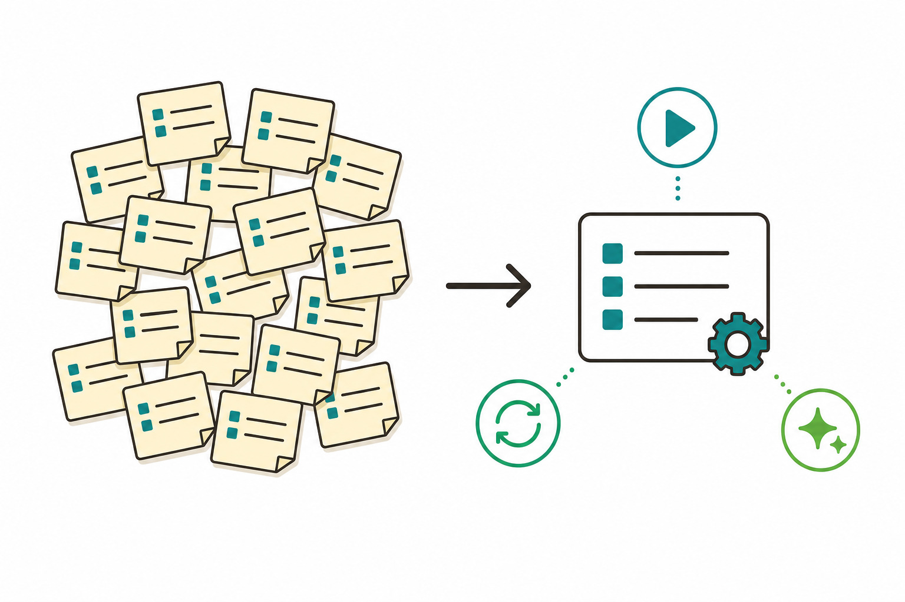

# 슬라이드 2: WHY — 같은 프롬프트를 다시 적지 마세요
<!-- 패턴: F(멀티 섹션: 골든서클 불릿 + 비교표) -->

**왜 Skill인가?** (골든서클: WHY → HOW → WHAT)

- **WHY**: 같은 지시·체크리스트·여러 단계 절차를 채팅에 **반복해서 붙여넣고 있다면**, 바로 그때가 Skill로 만들 시점임
- **HOW**: 그 절차를 **SKILL.md** 파일 하나에 자연어로 적어두면, Claude가 자기 "도구함"에 추가함
- **WHAT**: 이후엔 한 번 만든 자동화를 **자동으로(요청이 맞으면) 또는 "/이름"으로 바로** 재사용

| 구분 | 1~2회차 | 3회차(오늘) |
|------|---------|-------------|
| 지시 방식 | 매번 같은 프롬프트를 다시 입력 | **한 번 만들어 재사용** |
| 보관 형태 | 사람 머릿속·메모장 | **SKILL.md 파일로 저장** |
| 호출 | 그때그때 타이핑 | 자동 트리거 또는 **/스킬이름** |

> **오늘의 기대치**: 외부 도구 없이 **자연어 지침만**으로 동작하는 Skill을 만듦 — 산출물은 **SKILL.md 1개(문서 초안 생성용)**

> 노트: 골든서클로 동기 부여. 공식 메시지 "같은 지시·체크리스트·다단계 절차를 반복 붙여넣고 있을 때, 또는 CLAUDE.md의 한 섹션이 '사실'이 아니라 '절차'로 커졌을 때 스킬로 만든다"를 입문자 말투로 전달. WHY(반복 입력의 비효율)→HOW(SKILL.md에 적기)→WHAT(자동/수동 재사용). 입문자 부담 경감을 위해 오늘은 외부 도구 없이 지침만으로 만드는 점, 산출물은 SKILL.md 1개임을 도입부에서 명시. 출처: https://code.claude.com/docs/en/skills

---
# 슬라이드 3: Skill이란? — 나만의 자동화 레시피
<!-- 패턴: B(좌: 3대 이점 카드 그리드 / 우: 개념 이미지) -->

**한 줄 정의**: **Skill = SKILL.md에 지침을 적어 Claude의 능력을 넓히는 것** — 만들면 Claude의 "도구함"에 추가됨

**왜 좋은가 — 3대 이점(좌측 카드 3개)**
- **[카드 1] 전문가화(Specialize)**
  범용 Claude에 "우리 회사 방식·체크리스트"를 입혀 그 일에 능숙한 전문가로 만듦
- **[카드 2] 반복 제거(Reduce repetition)**
  한 번 만들면 관련 상황에서 알아서 재사용 — 매번 설명할 필요 없음
- **[카드 3] 조합(Compose)**
  여러 Skill을 이어 붙여 복잡한 업무 흐름을 구성

- **쉬운 비유**: Skill은 **요리 레시피** — 한 번 적어두면 매번 같은 결과를 빠르게 재현



> 노트: 가장 중요한 개념 슬라이드. [가이드 리뷰 MUST/RECOMMEND 반영] 과밀 해소 — 패턴을 A(전폭 3열)에서 **B(좌: 3카드 개념 / 우: 이미지 1열)**로 변경하여 패턴-구조를 일치시키고, '호출 방법 2가지'는 슬라이드 5(자동 트리거)·슬라이드 8(만들기·/호출)에서 다루므로 본 슬라이드에서 삭제. 이미지는 우측 열(또는 카드 하단 캡션)으로 작게 배치해 좌측 3카드+상세에 16pt 이상 폭을 확보. 공식 한 줄 "Skills extend what Claude can do. Create a SKILL.md file with instructions, and Claude adds it to its toolkit."를 쉬운 말로. 3대 이점(Specialize / Reduce repetition / Compose)은 overview Key benefits와 일치. '도구함(toolkit)'·'레시피' 비유로 입문자 친화. 호출 2방식(자동 트리거 + /이름)은 슬라이드 5·8에서 실습. 빌더는 좌측 카드 폭이 16pt 본문을 수용하는지 6-1·6-2 검증 수행. 출처: https://code.claude.com/docs/en/skills , https://platform.claude.com/docs/en/agents-and-tools/agent-skills/overview

---
# 슬라이드 4: SKILL.md 구조 — 1회차 5요소의 확장
<!-- 패턴: C 변형(좌: 플로우 / 우: 항목 표 / 하단: 핵심 박스) -->

**SKILL.md는 두 부분** — ① 파일 맨 위 **설정 칸**(언제 쓸지) ② **본문**(어떻게 할지)

**위에서 아래로 읽는 구조(좌측 플로우)**
1. **설정 칸 시작(---)** → `name`(스킬 이름) · `description`(무엇을·언제)
2. **설정 칸 끝(---)**
3. **본문(자연어 지침)** → 1회차 5요소(역할·맥락·입력·작업방법·출력·제약)가 그대로 들어감

| 본문 섹션 | 적는 내용(1회차 5요소의 확장) |
|-----------|-------------------------------|
| 목표·역할·맥락 | 무엇을 위해, 어떤 역할로, 어떤 상황에서 |
| 입력·작업방법 | 받을 정보 / 따라야 할 단계·체크리스트 |
| 출력·제약 | 결과 형식 / 하지 말아야 할 것 |

> **핵심 박스**: 꼭 필요한 건 **둘뿐** — **이름표 한 개(name)** + **설명 한 줄(description: 무엇+언제)**. 본문은 **짧게**(권장 500줄 이하): 한 번 불려오면 대화 내내 남아 길수록 매번 비용이 들기 때문

> 노트: [입문자 MUST 반영] 표면의 'YAML 머리말/프런트매터' 용어를 슬라이드에서 빼고 '파일 맨 위 설정 칸'으로 풀어씀(원어는 구두 보충). name 글자수·문자종류 제약(소문자·숫자·하이픈·최대 64자·예약어 anthropic·claude 금지)은 본문에서 제거하고 노트로 이동, 핵심 박스는 '이름표 한 개 + 설명 한 줄'로 단순화. '토큰 낭비'는 '길수록 매번 비용'으로 평이화. [입문자 RECOMMEND 반영] 1회차 5요소(역할·맥락·입력·작업방법·출력·제약)를 괄호로 명시하고 'SKILL.md 본문 = 이 항목들'을 1:1로 연결. [가이드 RECOMMEND 반영] 우측이 코드가 아니라 '항목 표'이므로 패턴 주석을 'C 변형(플로우 + 표 + 핵심 박스)'으로 표기해 진짜 코드블록을 쓰는 슬라이드 8(C)과 구분. 공식 구조 = 프런트매터(---사이, 언제 쓸지) + 마크다운 본문(실행 시 따르는 지침). 필수 필드는 name·description 둘뿐(Claude Code는 description만 권장). 주의(구두 보충): description '자체 최대 1024자'와, 스킬 목록 표시가 'description+when_to_use 합산 1,536자에서 잘리는' listing 절단 한도는 서로 다른 개념이므로 혼동 금지 — 본문엔 수치 미노출. 본문 간결 원칙(세션 내내 컨텍스트 잔존→토큰 비용 반복, 500줄 이하 권장). 출처: https://code.claude.com/docs/en/skills , https://platform.claude.com/docs/en/agents-and-tools/agent-skills/overview , https://platform.claude.com/docs/en/agents-and-tools/agent-skills/best-practices

---
# 슬라이드 5: description이 핵심 — 자동으로 불려오는 원리
<!-- 패턴: B(좌: 자동 트리거 흐름 다이어그램 / 우: 작성 원칙 + 예시) -->

**왜 description이 중요한가?** Claude는 평소 각 스킬의 **이름·description만** 알고 있다가, 내 요청이 description과 **맞을 때** 그제서야 본문을 읽어옴

**자동 트리거 흐름(좌측)**: ① 시작 시 이름·description만 인지 → ② 내 요청과 비교 → ③ 맞으면 SKILL.md 본문을 불러와 실행

**좋은 description 작성 원칙(우측)**
- **무엇 + 언제**를 모두, 사용자가 자연스럽게 말할 **키워드**로
- **3인칭으로** 작성 — "엑셀 파일을 처리하고 보고서를 만듦"(O) / "제가 도와드릴게요"(X)
- "문서 관련 도움을 줌" 같은 **모호한 표현 금지**

> **한 줄 요점**: 평소엔 이름표(약 100토큰 = AI가 읽는 글자 분량)만, 쓸 때만 본문을 읽음 → 스킬을 많이 만들어도 평소 부담이 거의 없음

> 노트: [입문자 MUST 반영] 한 슬라이드 한 메시지 원칙 — '점진적 로딩'을 별도 슬라이드로 키우지 않고 '한 줄 요점'으로 축약해 '왜 description이 중요한가(자동 호출 원리)'에 집중. '토큰' 첫 등장 지점에 '(AI가 읽는 글자 분량)'을 슬라이드에 직접 병기. 3인칭 예시를 한글로 교체(엑셀 처리·보고서 생성 O / 1인칭 회피 X). 자동 트리거 원리: Claude는 시작 시 name·description 메타데이터만 시스템 프롬프트에 올려두고, 요청이 description과 매칭되면 그때 SKILL.md 본문을 컨텍스트에 로드함(공식 overview). description은 반드시 3인칭(공식 best-practices 경고), 모호어 금지. 점진적 공개(progressive disclosure)는 구두로 '이름표(L1 ~100토큰 상시)→본문(L2 트리거 시 5천토큰 미만)→첨부파일(L3 필요 시)' 3단계 보충. 출처: https://platform.claude.com/docs/en/agents-and-tools/agent-skills/best-practices , https://platform.claude.com/docs/en/agents-and-tools/agent-skills/overview , https://code.claude.com/docs/en/skills

---
# 슬라이드 6: 어디에 둘까? — 유저 스코프 vs 프로젝트 스코프
<!-- 패턴: D(표 + 상세) -->

**저장 위치가 곧 "누가·어디서 쓸 수 있는지"를 정함** (스코프 = 사용 범위)

| 스코프 | 저장 위치 | 적용 범위 | 적합한 경우 |
|--------|-----------|-----------|-------------|
| **유저(개인)** | `~/.claude/skills/이름/SKILL.md` (내 PC의 개인 폴더) | **내 모든 폴더**에서 사용 | 나 혼자 두루 쓰는 개인 도구 |
| **프로젝트** | `.claude/skills/이름/SKILL.md` (이 작업 폴더 안) | **그 폴더에서만** | 팀 공유·특정 프로젝트 전용 절차 |

- **호출 이름은 폴더 이름**에서 옴 — `.claude/skills/summarize-changes/` → **/summarize-changes**
- **라이브 반영**: 만들거나 고치면 보통 **재시작 없이** 현재 세션에 즉시 적용(SKILL.md 텍스트 기준)

> **ICTK 포인트**: 팀 공유용 **프로젝트 스킬**은 폴더를 **신뢰(workspace trust)**해야 자동 권한이 적용됨 → 신뢰 전 스킬 내용을 **검토**하는 것이 "데이터 격리·사람 최종 승인" 기본기와 연결됨

> 노트: [입문자 RECOMMEND 반영] 충돌 우선순위(enterprise>personal>project)는 입문자에게 거의 쓸 일 없는 고급 정보라 본문에서 빼고 노트로 이동 — 표는 '개인(내 어디서나) vs 프로젝트(이 폴더만)' 2분법에 집중. 경로 옆에 한글 위치 설명('내 PC의 개인 폴더'·'이 작업 폴더 안') 병기, '~'는 'home(홈) 폴더'로 구두 1회 보충, '스코프=사용 범위'를 제목에 인라인. 공식 'Where skills live' 표 기반(개인 ~/.claude/skills/, 프로젝트 .claude/skills/). 호출 이름은 폴더 이름에서 옴(name 필드는 표시용 라벨). 충돌 우선순위는 enterprise>personal>project. 라이브 변경 감지(재시작 불필요, SKILL.md 텍스트 한정; 단 세션 시작 시 없던 최상위 skills 디렉터리 신규 생성은 재시작 필요 — 본문 생략, 노트 보충). ICTK 보안 메시지: 프로젝트 스킬의 allowed-tools는 workspace trust 수락 후 적용되며 신뢰 전 검토 권고가 '데이터 격리·사람 최종 승인'과 직결. 출처: https://code.claude.com/docs/en/skills

---
# 슬라이드 7: 만들지 말고 바로 쓰기 — Claude 내장 스킬
<!-- 패턴: E(카드 그리드 3열: 색상 헤더 바 카드) · 카드 헤더 컬러 A(#3776AB)/B(#1A6E36)/D(#1A5E7E) -->

**모든 세션에 기본 제공** — 프롬프트 박스에 **"/"** 만 입력하면 바로 호출(설치 불필요)

- **[카드 ① /goal] 목표 끝까지** (헤더 A #3776AB)
  완료 조건을 선언하면 그 조건이 충족될 때까지 Claude가 **턴을 넘어 계속** 작업 (예: "테스트가 통과할 때까지")
- **[카드 ② /code-review] 코드 품질 점검** (헤더 B #1A6E36)
  지금 변경한 코드의 **버그·정리할 곳**을 점검
- **[카드 ③ /security-review] 보안 점검** (헤더 D #1A5E7E)
  변경분을 **보안 취약점**(인젝션·인증·데이터 노출) 관점에서 분석 — ICTK 같은 보안 기업에 유용

- 이 밖에 `/review`(PR 리뷰), `/loop`(반복 실행) 등도 기본 제공
- **데스크톱 Code 탭 주의**: `/permissions`·`/config`·`/agents`·`/doctor`는 Code 탭 미지원 → **⚙️ Settings**로 대체

> 노트: [입문자 MUST 반영] 메시지가 '만들지 말고 바로 쓰기'이므로 CLI 플래그(`[low~max]`·`--fix`·`--comment`·`ultra`)를 슬라이드 본문에서 전면 제거하고 3개 카드를 모두 '한 줄 효용 + /명령어' 형식으로 통일 — '설치 없이 / 만 치면 됨'이라는 핵심만 남김(검은 명령창 두려움 방지). [정확성 MUST 해소] 본문에서 플래그를 제거함으로써 'ultra를 --fix/--comment급 옵션으로 오인'시키던 구문 오류가 근본 해소됨. 강사 구두/노트 정정용 정확 구문: `/code-review [low|medium|high|xhigh|max|ultra] [--fix] [--comment] [target]` — 여기서 **ultra는 effort 레벨 값**(가장 깊은 클라우드 멀티에이전트 심층 리뷰는 `/code-review ultra`), **--fix(작업트리 자동 적용)·--comment(GitHub PR 인라인 댓글)는 별개 플래그**임. ultra는 권장 호출이며 /ultrareview는 'remains as an alias'이므로 'deprecated'로 말하지 말 것(Pro·Max 무료 3회 후 usage credit). [정확성 RECOMMEND 반영] /goal 해제 키워드는 clear/stop/off/reset/none/cancel 6종(본문엔 비노출, 구두로 'clear 등으로 해제'). 미확인 세부('v2.1.139 이상'·'Haiku 판정'·'세션당 1개')는 commands 페이지 미확인이므로 단정 회피 — 본문·구두 모두 단정 금지. 로컬 참조본(claude-code-builtin-skills.md)을 함께 보일 경우 (a) /ultrareview 'deprecated' 표기는 공식 'remains as an alias'로 정정, (b) /fast는 'Toggle fast mode'까지만 단정(소형 모델 다운그레이드 여부 미확인). 번들 스킬은 disableBundledSkills로 끌 수 있음. [가이드 RECOMMEND 반영] 카드 헤더 컬러는 A(#3776AB)/B(#1A6E36)/D(#1A5E7E)로 배정해 슬라이드 10과 색상 중복 회피. Code 탭 미지원 명령은 'isn't available in this environment' 응답→⚙️ Settings 대체. 출처: https://code.claude.com/docs/en/commands , https://code.claude.com/docs/en/skills , https://code.claude.com/docs/en/desktop

---
# 슬라이드 8: 데스크톱 앱에서 Skill 만들기 — 한 흐름으로
<!-- 패턴: C(플로우 + 코드 박스 + 핵심 박스) -->

**첫 스킬 만들기(GUI, 3단계)** — Code 탭 프롬프트 박스에 부탁하면 Claude가 파일을 만들어 줌

**만드는 흐름(좌측 플로우)**
1. **요청**: "내 변경사항을 요약하는 summarize-changes 스킬을 만들어줘"
2. **승인**: Claude가 폴더·SKILL.md 생성을 제안 → **diff를 보고 Accept/Reject**
3. **테스트**: "내가 뭘 바꿨지?"로 자동 호출하거나 **/summarize-changes**로 직접 실행

**SKILL.md 최소 예시(우측 코드 박스)**
```
---
name: summarize-changes
description: Summarizes recent file changes. Use when the user asks what changed.
---
# 변경사항 요약
## 작업방법
1. 최근 변경 파일을 확인
2. 변경 요지를 항목으로 정리
```

> **핵심 박스**: Claude는 Skill 형식을 이미 알고 있어 **별도 도구 없이** 만들어 줌. 안 불려오면 description에 키워드 보강, 너무 자주 불려오면 description을 더 **구체적으로**(또는 자동 호출 끄기 설정)

> 노트: 데스크톱 Code 탭 기준 첫 스킬 만들기. 공식 'Create your first skill'의 summarize-changes 튜토리얼 사용(요청→생성→diff 승인→자동/직접 호출). 데스크톱에서는 mkdir 대신 프롬프트로 "스킬 폴더와 SKILL.md를 만들어줘" 요청 후 diff Accept로 승인하는 GUI 흐름으로 서술(터미널 표현 금지). 우측 코드 박스는 공식 최소 예시(--- 사이 name·description + 본문). description은 3인칭·무엇+언제 키워드. 트러블슈팅: 자동 호출 안 되면 키워드 확인/요청 재표현/직접 호출, 너무 자주면 description 구체화 또는 disable-model-invocation:true(슬라이드엔 '자동 호출 끄기 설정'으로 한글화). 'diff'(변경 전후 비교 화면), 'Accept/Reject'(각 변경 수락/거부)는 2회차에서 익힌 개념 재활용. skill-creator는 anthropic-skills 플러그인 스킬로 실재하나 인용 가능한 공식 overview URL에 언급이 없어 출처 불확실 → 구두 소개 시 출처를 github.com/anthropics/skills로 표기하고 단정 회피. 출처: https://code.claude.com/docs/en/skills , https://code.claude.com/docs/en/desktop , https://platform.claude.com/docs/en/agents-and-tools/agent-skills/best-practices

---
# 슬라이드 9: 실습 2종 — 문서 스킬(직접) / 정보조사 스킬(데모)
<!-- 패턴: E(카드 그리드 2열: 색상 헤더 바 카드) · 카드 헤더 컬러 B(#1A6E36)/C(#C0530A) -->

**오늘의 손으로 해보기**

- **[카드 ① 문서 스킬] 표준 문서 초안·요약 — [직접 실습]** (헤더 B #1A6E36)
  외부 도구 없이 **지침만**으로 동작. 자주 쓰는 보고서·회의록 양식을 SKILL.md에 담아 **/문서초안** 또는 **/문서요약** 으로 호출
  → 매번 양식을 설명하지 않고 한 번에 표준 초안 생성
- **[카드 ② 정보조사 스킬] 조사 → 레포트 → 슬라이드 — [함께 보기/데모]** (헤더 C #C0530A)
  한 번의 호출로 **특정 주제 검색 → 레포트 작성 → 웹페이지로 가시화 → PPT 슬라이드** 까지 단계 실행
  → 여러 단계 절차를 하나의 레시피로 묶는 체험 (웹 검색·PPT 생성 등 **도구 연동 포함**)

> **오늘의 산출물(하이라이트 박스)**: 직접 만드는 것은 **카드 ①(SKILL.md 1개, 문서 초안 생성용)** — name·description·본문(목표·작업방법·출력)을 갖춰 완성

- (선택) 시간이 남으면: **법률 상담 스킬**(Korean Law MCP 연동) 데모 관찰

> 노트: 패턴 E(색상 헤더 바 카드 2열)로 실습 2종 명세. [입문자 RECOMMEND 반영] 카드 ①은 [직접 실습], 카드 ②는 [함께 보기/데모] 배지로 명시해 '직접 만드는 건 카드 ①'임을 표면에서 시각 구분 — 산출물 'SKILL.md 1개' 기대치와 체감 난이도 정합. [정확성 RECOMMEND 반영] '외부 도구 없이 지침만' 전제는 카드 ①(문서 스킬)에 한정. 카드 ②(정보조사)는 웹 검색(WebSearch/MCP)·PPT 생성 등을 수반하여 '지침만' 범주를 벗어날 수 있으므로 '도구 연동 포함'·'데모'로 표기(주의: Claude Code는 사전 제작 pptx 스킬 미포함, 커스텀 스킬만 파일시스템 기반). [가이드 RECOMMEND 반영] 카드 헤더 컬러는 B(#1A6E36)/C(#C0530A)로 배정해 슬라이드 7·10과 중복 회피. 선택 항목 법률 상담 스킬(Korean Law MCP 연동)은 외부 연동이라 '관찰/데모'로만 표기하고 4회차 외부연동 심화의 디딤돌로 안내. 'MCP'(외부 도구를 잇는 표준 통로)는 2회차 학습 용어 재활용. 출처: https://code.claude.com/docs/en/skills , https://platform.claude.com/docs/en/agents-and-tools/agent-skills/overview

---
# 슬라이드 10: ICTK 안전 수칙 — 스킬도 "소프트웨어처럼" 다루기
<!-- 패턴: E(카드 그리드 3열: 색상 헤더 바 카드 + 카드별 상세) · 카드 헤더 컬러 B(#1A6E36)/C(#C0530A)/E(#8B1A1A) -->

**보안 IC(PUF) 기업 ICTK의 Skill 안전 3원칙** — 편리해도 흔들리지 않는 기본기

**3원칙 카드**
- **[카드 1] 신뢰 출처만** (헤더 B #1A6E36)
  스킬은 새 능력을 부여하므로 **소프트웨어 설치처럼** 취급 — 내가 만들었거나 Anthropic이 제공한 것만. 외부 스킬은 SKILL.md·스크립트를 **전부 감사** 후 사용
- **[카드 2] 민감정보 그대로 적지 않기** (헤더 C #C0530A)
  비밀번호·고객정보·ICTK의 핵심 보안 자산 등을 **SKILL.md 파일에 그대로 적어두지 말 것** — 파일은 공유·커밋될 수 있음
- **[카드 3] 사람 최종 승인** (헤더 E #8B1A1A)
  편집·실행은 **diff를 보고 Accept/Reject**. 배포·제출처럼 되돌리기 어려운 작업은 **자동 호출 끄기 설정**으로 막아 사람이 직접 호출

- **프롬프트 인젝션**(외부 문서·스킬 속 숨은 지시문이 Claude를 속이는 공격)을 경계 — 신뢰되지 않은 스킬 연결 금지

> 노트: [가이드 MUST 반영] 패턴 주석을 'A'에서 **'E(카드 그리드 3열: 색상 헤더 바 카드 + 카드별 상세)'**로 정정 — '색상 헤더 바 카드'는 ppt-guide §3 패턴 E의 고유 특징이며 패턴 A(#F5F5F7 배경 RoundRect, 헤더 바 없음)와 어긋났고 슬라이드 7(E)과도 표기 불일치였음. [입문자 RECOMMEND 반영] 'disable-model-invocation'은 슬라이드에서 '자동 호출 끄기 설정'으로 한글화(영문 키는 구두 보충), '하드코딩'은 '파일에 그대로 적어두기'로 풀이, 'PUF/암호 IP'는 'ICTK의 핵심 보안 자산'으로 일반화. [가이드 RECOMMEND 반영] 카드 헤더 컬러는 B(#1A6E36)/C(#C0530A)/E(#8B1A1A)로 슬라이드 7·9와 중복 없이 배정. 공식 'Security considerations': 직접 만들었거나 Anthropic 제공 신뢰 출처만, 외부는 전 파일 감사, '소프트웨어 설치처럼' 취급. 민감정보 비기재는 ICTK(PUF·암호 IP 보안 기업) 맥락 강조 — SKILL.md가 git 커밋·팀 공유 대상이 될 수 있음. 사람 최종 승인: diff Accept/Reject + 위험 작업은 disable-model-invocation:true로 자동 호출 차단. 프롬프트 인젝션 정의 재확인(2회차 연계). 출처: https://platform.claude.com/docs/en/agents-and-tools/agent-skills/overview , https://code.claude.com/docs/en/skills

---
# 슬라이드 11: 정리 · 회차 흐름 · 2주 과제 · 4회차 예고
<!-- 패턴: F(종합) -->

**오늘 배운 것**
- **Skill = 나만의 자동화 레시피**: 반복 작업을 **SKILL.md**(설정 칸 + 본문)로 승격 / 두 가지 필수는 `name`·`description`(무엇+언제, 3인칭) → 자동 트리거의 핵심
- **저장 위치**: 유저(내 모든 폴더) vs 프로젝트(그 폴더만) · **내장 스킬**(/goal·/code-review·/security-review)은 만들지 말고 바로 사용

**회차 흐름(타이틀에서 이동)**

| 회차 | 핵심 | 한 줄 |
|------|------|------|
| 2회차 | 커넥터·루틴·Computer use | 외부 도구 연결 + 자동 반복 |
| **3회차(오늘)** | **Skill 기초(SKILL.md)** | **반복 작업을 재사용 가능하게 승격** |
| 4회차(예고) | Skill 심화 + 웹브라우저 MCP | 외부 연동 확장 + MCP 개발 |

**2주 과제 — 2회차에서 설계한 반복 작업을 Skill로 구현**: ① **만들기**(2회차 루틴 후보를 SKILL.md로) → ② **실사용**(실제 업무에서 3회 이상) → ③ **개선**(안 불려옴/오작동 등 개선점 기록 = 4회차 확장 재료)

> **4회차 예고 — Skill 심화 + 웹브라우저 MCP**: Playwright·Claude in Chrome로 웹을 다루고 **MCP를 직접 개발** — 오늘 만든 지침만의 Skill에 **외부 연동**을 더해 확장함

> 노트: [가이드 RECOMMEND 반영] 분량·과밀 균형 — 슬라이드 1의 회차 비교표를 본 슬라이드로 흡수하고, '오늘 배운 것'은 3불릿→2불릿으로 축약, 2주 과제는 3행 표 대신 인라인 ①②③ 흐름으로 압축해 16pt 가정 시 분량 압박을 완화(§5 분리 권고 회피, 총 11장 유지). 2주 과제 명확화: 2회차에서 설계한 반복 작업(루틴 후보)을 Skill로 구현하고 3회 이상 실사용 후 개선점 기록(4회차 외부연동 확장의 재료). 학습 연속성: 2회차(연결·자동반복)→3회차(지침만 Skill로 재사용)→4회차(Skill 심화 + 웹브라우저 MCP[Playwright·Claude in Chrome] + MCP 개발). 'MCP'(외부 도구를 잇는 표준 통로)·'Playwright'(웹브라우저를 자동 조작하는 도구)는 구두로 한 줄 보충하되 깊은 설명은 4회차로 미룸. 빌더는 표(3행)+불릿+과제+예고가 한 장에 들어가는지 6-1·6-2 검증, 빡빡하면 '오늘 배운 것'을 한 줄 더 축약. 출처: https://code.claude.com/docs/en/skills , https://code.claude.com/docs/en/commands