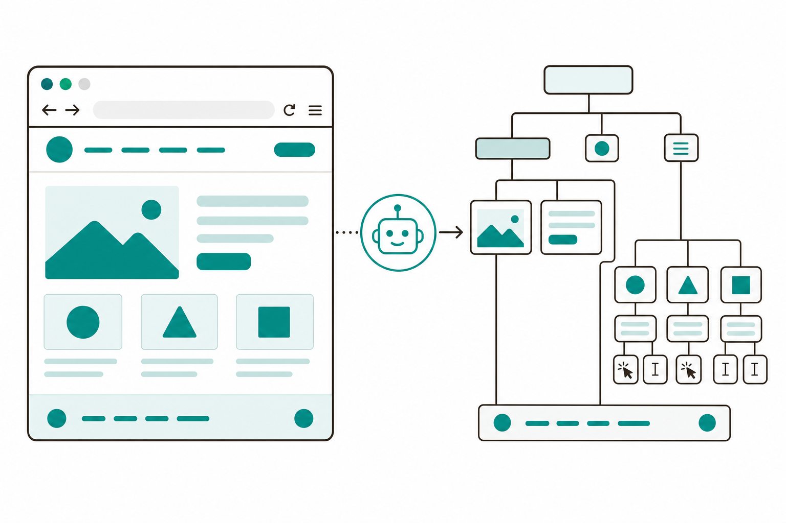
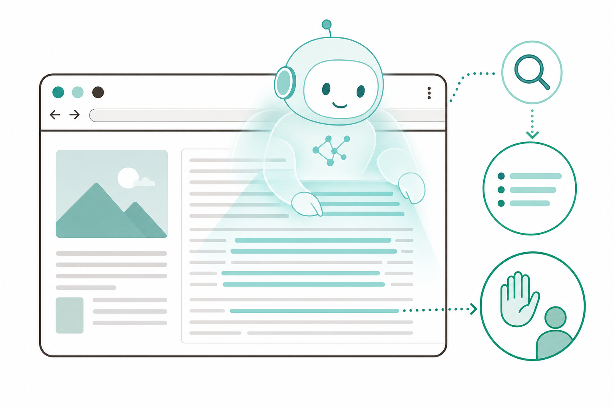
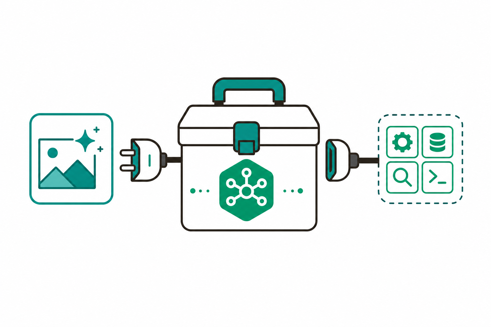

# 슬라이드 2: WHY — Skill에 "손과 눈"을 달면 할 수 있는 일이 커진다
<!-- 패턴: F(멀티 섹션: 골든서클 불릿 + 비교표) -->

**왜 웹·외부·자작 도구인가?** (골든서클: WHY → HOW → WHAT)

- **WHY**: 3회차 Skill은 "지침"만 있어 **내 PC 폴더 안**에서만 동작 — 웹에서 정보를 가져오거나, 최신 문서를 보거나, 없는 기능을 쓰지는 못함
- **HOW**: **MCP**(Model Context Protocol — Claude에 외부 도구를 잇는 "표준 콘센트")로 웹브라우저·문서조회·내가 만든 도구를 **꽂아 줌**
- **WHAT**: 이후엔 Skill이 **웹을 조회·조작**하고, **최신 공식문서**를 참고하고, **나만의 기능**(예: 이미지 생성)까지 호출

| 구분 | 3회차 | 4회차(오늘) |
|------|-------|-------------|
| Skill이 쓰는 도구 | 지침(자연어)만 | 지침 + **MCP로 연결한 외부 도구** |
| 닿는 범위 | 내 PC 폴더 안 | **웹·외부 서비스·자작 도구**까지 |
| 산출물 | 지침만의 SKILL.md | **MCP 연동 Skill + 웹 조회 Skill** |

> **ICTK 보안 메시지**: 범위가 넓어질수록 기본기가 더 중요 — Claude는 **내가 고른 폴더 안에서만** 작업하고, 웹 조작·편집·실행은 **사람이 diff로 Accept/Reject** 후에만 진행됨(데이터 격리 · 사람 최종 승인)

> 노트: 골든서클로 동기 부여. WHY(지침만 Skill의 한계: 내 폴더 밖을 못 봄)→HOW(MCP로 외부 도구 연결)→WHAT(웹 조회·조작 + 최신 문서 + 자작 기능). MCP는 공식 정의 "an open source standard for AI-tool integrations… MCP servers give Claude Code access to your tools, databases, and APIs"를 입문자 비유('표준 콘센트')로 전달. 보안 메시지는 2회차 안전모델(폴더 격리·사람 승인) 재활용 — ICTK는 보안 IC(PUF) 기업이라 1회 명시 필수. 비교표는 3→4회차 확장 한눈에. 출처: https://code.claude.com/docs/en/mcp , https://modelcontextprotocol.io/docs/develop/build-server

---
# 슬라이드 3: 웹 자동화 2종 — Playwright MCP vs Claude in Chrome
<!-- 패턴: D(표 + 상세) -->

**같은 "웹을 다룬다"지만 브라우저가 다름** — 용도에 맞게 골라 씀

| 구분 | **Playwright MCP** | **Claude in Chrome** |
|------|--------------------|----------------------|
| 어떤 브라우저? | Claude가 제어하는 **별도 자동화 브라우저** | **내가 쓰는 실제 Chrome/Edge** |
| 내 로그인 상태 | **분리(깨끗)** — 내 세션과 별개 | **공유** — 이미 로그인한 사이트 접근 |
| 잘 맞는 일 | 공개 웹 정보 조회·정리 | 로그인이 필요한 내 계정 작업 |
| 상태 | 안정(설치형) | **beta** — 별도 Anthropic 플랜 필요 |

- **Playwright MCP**(웹브라우저를 자동 조작하는 도구): 화면 그림이 아니라 **페이지 구조(접근성 트리)**를 읽어 클릭·입력·이동 → 빠르고 결과가 안정적
- **Claude in Chrome**(내 브라우저에 붙는 Claude): 로그인·CAPTCHA가 나오면 **멈추고 사람에게 처리해 달라고 물음**

> **공통 안전선**: 둘 다 사이트 이용약관(ToS)·로봇 정책을 지키고, **로그인은 사람이**, 외부 페이지의 숨은 지시(프롬프트 인젝션)를 경계해야 함

> 노트: 본 회차 핵심 분기점. 정확한 차이를 전달 — Playwright MCP = "browser automation capabilities using Playwright… enables LLMs to interact with web pages through structured accessibility snapshots, bypassing the need for screenshots"(README), Claude가 제어하는 별도 브라우저(npx @playwright/mcp, 계정 불필요, 내 로그인과 분리). Claude in Chrome = "Claude opens new tabs… and shares your browser's login state, so it can access any site you're already signed into… When Claude encounters a login page or CAPTCHA, it pauses and asks you to handle it manually"(공식, beta, Chrome/Edge만, 직접 Anthropic 플랜 필요). 표 헤더는 옅은 파랑(#E2EEF9). 출처: https://github.com/microsoft/playwright-mcp , https://code.claude.com/docs/en/chrome

---
# 슬라이드 4: Playwright MCP — 웹 조회·조작을 자동으로
<!-- 패턴: C(플로우 + 코드 박스 + 핵심 박스) -->

**한 줄 정의**: Claude가 **별도 자동화 브라우저**를 띄워 페이지를 읽고 클릭·입력·이동하는 MCP — 공개 웹 정보 수집에 적합

**동작 흐름(좌측 플로우)**
1. **연결**: 데스크톱 Code 탭에 "playwright MCP를 추가해줘"라고 부탁 → diff Accept로 승인
2. **지시**: "example.com 을 열고 제목을 알려줘" 같은 자연어 요청
3. **실행**: Claude가 **접근성 트리(페이지 구조)**를 읽어 이동·클릭·입력 (그림이 아닌 구조 기반 → 빠르고 안정적)
4. **정리**: 가져온 정보를 표·요약으로 결과 반환

**최소 설정 예시(우측 코드 박스, Claude가 만들어 줌)**
```
{
  "mcpServers": {
    "playwright": {
      "command": "npx",
      "args": ["-y", "@playwright/mcp@latest"]
    }
  }
}
```



> **핵심 박스**: 화면을 "보고 누르는" 방식이 아니라 **페이지 구조를 읽는** 방식이라 빠르고 결과가 일정함 — 계정 없이도 공개 웹 조회 가능. 브라우저 창이 떠서 **무슨 일을 하는지 눈으로 확인** 가능

> 노트: Playwright MCP 단독 슬라이드. 공식 README 인용 — "Fast and lightweight. Uses Playwright's accessibility tree, not pixel-based input / LLM-friendly. No vision models needed, operates purely on structured data / Deterministic tool application". Claude Code 공식 가이드도 "gives Claude a browser it can navigate, click, and read, and it needs no account… A browser window opens so you can watch it work"라 확인. 설정 예시는 README 표준 config(데스크톱에선 명령 대신 프롬프트로 추가 요청 후 diff 승인 흐름으로 서술, 터미널 표현 금지). Node.js 18+ 필요(구두 보충). 코드 박스는 회색 배경(#F5F5F7). 실습: 공개 웹 정보 조회·정리. 출처: https://github.com/microsoft/playwright-mcp , https://code.claude.com/docs/en/mcp-quickstart

---
# 슬라이드 5: Claude in Chrome — 내 브라우저에서 조회·요약
<!-- 패턴: B(좌: 동작 흐름 다이어그램 / 우: 개념 이미지) -->

**한 줄 정의**: 내가 쓰는 **실제 Chrome/Edge**에 Claude가 붙어, 내가 로그인한 상태 그대로 웹을 다루는 **beta** 기능

**동작 흐름(좌측)**: ① ⚙️ Settings/`/chrome`로 켬 → ② Claude가 **새 탭**을 열어 작업(보이는 창에서 실시간) → ③ **로그인·CAPTCHA가 나오면 멈추고 사람에게 요청** → ④ 결과 요약

**예시 — 아카이브에서 '반도체' 논문 검색·요약**
- 논문 사이트로 이동 → "반도체" 검색 → 상위 결과 **제목·초록을 추려 한국어 요약**
- 내 브라우저라 **이미 로그인한 사이트**도 접근 가능(별도 API 연결 불필요)



> **주의(ICTK)**: beta·실제 브라우저라 **신뢰 경계**가 더 중요 — 사이트별 권한을 좁게 주고, 외부 페이지의 숨은 지시(프롬프트 인젝션)를 경계, **로그인은 항상 사람이** 직접

> 노트: Claude in Chrome 단독 슬라이드. 공식 사실만 사용 — beta, Google Chrome/Microsoft Edge만(Brave·Arc·WSL 미지원), "A direct Anthropic plan (Pro, Max, Team, or Enterprise)" 필요, "shares your browser's login state, so it can access any site you're already signed into", "When Claude encounters a login page or CAPTCHA, it pauses and asks you to handle it manually", 켜기 `/chrome` 또는 `--chrome`(데스크톱 Code 탭은 ⚙️ Settings/패널 흐름으로 서술), "Site-level permissions are inherited from the Chrome extension"(사이트별 권한). 데이터 추출 예시(논문 검색·요약)는 공식 "Extract data from web pages" 패턴을 ICTK 반도체 맥락으로 적용. 이미지는 우측 1열(개념 메타포만, 스크린샷류 금지). 출처: https://code.claude.com/docs/en/chrome

---
# 슬라이드 6: 도우미 MCP 2종 — context7 · sequential thinking
<!-- 패턴: E(카드 그리드 2열: 색상 헤더 바 카드) · 카드 헤더 컬러 A(#3776AB)/D(#1A5E7E) -->

**Skill의 품질을 높이는 "보조 도구" — 둘 다 외부 서비스/표준 서버를 MCP로 연결**

- **[카드 ① context7] 최신 공식문서 조회** (헤더 A #3776AB)
  라이브러리·프레임워크의 **최신·버전별 공식문서와 코드 예시**를 **실시간으로 프롬프트에 넣어 줌**
  → "use context7"라고 덧붙이면 옛 기억이 아닌 **지금의 정식 문서** 기준으로 답함(오래된·없는 API 환각 감소)
- **[카드 ② sequential thinking] 단계적 사고** (헤더 D #1A5E7E)
  복잡한 문제를 **여러 생각 단계로 쪼개고**, 필요하면 **수정·분기**하며 차근차근 풀도록 돕는 표준 MCP 서버
  → 긴 절차·설계처럼 **한 번에 답하기 어려운 일**의 정확도를 높임

> **요점**: 둘 다 "직접 호출"보다 **Skill/요청 속에서 알아서 쓰이는** 보조 도구 — Skill에 붙이면 결과가 더 최신·더 정확해짐

> 노트: 도우미 MCP 2종. context7(공식 README 인용) — "Context7 pulls up-to-date, version-specific documentation and code examples straight from the source — and places them directly into your prompt"; 사용법 "use context7" 덧붙이기; 서버 URL https://mcp.context7.com/mcp. sequential thinking(modelcontextprotocol servers의 sequentialthinking, README 인용) — "An MCP server implementation that provides a tool for dynamic and reflective problem-solving through a structured thinking process"(복잡 문제 단계 분해·수정·분기). 입문자에겐 둘 다 '개념 수준'으로만, 깊은 내부는 단정 회피. 카드 헤더 컬러 A/D로 슬라이드 9·10과 중복 회피. 출처: https://github.com/upstash/context7 , https://github.com/modelcontextprotocol/servers/tree/main/src/sequentialthinking

---
# 슬라이드 7: 나만의 MCP 만들기 — 자작 도구를 표준 도구로
<!-- 패턴: C(플로우 + 코드 박스 + 핵심 박스) -->

**MCP "서버"란?** 내 기능(도구)을 **표준 방식으로 노출**하는 작은 프로그램 — 한 번 만들면 Claude가 그 기능을 "도구함"에 넣고 씀

**만드는 흐름(좌측 플로우) — 코드는 Claude가 생성·설명**
1. **무엇을**: "GPT Image로 그림 만드는 기능을 MCP로 만들어줘"처럼 **원하는 도구를 말로** 설명
2. **생성**: Claude가 파이썬/노드 **SDK** 코드를 **대신 작성**하고 한 줄씩 설명 → diff Accept로 승인
3. **연결·확인**: 데스크톱에서 MCP로 등록 → 도구가 잘 보이는지 확인 후 사용

**MCP 서버가 노출하는 것(우측 코드 박스)**
```
도구(Tools)    : Claude가 호출하는 기능 (사람 승인 후 실행)
리소스(Resources): 읽어올 데이터(파일·API 응답)
프롬프트(Prompts): 자주 쓰는 작업 템플릿
```



> **핵심 박스**: 비개발자도 가능 — **코드는 Claude가 쓰고 설명**함. 핵심은 "어떤 기능을, 어떤 입력으로, 무엇을 돌려줄지" **내가 말로 정의**하는 것

> 노트: MCP 개발 슬라이드. 공식 개념 인용 — MCP 서버 3대 능력 "Resources(file-like data read by clients) / Tools(functions called by the LLM, with user approval) / Prompts(pre-written templates)"(modelcontextprotocol build-server). Python SDK(3.10+, `mcp[cli]`) 또는 Node/TS SDK로 작성. 비개발자 친화 메시지: Claude Code가 코드를 scaffold/설명(공식 mcp-server-dev 플러그인 `/mcp-server-dev:build-mcp-server`로 use case 묻고 서버 골격 생성). 'SDK'(도구를 만들 때 쓰는 부품 모음)는 한 줄 비유 보충. 'Tools는 사람 승인 후 실행'을 강조해 ICTK 안전모델과 연결. 코드 박스 회색 배경(#F5F5F7). 출처: https://modelcontextprotocol.io/docs/develop/build-server , https://code.claude.com/docs/en/mcp

---
# 슬라이드 8: Skill + MCP 결합 — 정보조사 스킬에 이미지 생성 더하기
<!-- 패턴: C(플로우 + 코드 박스 + 핵심 박스) -->

**오늘의 결합점**: 3회차에서 만든 **정보조사 스킬**에, 7번에서 만든 **이미지 생성 MCP**를 붙여 기능을 확장

**확장 흐름(좌측 플로우)**
1. **기존**: 정보조사 스킬 = 검색 → 레포트 → 슬라이드(지침 기반)
2. **추가**: SKILL.md 본문에 "표지·삽화는 **GPT Image MCP로 생성**" 단계를 한 줄 추가
3. **결과**: 한 번의 호출로 조사 → 레포트 → **이미지까지 생성**되어 결과물이 풍부해짐

**SKILL.md에 추가하는 지침(우측 코드 박스)**
```
## 작업방법(추가)
4. 레포트 핵심 장면을 그림으로 표현
5. GPT Image MCP로 표지 이미지 1장 생성
6. 생성 이미지를 슬라이드에 삽입
```

> **핵심 박스**: Skill(절차) + MCP(도구)는 **레고처럼 조합** — 같은 방식으로 Playwright MCP를 붙이면 **웹 조회 Skill**(슬라이드 9 실습)이 됨

> 노트: Skill+MCP 결합. 3회차 정보조사 스킬(검색→레포트→슬라이드)에 자작 이미지 생성 MCP를 연결해 "기능 추가" 체험 — Skill은 '절차', MCP는 '도구'이며 SKILL.md 본문에 도구 사용 단계를 한 줄 추가하는 것으로 결합됨을 보여 줌. 공식 Skill 'Compose'(여러 능력을 이어 붙임) 개념의 실제 적용. 동일 패턴으로 Playwright MCP를 붙이면 웹 조회 Skill이 됨을 예고(슬라이드 9 연결). 코드 박스 회색 배경(#F5F5F7), 3회차 SKILL.md 구조(설정 칸+본문) 재활용. 출처: https://code.claude.com/docs/en/skills , https://code.claude.com/docs/en/mcp

---
# 슬라이드 9: 실습 3종 — 웹 조회 / 논문 요약 / MCP 제작·연동
<!-- 패턴: E(카드 그리드 3열: 색상 헤더 바 카드) · 카드 헤더 컬러 B(#1A6E36)/C(#C0530A)/E(#8B1A1A) -->

**오늘의 손으로 해보기**

- **[카드 ① 웹 조회 Skill] Playwright MCP — [직접 실습]** (헤더 B #1A6E36)
  공개 웹의 정보 한 가지를 **조회·정리**하는 Skill을 만듦 → **/웹조회** 로 호출
- **[카드 ② 논문 요약] Claude in Chrome — [함께 보기/데모]** (헤더 C #C0530A)
  내 브라우저로 아카이브에서 **'반도체' 논문 검색 → 제목·초록 요약**(beta·로그인은 사람)
- **[카드 ③ MCP 제작·연동] 이미지 생성 MCP — [직접 실습]** (헤더 E #8B1A1A)
  **GPT Image 이미지 생성 MCP**를 만들고, 3회차 **정보조사 스킬에 이미지 생성 기능 추가**

> **오늘의 산출물(하이라이트 박스)**: **MCP 연동 Skill**(카드 ③) + **웹 조회 Skill**(카드 ①) — 둘 다 직접 만들어 완성

> 노트: 패턴 E(색상 헤더 바 카드 3열)로 실습 3종 명세. 커리큘럼 실습 항목 그대로: ① Playwright MCP 공개 웹 조회·정리 ② Claude in Chrome 반도체 논문 검색·요약 ③ GPT Image 이미지 생성 MCP 제작 후 정보조사 스킬에 추가. 카드 ①·③은 [직접 실습](산출물=MCP 연동 Skill+웹 조회 Skill), 카드 ②는 beta·로그인 필요라 [함께 보기/데모]로 표기해 체감 난이도·안전 정합. 카드 헤더 컬러 B/C/E로 슬라이드 6·10과 중복 회피. 출처: https://github.com/microsoft/playwright-mcp , https://code.claude.com/docs/en/chrome , https://code.claude.com/docs/en/mcp

---
# 슬라이드 10: ICTK 안전 수칙 — 웹·외부 도구는 "경계하며" 쓰기
<!-- 패턴: E(카드 그리드 3열: 색상 헤더 바 카드 + 카드별 상세) · 카드 헤더 컬러 B(#1A6E36)/C(#C0530A)/E(#8B1A1A) -->

**보안 IC(PUF) 기업 ICTK의 웹·MCP 안전 3원칙** — 범위가 넓어져도 흔들리지 않는 기본기

**3원칙 카드**
- **[카드 1] 웹 자동화는 규칙 안에서** (헤더 B #1A6E36)
  사이트 **이용약관(ToS)·로봇 정책(robots)**을 지키고, 과도한 자동 접근 금지. **로그인·CAPTCHA는 사람이** 직접
- **[카드 2] 신뢰된 MCP만 연결** (헤더 C #C0530A)
  MCP는 새 능력을 부여하므로 **소프트웨어 설치처럼** 취급 — 출처를 신뢰할 수 있는 서버만. 외부 콘텐츠를 가져오는 서버는 **프롬프트 인젝션** 위험을 동반
- **[카드 3] 사람 최종 승인 · 데이터 격리** (헤더 E #8B1A1A)
  편집·실행·웹 조작은 **diff Accept/Reject**로 사람이 확인. Claude는 **내가 고른 폴더 안에서만** 작업 — ICTK 핵심 보안 자산은 외부로 내보내지 않음

- **프롬프트 인젝션**(웹페이지·외부 도구 속 숨은 지시문이 Claude를 속이는 공격)을 항상 경계 — 프로젝트 MCP는 **승인(approval)** 후에만 사용

> 노트: ICTK 안전 수칙(4회차판). 공식 경고 인용 — "Verify you trust each server before connecting it. Servers that fetch external content can expose you to prompt injection risk"(MCP 페이지). 프로젝트 스코프 MCP는 "Claude Code prompts for approval before using project-scoped servers"(공식). 웹 자동화는 ToS·robots 준수·로그인은 사람(Claude in Chrome도 login/CAPTCHA에서 사람에게 멈춰 물음). 데이터 격리(선택 폴더 한정)+사람 최종 승인(diff Accept/Reject)는 전 회차 일관 메시지. 'MCP=소프트웨어 설치처럼'은 3회차 Skill 보안수칙과 연결. 카드 헤더 B/C/E. 출처: https://code.claude.com/docs/en/mcp , https://code.claude.com/docs/en/chrome , https://code.claude.com/docs/en/skills

---
# 슬라이드 11: 정리 · 회차 흐름 · 2주 과제 · 5회차 예고
<!-- 패턴: F(종합) -->

**오늘 배운 것**
- **MCP = Claude에 외부 도구를 잇는 표준 콘센트**: 웹브라우저(Playwright MCP·Claude in Chrome)·도우미(context7·sequential thinking)·**자작 도구**까지 연결
- **Skill + MCP = 레고 조합**: 지침만의 Skill에 도구를 붙여 **웹 조회 Skill / MCP 연동 Skill**을 완성 — 코드는 Claude가 생성·설명

**회차 흐름**

| 회차 | 핵심 | 한 줄 |
|------|------|------|
| 3회차 | Skill 기초(SKILL.md) | 반복 작업을 재사용 가능하게 승격 |
| **4회차(오늘)** | **Skill 심화 + 웹 MCP + MCP 개발** | **지침 Skill에 외부·자작 도구 결합** |
| 5회차(예고) | Skill + Agent | 오케스트레이터가 서브에이전트를 부르는 다단계 자동화 |

**2주 과제 — 웹에서 주기적으로 확인하는 정보 1개를 Playwright MCP 조회 Skill로**: ① **고르기**(매주 확인하는 공개 웹 정보 1개) → ② **만들기**(Playwright MCP 조회 Skill로 구현) → ③ **실사용·개선**(실제로 돌려보고 개선점 기록 = 5회차 다단계 워크플로우 재료)

> **5회차 예고 — Skill + Agent**: 오늘 만든 도구 결합 Skill을 **여러 역할(작성자·검토자)로 나눠** 오케스트레이터 Skill이 호출하는 **다단계 자동화**로 발전시킴

> 노트: 종합 정리. '오늘 배운 것'은 2불릿(MCP 개념+종류 / Skill+MCP 결합)으로 축약. 회차 흐름 표(3행)로 3→4→5회차 연결. 2주 과제는 커리큘럼 명시 그대로(웹에서 주기 확인 정보 1개를 Playwright MCP 조회 Skill로) ①②③ 인라인 흐름으로 압축 — 산출물이 5회차 다단계 워크플로우 재료가 됨을 명시. 5회차 예고: Skill+Agent(오케스트레이터 Skill이 서브에이전트 작성자·검토자 호출). 빌더는 표+불릿+과제+예고가 한 장에 들어가는지 §6-1·6-2 검증, 빡빡하면 '오늘 배운 것' 한 줄 더 축약. 출처: https://code.claude.com/docs/en/mcp , https://code.claude.com/docs/en/skills
