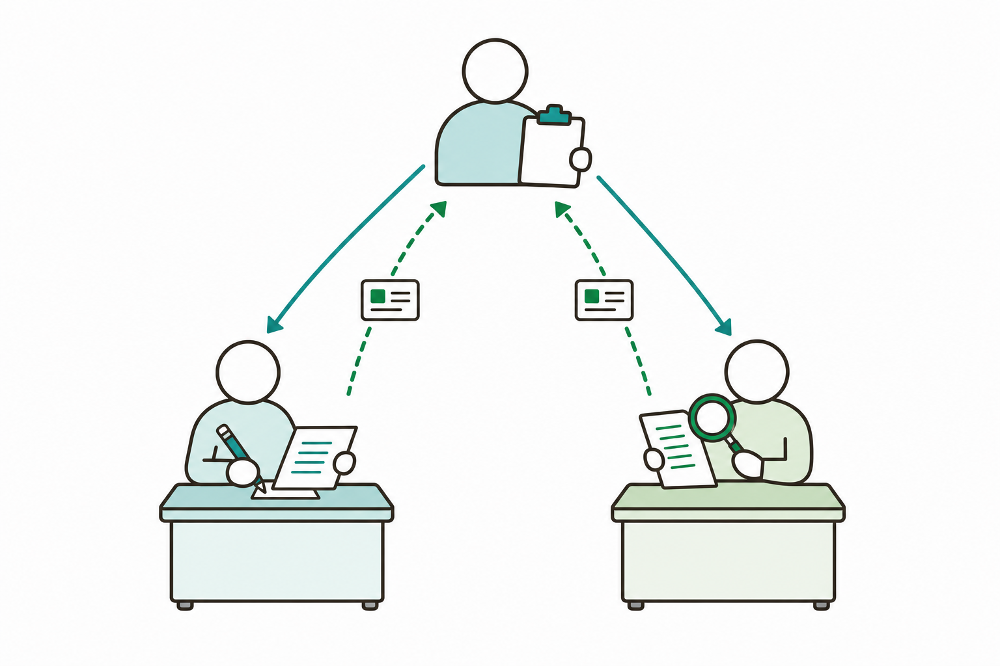
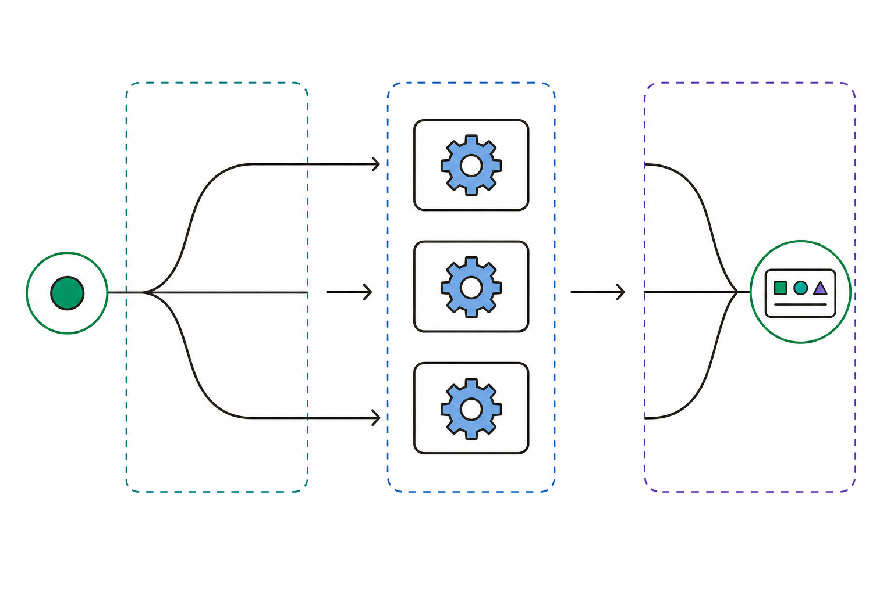
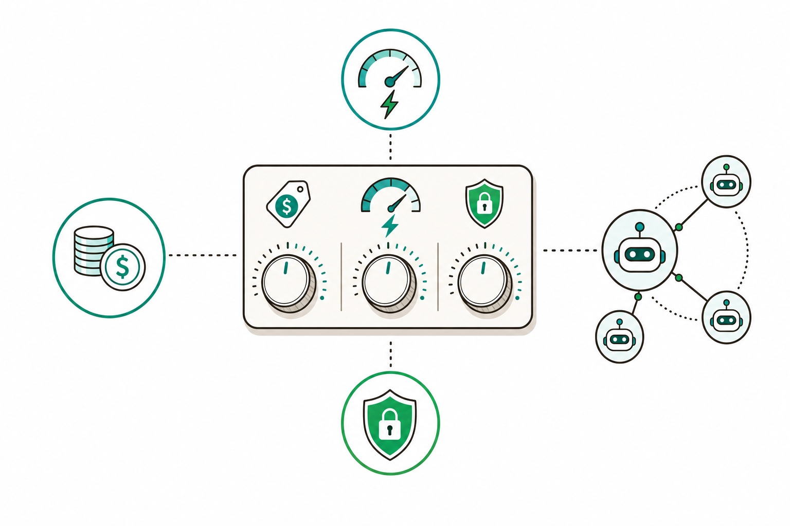

# 슬라이드 2: WHY — 혼자 다 하면 빠뜨리고, 나눠 맡기면 꼼꼼해진다
<!-- 패턴: F(멀티 섹션: 골든서클 불릿 + 비교표) -->

**왜 Skill에 'Agent(역할 분담)'를 더하는가?** (골든서클: WHY → HOW → WHAT)

- **WHY**: 한 명이 글도 쓰고 검토도 하면 **자기 실수를 못 봄** — 작성과 점검을 **다른 역할**이 맡으면 품질이 올라감
- **HOW**: 일을 잘게 나눠 **'작성자'·'검토자' 같은 보조 AI(서브에이전트)** 에게 맡기고, 메인이 결과를 **종합**함
- **WHAT**: 오케스트레이터 스킬 하나로 **여러 단계가 자동으로** 굴러가는 자동화(예: 작성 → 검토 → 보고)

| 구분 | 3~4회차(지금까지) | 5회차(오늘) |
|------|-------------------|-------------|
| 일하는 방식 | **한 스킬이 혼자** 처음부터 끝까지 | **메인이 나눠 맡기고** 종합 |
| 품질 점검 | 같은 맥락에서 자가 점검 | **다른 역할(검토자)이 별도 점검** |
| 속도 | 단계가 길면 한 줄로 느림 | 독립 작업은 **동시에(병렬)** 처리 |

> **오늘의 기대치**: 작성자 → 검토자처럼 **역할을 나눈** 다단계 스킬을 만들고, 비용·성능·보안까지 고려해 조율(하네스 엔지니어링)

> 노트: 골든서클로 동기 부여. 핵심 메시지는 "한 스킬이 혼자 다 하던 것을, 역할을 나눈 서브에이전트들에게 분배하면 품질·속도가 오른다". 공식 근거: 서브에이전트는 "specialized AI assistants that handle specific types of tasks"이며 각자 "its own context window with a custom system prompt, specific tool access, and independent permissions"에서 독립 작업 후 요약만 반환함. 독립 작업은 병렬 가능("spawn multiple subagents to work simultaneously"). 비교표는 3~4회차(혼자 하는 스킬)와 5회차(분배·종합)를 대조. 출처: https://code.claude.com/docs/en/sub-agents

---
# 슬라이드 3: 에이전트 · 서브에이전트란? — 팀장과 팀원
<!-- 패턴: B(좌: 3카드 개념 / 우: 비유 이미지) -->

**한 줄 정의**: **에이전트 = 스스로 여러 단계를 알아서 해내는 AI 일꾼** / **서브에이전트 = 특정 역할만 맡는 보조 AI 일꾼**

**쉬운 비유 — 회사 조직 (좌측 카드 3개)**
- **[카드 1] 팀장 = 메인(오케스트레이터)**
  일을 쪼개 누구에게 맡길지 정하고, 결과를 모아 최종 정리
- **[카드 2] 팀원 = 서브에이전트**
  '작성자'·'검토자'처럼 **한 가지 역할**만 맡아 **자기 책상(독립 작업 공간)**에서 처리
- **[카드 3] 보고 = 요약만 전달**
  팀원은 잡다한 과정은 자기 선에서 끝내고 **결론(요약)만** 팀장에게 올림 → 팀장 책상이 깔끔

- **왜 따로 두나**: 역할마다 **쓸 수 있는 도구·권한을 다르게** 줄 수 있어 안전하고, **저렴한 모델**에 맡겨 비용도 아낌



> 노트: 가장 중요한 개념 슬라이드 — '팀장-팀원' 비유로 입문자 친화. 공식 정의 반영: 서브에이전트는 각자 독립 컨텍스트 창에서 일하고 "returns only the summary"(요약만 반환) → 팀장(메인) 컨텍스트가 깨끗하게 유지됨("Preserve context"). 역할별 도구·권한 제한("Enforce constraints by limiting which tools a subagent can use")과 저렴 모델 라우팅("Control costs by routing tasks to faster, cheaper models like Haiku")을 카드 하단에 일반화해 담음. '에이전트=스스로 여러 단계 수행', '서브에이전트=특정 역할 보조 AI'는 입문자 비유로만 노출하고 영어 원문은 구두 보충. 이미지는 우측 1열로 배치해 좌측 3카드에 16pt 이상 폭 확보(빌더 6-1·6-2 검증). 출처: https://code.claude.com/docs/en/sub-agents

---
# 슬라이드 4: 오케스트레이션 흐름 — 분배 → 실행 → 종합
<!-- 패턴: C 변형(좌: 세로 플로우 / 우: 단계 설명 표 / 하단: 핵심 박스) -->

**오케스트레이션 = 메인이 작업을 나눠 맡기고 결과를 종합하는 것** (한 줄)

**세 단계 흐름(좌측 플로우, 위→아래)**
1. **분배(Distribute)** — 메인이 일을 쪼개 알맞은 서브에이전트에게 맡김 (`#059669`)
2. **실행(Run)** — 각 서브에이전트가 **자기 공간에서 독립 실행** (서로 안 섞임) (`#0284C7`)
3. **종합(Synthesize)** — 메인이 결과(요약)를 **모아 최종 정리** (`#7C3AED`)

| 단계 | 메인(팀장)이 하는 일 | 서브에이전트(팀원)가 하는 일 |
|------|----------------------|------------------------------|
| 분배 | 요청과 역할 설명을 맞춰 위임 | (대기) |
| 실행 | 기다림 / 동시 진행 관리 | 자기 역할만 독립 수행 → 요약 작성 |
| 종합 | 요약들을 합쳐 결론 도출 | (반환 완료) |



> **핵심 박스**: **독립적인 일은 동시에(병렬)**, **이어지는 일은 차례로(체인)**. 둘 다 결과는 메인이 모음 — 그래서 빠르면서도 한 줄로 꿰어짐

> 노트: 오케스트레이션 정의="메인이 작업을 나눠 맡기고 결과를 종합". 공식 패턴 2종을 입문자어로: ① 병렬("Run parallel research — spawn multiple subagents to work simultaneously ... then Claude synthesizes the findings", 단 독립 경로일 때), ② 체인("Chain subagents — ask Claude to use subagents in sequence. Each subagent ... returns results to Claude, which then passes relevant context to the next"). 각 서브에이전트는 "fresh, isolated context window"에서 시작해 대화 이력을 못 봄 → '서로 안 섞임'으로 표현. 우측은 코드가 아닌 '단계 설명 표'이므로 패턴 주석을 'C 변형(플로우+표+핵심 박스)'으로 표기(진짜 코드 슬라이드 6과 구분). 출처: https://code.claude.com/docs/en/sub-agents

---
# 슬라이드 5: 역할 분리 설계 — 작성자↔검토자 / 수집자↔요약자
<!-- 패턴: E(카드 그리드 2열: 색상 헤더 바 카드) · 카드 헤더 컬러 B(#1A6E36)/D(#1A5E7E) -->

**핵심 원칙**: **하나의 서브에이전트는 한 가지 일만 잘하게** — 역할이 섞이면 품질도, 안전도 흐려짐

**대표 역할 쌍 2종**
- **[카드 ① 작성자 ↔ 검토자] 만들고 → 점검하기** (헤더 B #1A6E36)
  **작성자**는 글·코드를 만드는 데 집중(쓰기 권한 보유)
  **검토자**는 **읽기 전용**으로 버그·보안만 점검 → 자기 글을 자기가 못 보는 문제 해소
- **[카드 ② 수집자 ↔ 요약자] 모으고 → 추리기** (헤더 D #1A5E7E)
  **수집자**는 흩어진 자료·로그를 폭넓게 긁어모음(많은 출력 흡수)
  **요약자**는 그중 **핵심만** 골라 메인에 짧게 보고 → 메인 책상이 안 넘침

> **설계 팁(하이라이트 박스)**: 각 역할의 **description(언제 부를지)을 명확히**, **도구는 꼭 필요한 것만** — 검토자에겐 '읽기 도구'만 주면 실수로 파일을 고칠 일이 없음

> 노트: 역할 분리 설계. 공식 예시 직접 반영 — 'code-reviewer'는 `tools: Read, Grep, Glob, Bash`로 Write/Edit 없이 읽기 전용 점검("design a focused subagent with limited tool access (no Edit or Write)"), 'debugger'는 고치려면 Edit 포함. 따라서 작성자=쓰기 권한 / 검토자=읽기 전용으로 대비. 수집자↔요약자는 "Isolate high-volume operations" 패턴(verbose output은 서브에이전트 컨텍스트에 남고 요약만 반환)을 역할 2개로 분해해 설명. 설계 원칙 "each subagent should excel at one specific task", "Write detailed descriptions", "Limit tool access"를 팁 박스에 담음. 카드 헤더 컬러 B/D로 슬라이드 7·8·10과 중복 회피. 출처: https://code.claude.com/docs/en/sub-agents

---
# 슬라이드 6: 데스크톱 앱에서 서브에이전트 만들기 — Settings 또는 파일로
<!-- 패턴: C(좌: 플로우 / 우: 코드 박스 / 하단: 핵심 박스) -->

**서브에이전트도 작은 파일 하나** — `.claude/agents/이름.md` (맨 위 **설정 칸** + **본문=그 역할의 지침**)

**데스크톱 Code 탭에서 만드는 흐름(좌측 플로우)**
1. **부탁**: Code 탭에 "코드 검토만 하는 읽기 전용 검토자 에이전트를 만들어줘"
2. **승인**: Claude가 `.claude/agents/code-reviewer.md` 생성을 제안 → **diff를 보고 Accept/Reject**
3. **호출**: "방금 변경분을 검토해줘"라고 하면 메인이 그 검토자에게 **자동 위임**

**서브에이전트 최소 예시(우측 코드 박스)**
```
---
name: code-reviewer
description: Reviews code for quality and best practices
tools: Read, Glob, Grep
model: sonnet
---
당신은 코드 검토자입니다. 변경분의 버그·보안·가독성을 점검하고
우선순위(필수/권장/제안)별로 구체적 수정안을 제시하세요.
```

> **핵심 박스**: 데스크톱 **Code 탭은 `/agents` 메뉴 미지원** → **⚙️ Settings** 또는 위처럼 **`.claude/agents` 파일**로 구성. 꼭 필요한 건 **이름(name)** + **설명(description)** 둘뿐, 나머지(tools·model)는 선택

> 노트: 공식 frontmatter 표 기준 — 필수는 `name`·`description` 둘뿐, 선택 `tools`(생략 시 전체 상속)·`model`(`sonnet`/`opus`/`haiku`/`inherit`). 저장 위치: 프로젝트 `.claude/agents/`, 유저 `~/.claude/agents/`. 본문(markdown body)이 그 서브에이전트의 시스템 프롬프트가 됨. [과정 고정 사실] 데스크톱 Code 탭에서 `/agents`·`/permissions`·`/config`·`/doctor`는 미지원 → ⚙️ Settings로 대체. 공식 문서의 `/agents` TUI 흐름은 터미널 기준이므로 슬라이드에는 노출하지 않고, GUI에서는 프롬프트로 "에이전트 파일을 만들어줘" 요청 후 diff Accept(2회차 학습) + Settings 경로로 서술. 파일을 직접 디스크에 추가하면 세션 재시작 필요("Subagents are loaded at session start ... restart your session"), `/agents` 인터페이스로 만들면 즉시 적용 — 본문 생략, 구두 보충. 코드 박스 영어 키는 공식 예시 그대로, 본문 지침은 한글로 풀어씀. 출처: https://code.claude.com/docs/en/sub-agents , https://code.claude.com/docs/en/desktop

---
# 슬라이드 7: 하네스 엔지니어링 — 비용 · 성능 · 보안으로 조율하기
<!-- 패턴: E(카드 그리드 3열: 색상 헤더 바 카드) · 카드 헤더 컬러 A(#3776AB)/C(#C0530A)/E(#8B1A1A) -->

**하네스 엔지니어링 = 비용·성능·보안을 고려해 에이전트 구성을 조율하는 것** — 마구 늘리지 말고 **알맞게**

**조율 3관점 카드**
- **[카드 1] 비용(Cost)** (헤더 A #3776AB)
  단순·반복 역할은 **저렴하고 빠른 모델(예: Haiku)** 에 맡김 / 서브에이전트가 많을수록 결과가 메인으로 모이니 **꼭 필요한 만큼만**
- **[카드 2] 성능(Performance)** (헤더 C #C0530A)
  **독립적인 일은 병렬**로 동시에 / 무거운 출력(로그·검색)은 서브에이전트가 **흡수하고 요약만** 보내 메인을 가볍게
- **[카드 3] 보안(Security)** (헤더 E #8B1A1A)
  역할별 **도구·권한 최소화**(검토자=읽기 전용) / 위험 작업은 사람이 **diff로 최종 승인**



> **한 줄 요점(하이라이트 박스)**: "더 많이"가 아니라 **"역할마다 알맞은 모델·권한·동시성"** — 같은 일을 더 싸고·빠르고·안전하게

> 노트: 하네스 엔지니어링="비용·성능·보안을 고려해 에이전트 구성을 조율"(입문자 비유). 공식 근거 매핑 — 비용: "Control costs by routing tasks to faster, cheaper models like Haiku" + 경고 "Running many subagents that each return detailed results can consume significant context"(많을수록 부담). 성능: "spawn multiple subagents to work simultaneously"(병렬) + "Isolate high-volume operations ... only the relevant summary returns"(요약만). 보안: "Enforce constraints by limiting which tools a subagent can use" + 코드 검토자 읽기 전용 예시 + diff Accept/Reject 사람 승인. 카드 헤더 A/C/E로 슬라이드 5·8·9와 중복 회피. 출처: https://code.claude.com/docs/en/sub-agents

---
# 슬라이드 8: 빌트인 활용 — PR 품질·보안 병렬 검토
<!-- 패턴: E(카드 그리드 2열: 색상 헤더 바 카드) · 카드 헤더 컬러 B(#1A6E36)/D(#1A5E7E) -->

**만들지 말고 바로 쓰기** — 검토자 에이전트를 직접 안 만들어도 **내장 스킬**이 이미 검토를 대신함(프롬프트 박스에 **"/"** 입력)

- **[카드 ① /code-review] 코드 품질 점검** (헤더 B #1A6E36)
  지금 변경한 코드의 **버그·정리할 곳**을 점검 — 품질 관점의 검토자 역할을 대신
- **[카드 ② /security-review] 보안 점검** (헤더 D #1A5E7E)
  변경분을 **보안 취약점**(인젝션·인증 문제·데이터 노출) 관점에서 분석 — ICTK 같은 보안 기업에 특히 유용

- **병렬의 힘**: 두 검토를 **함께(동시에) 돌리면** 품질·보안을 **한 번에** 받아볼 수 있음 — 내가 만든 작성자 스킬과 **이어 붙이면** "작성 → (품질·보안 동시 검토) → 보고"가 완성

> **참고**: `/simplify`(정리 제안)는 내부적으로 **네 개의 검토 에이전트를 병렬**로 돌림 — '한 스킬이 여러 보조 AI를 부른다'는 오늘의 개념이 빌트인에 이미 적용된 예

> 노트: [과정 제약] CLI 플래그 본문 노출 금지 — 카드는 '한 줄 효용 + /명령어' 형식으로만. 공식 한 줄(verbatim): /code-review = "checks the diff for correctness bugs and cleanups", /security-review = "Analyze pending changes on the current branch for security vulnerabilities. Reviews the git diff and identifies risks like injection, auth issues, and data exposure". '병렬'의 실증으로 /simplify 인용: "Four review agents run in parallel, covering reuse ... simplification, efficiency, and ... abstraction"(오케스트레이터 스킬이 서브에이전트를 병렬 호출하는 빌트인 사례). /code-review·/security-review·/review·/init은 Skill 도구로도 호출 가능. ultra(가장 깊은 클라우드 멀티에이전트 리뷰는 /code-review ultra)·--fix·--comment 등 플래그는 강사 구두 정정용으로만, 슬라이드 비노출. /ultrareview는 'remains as an alias'이므로 'deprecated'로 말하지 말 것. Pro·Max 무료 3회 후 usage credit. Code 탭 미지원 명령(/agents 등)은 ⚙️ Settings 대체(5회차 슬라이드 6 연계). 출처: https://code.claude.com/docs/en/commands , https://code.claude.com/docs/en/skills

---
# 슬라이드 9: 실습 — 작성자→검토자 2단계 / 주간 기술부채 리포트
<!-- 패턴: E(카드 그리드 2열: 색상 헤더 바 카드) · 카드 헤더 컬러 B(#1A6E36)/C(#C0530A) -->

**오늘의 손으로 해보기**

- **[카드 ① 작성자 → 검토자 2단계] — [직접 실습]** (헤더 B #1A6E36)
  3회차에서 만든 **정보조사 스킬**을 **Skill+Agent로 변환** + **하네스 엔지니어링** 추가
  흐름: 메인 스킬이 **작성자**에게 초안을 맡기고 → **검토자(읽기 전용)** 가 품질·보안 점검 → 메인이 종합
  → 커밋 전 코드검토를 **/code-review·/security-review 병렬**로 붙여 체험
- **[카드 ② 주간 기술부채 누적 리포트] — [함께 보기/데모]** (헤더 C #C0530A)
  **지난 7일 머지된 PR 조회 → 각 PR을 병렬로 리뷰 → 팀 주간 리포트** 한 번에 생성
  → 여러 PR을 **동시에(병렬)** 검토하고 결과를 **하나의 리포트로 종합**하는 다단계 자동화 체험

> **오늘의 산출물(하이라이트 박스)**: 직접 만드는 것은 **카드 ①(Skill + Agent)** — 메인 스킬 + 서브에이전트(작성자·검토자) 구성을 갖추고 하네스(모델·권한·병렬) 적용

> 노트: 패턴 E(색상 헤더 바 카드 2열)로 실습 2종 명세. [과정 커리큘럼 범위 내] 카드 ①=3회차 스킬을 Skill+Agent로 변환 + 하네스 엔지니어링(직접 실습, 산출물 'Skill+Agent'와 정합), 커밋 전 코드검토 병렬은 빌트인(/code-review·/security-review) 활용. 카드 ②=주간 기술부채 리포트(지난 7일 머지 PR 조회→각 PR 병렬 리뷰→팀 주간 리포트)는 GitHub 연동·다수 PR 병렬을 수반하므로 [함께 보기/데모]로 표기(난이도·산출물 기대치 정합). 공식 병렬·체인 패턴(parallel research / chain subagents)이 두 실습의 토대. PR 품질 보고서(품질·보안 병렬 검토, 빌트인 스킬 활용)는 카드 ① 흐름에 흡수. 카드 헤더 B/C로 슬라이드 7·8·10과 중복 회피. 출처: https://code.claude.com/docs/en/sub-agents , https://code.claude.com/docs/en/commands

---
# 슬라이드 10: ICTK 안전 수칙 — 권한 최소 · 사람 최종 승인 · 정보 격리
<!-- 패턴: E(카드 그리드 3열: 색상 헤더 바 카드 + 카드별 상세) · 카드 헤더 컬러 B(#1A6E36)/C(#C0530A)/E(#8B1A1A) -->

**보안 IC(PUF) 기업 ICTK의 Skill+Agent 안전 3원칙** — 여러 일꾼을 부려도 흔들리지 않는 기본기

**3원칙 카드**
- **[카드 1] 서브에이전트 권한 최소** (헤더 B #1A6E36)
  팀원(서브에이전트)에게는 **그 역할에 꼭 필요한 도구만** — 검토자는 **읽기 전용**, 작성자도 폴더 밖은 못 건드림(데이터 격리)
- **[카드 2] 사람 최종 승인** (헤더 C #C0530A)
  자동으로 굴러가도 **편집·실행은 diff를 보고 Accept/Reject** — 되돌리기 어려운 작업(배포·제출)은 사람이 직접
- **[카드 3] 민감정보 격리** (헤더 E #8B1A1A)
  비밀번호·고객정보·ICTK 핵심 보안 자산은 **에이전트/스킬 파일에 그대로 적지 말 것** — 파일은 공유·커밋될 수 있음

- **프롬프트 인젝션** 경계: 외부 문서·PR 속 **숨은 지시문**이 서브에이전트를 속일 수 있으니, **신뢰되지 않은 입력은 검토자 단계에서 한 번 더 걸러냄**

> 노트: [과정 제약] ICTK 보안 1회 — 본 슬라이드에 집중. 공식 보안 근거: 도구 제한("Enforce constraints by limiting which tools a subagent can use", "Limit tool access: grant only necessary permissions"), 검토자 읽기 전용 예시. 선택 폴더 내 작업(데이터 격리)·diff Accept/Reject 사람 승인은 과정 고정 안전 수칙. 민감정보 비기재는 .claude/agents·SKILL.md가 git 커밋·팀 공유 대상이 될 수 있는 점(프로젝트 스킬은 workspace trust 수락 후 allowed-tools 적용 → 신뢰 전 검토 권고)과 직결. 프롬프트 인젝션은 2~3회차 학습 용어 재활용, 다단계에선 검토자 단계가 추가 방어선이 됨을 강조. 카드 헤더 B/C/E로 슬라이드 7·9와 중복 회피. 출처: https://code.claude.com/docs/en/sub-agents , https://code.claude.com/docs/en/skills

---
# 슬라이드 11: 정리 · 2주 과제 · 6회차(Plugin) 예고
<!-- 패턴: F(종합) -->

**오늘 배운 것**
- **Skill + Agent = 역할을 나눈 다단계 자동화**: 메인(오케스트레이터)이 **분배 → 실행 → 종합** / 서브에이전트는 `.claude/agents` 파일(필수는 **name·description**), 데스크톱은 **⚙️ Settings/파일**로 구성
- **하네스 엔지니어링**으로 조율: **비용**(저렴 모델)·**성능**(병렬·요약)·**보안**(권한 최소·사람 승인) / **빌트인**(/code-review·/security-review)은 만들지 말고 바로 병렬 활용

**회차 흐름**

| 회차 | 핵심 | 한 줄 |
|------|------|------|
| 4회차 | Skill + 웹/외부 MCP · 자작 MCP | Claude를 바깥 세계와 연결 |
| **5회차(오늘)** | **Skill + Agent(다단계)** | **역할을 나눠 맡기고 종합** |
| 6회차(예고) | Plugin | 스킬·에이전트·MCP를 묶어 사내 표준 배포 |

**2주 과제 — 3회차에서 만든 스킬을 Skill+Agent로 개발**: ① **역할 나누기**(작성자·검토자 등 서브에이전트 설계) → ② **하네스 적용**(역할별 모델·권한·병렬 조율) → ③ **실사용·개선**(실제 업무에 적용, 개선점 기록 = 6회차 Plugin 패키징 재료)

> **6회차 예고 — Plugin**: 오늘 만든 **스킬·서브에이전트**와 4회차 **MCP**를 **하나의 Plugin으로 묶어** 팀·전사에 **사내 표준으로 배포** — 각자 만든 자동화를 모두가 설치해 쓰게 함

> 노트: [가이드 RECOMMEND] 분량·과밀 균형 — '오늘 배운 것'은 2불릿, 2주 과제는 인라인 ①②③ 흐름으로 압축(16pt 가정 시 분량 압박 완화, 총 11장 유지). 2주 과제는 [과정 커리큘럼] "3회차에서 만든 스킬을 Skill+Agent로 개발(하네스 엔지니어링 적용 포함)"을 정확히 반영하고, 산출물이 6회차 Plugin 패키징 재료가 됨을 연결. 학습 연속성: 4회차(MCP 연결)→5회차(서브에이전트 다단계)→6회차(Plugin으로 스킬·에이전트·MCP 묶어 배포). 빌더는 표(3행)+불릿+과제+예고가 한 장에 들어가는지 6-1·6-2 검증, 빡빡하면 '오늘 배운 것'을 한 줄 더 축약. 출처: https://code.claude.com/docs/en/sub-agents , https://code.claude.com/docs/en/skills , https://code.claude.com/docs/en/commands
