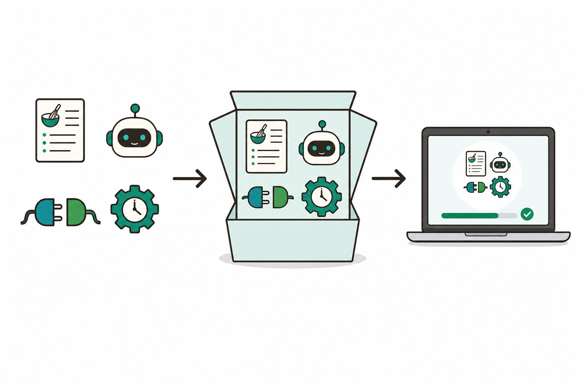
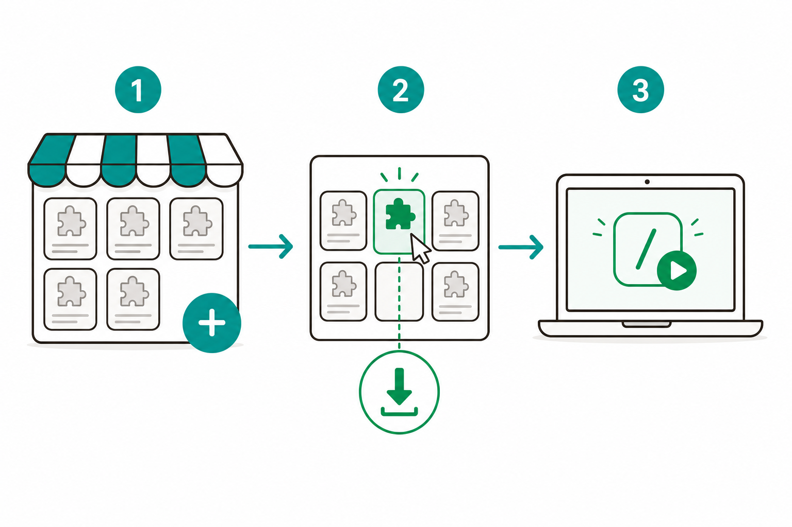
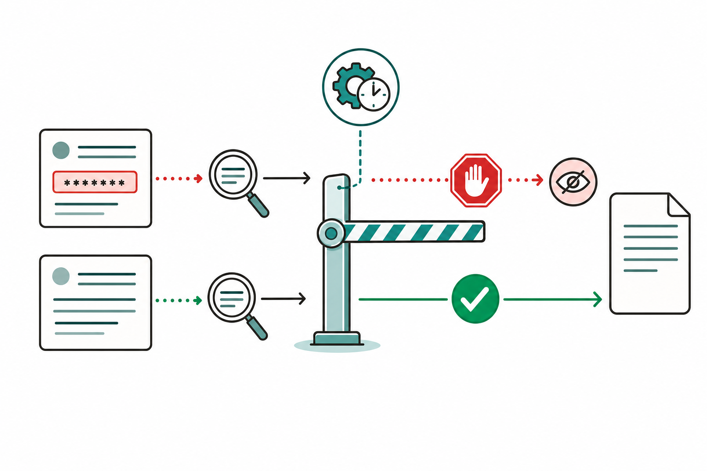
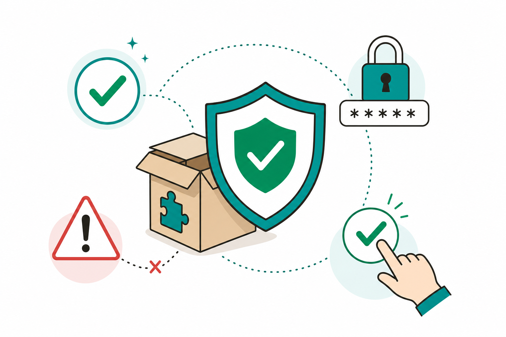

# 슬라이드 2: WHY — 좋은 자동화를 '나 혼자'에서 '우리 팀'으로
<!-- 패턴: F(멀티 섹션: 골든서클 불릿 + 비교표) -->

**왜 Plugin인가?** (골든서클: WHY → HOW → WHAT)

- **WHY**: 잘 만든 스킬·에이전트를 동료에게 주려면 폴더를 일일이 복사하고 설정을 설명해야 함 — **공유가 번거롭고 버전이 제각각**이 됨
- **HOW**: 관련된 스킬·에이전트·MCP·훅을 **하나의 폴더(Plugin)**로 묶고 **마켓플레이스**에 올리면, 동료는 **클릭 한 번**으로 설치
- **WHAT**: 사내 표준 자동화를 **버전과 함께** 배포·업데이트 — 누구 PC에서나 같은 결과

| 구분 | 5회차(개인) | 6회차(오늘, 팀) |
|------|-------------|------------------|
| 공유 방법 | 폴더 직접 복사·설정 설명 | **마켓플레이스에서 클릭 설치** |
| 보관 형태 | 흩어진 SKILL.md·설정 | **하나의 Plugin 꾸러미** |
| 버전 관리 | 사람이 수동 동기화 | **version으로 자동 업데이트** |

> **오늘의 기대치**: 5회차에서 만든 자동화를 **동작하는 Plugin 1개**로 패키징 — 동료가 설치해 바로 쓸 수 있는 상태로 완성

> 노트: 골든서클로 동기 부여. 공식 메시지 "Use plugins when you want to share functionality with your team, need the same skills/agents across projects, want version control and easy updates, or distribute through a marketplace"를 입문자 말투로 전달. WHY(공유의 번거로움·버전 불일치)→HOW(한 폴더로 묶어 마켓플레이스 배포)→WHAT(버전과 함께 사내 표준 배포). 5회차(개인 다단계 Skill)→6회차(팀 배포 Plugin) 대비를 표로 명시. 산출물은 '동작하는 Plugin 1개'임을 도입부에 못박음. 출처: https://code.claude.com/docs/en/plugins

---
# 슬라이드 3: Plugin이란? — 자동화를 묶은 '앱 설치 꾸러미'
<!-- 패턴: B(좌: 3대 이점 카드 그리드 / 우: 개념 이미지) -->

**한 줄 정의**: **Plugin = 스킬·에이전트·MCP·훅을 한 폴더에 묶어 공유·설치하는 패키지** — 설치하면 그 안의 기능이 한꺼번에 추가됨

**왜 좋은가 — 3대 이점(좌측 카드 3개)**
- **[카드 1] 한 번에 설치(Bundle)**
  여러 스킬·에이전트·설정을 따로 옮길 필요 없이 **꾸러미 하나로** 설치
- **[카드 2] 팀 공유(Share)**
  마켓플레이스에 올리면 동료가 **클릭으로** 받아 씀 — 사내 표준 자동화로 확산
- **[카드 3] 버전·업데이트(Version)**
  버전 번호를 붙여 배포하고, 고치면 **업데이트로 전달** — 모두가 같은 최신본 사용

- **쉬운 비유**: Plugin은 **스마트폰 앱** — 앱스토어(마켓플레이스)에서 설치하면 기능이 통째로 추가됨



> 노트: 가장 중요한 개념 슬라이드. 패턴 B(좌: 3카드 개념 / 우: 이미지 1열)로 과밀을 피하고 좌측 3카드+상세에 16pt 이상 폭 확보. 공식 정의 "A plugin is a self-contained directory of components that extends Claude Code... Plugin components include skills, agents, hooks, MCP servers, LSP servers, and monitors"를 입문자 말씨로. 입문자 대상이라 LSP·monitor 등 고급 구성요소는 카드에서 빼고 '스킬·에이전트·MCP·훅' 4종으로 한정(나머지는 구두 보충). 3대 이점(Bundle/Share/Version)은 공식 'Use plugins when' 목록과 일치. '앱 설치 꾸러미'·'스마트폰 앱·앱스토어' 비유로 입문자 친화. 빌더는 좌측 카드 폭이 16pt 본문을 수용하는지 6-1·6-2 검증 수행. 출처: https://code.claude.com/docs/en/plugins , https://code.claude.com/docs/en/plugins-reference

---
# 슬라이드 4: Plugin 구성요소·디렉토리 — 한 폴더에 무엇이 들어가나
<!-- 패턴: C 변형(좌: 폴더 트리 플로우 / 우: 구성요소 표 / 하단: 핵심 박스) -->

**Plugin은 폴더 하나** — 맨 위에 **명함(plugin.json)**, 그 아래 기능별 폴더가 나란히 들어감

**폴더 구조(좌측, 위에서 아래로)**
```
my-plugin/
├── .claude-plugin/
│   └── plugin.json   ← 명함(이름·버전·설명)
├── skills/           ← 스킬들
├── agents/           ← 에이전트들
├── hooks/hooks.json  ← 훅(자동 실행 규칙)
└── .mcp.json         ← MCP(외부 도구 연결)
```

| 구성요소 | 위치 | 담는 내용 |
|----------|------|-----------|
| 명함(필수) | `.claude-plugin/plugin.json` | 이름·버전·설명·작성자 |
| 스킬 | `skills/이름/SKILL.md` | 자동화 레시피(3회차) |
| 에이전트 | `agents/` | 전문 역할 일꾼(4·5회차) |
| 훅 | `hooks/hooks.json` | 이벤트 자동 실행 규칙 |
| MCP | `.mcp.json` | 외부 도구 연결 설정 |

> **핵심 박스**: 명함(`plugin.json`)에 꼭 필요한 건 **이름(name)** 하나. 나머지(skills·agents·hooks·.mcp.json)는 **있는 것만** 자동 인식됨. **주의**: skills·agents·hooks는 반드시 폴더 **맨 위**에 둘 것 — `.claude-plugin/` 안에 넣으면 인식 안 됨

> 노트: [입문자 MUST] '명함=plugin.json'으로 메타데이터를 풀어쓰고, 좌측 트리는 입문자가 한눈에 보도록 4종(skills/agents/hooks/.mcp.json)만 표기(LSP·monitors·bin·settings.json은 구두 보충). 공식 'Plugin structure overview' 표 기반: .claude-plugin/(plugin.json만), skills/(<name>/SKILL.md), agents/, commands/(구식·신규는 skills/ 권장), hooks/(hooks.json), .mcp.json — 모두 plugin root. 공식 경고 "Don't put commands/, agents/, skills/, or hooks/ inside the .claude-plugin/ directory. Only plugin.json goes inside .claude-plugin/"를 핵심 박스 주의로 강조. plugin.json 필드: name(필수·네임스페이스), version·description·author·displayName·homepage·repository·license·keywords(선택) — 수치·전체 목록은 구두/노트, 표엔 핵심만. name은 스킬 네임스페이스가 되어 /plugin-name:skill 형태로 호출됨(구두 보충). 우측이 코드가 아닌 '구성요소 표'라 패턴 주석을 'C 변형'으로 표기. 빌더는 좌측 코드 박스 폰트 16pt 이상 6-1 검증. 출처: https://code.claude.com/docs/en/plugins , https://code.claude.com/docs/en/plugins-reference

---
# 슬라이드 5: 마켓플레이스로 배포·설치 — 추가 → 설치 → 사용
<!-- 패턴: C(플로우 + 코드 박스 + 핵심 박스) -->

**마켓플레이스 = 플러그인 앱스토어** — 카탈로그를 한 번 '추가'하면, 그 안의 플러그인을 골라 '설치'

**설치 흐름(좌측 플로우, GUI 3단계)**
1. **마켓플레이스 추가** — `/plugin` 으로 관리 화면 열기 → **Marketplaces** 탭에서 카탈로그 추가
2. **플러그인 설치** — **Discover** 탭에서 원하는 플러그인 선택 → 설치(개인/프로젝트/로컬 범위 선택)
3. **사용** — `/reload-plugins` 로 적용 → `/플러그인이름:스킬이름` 으로 호출

**명령으로도 가능(우측 코드 박스)**
```
/plugin marketplace add 회사/플러그인저장소   ← 카탈로그 추가
/plugin install 플러그인이름@마켓플레이스이름   ← 설치
/reload-plugins                              ← 재시작 없이 적용
```

> **핵심 박스**: 데스크톱은 **GUI가 기본** — `/plugin` 한 번으로 **Discover·Installed·Marketplaces·Errors** 4개 탭에서 추가·설치·관리·오류확인을 모두 처리. 설치 전 **'무엇이 설치되는지'(스킬·훅·MCP 목록)**를 상세 화면에서 확인 가능



> 노트: 공식 'Discover and install plugins' 기반. 2단계 원리 "Add the marketplace → Install individual plugins"를 '앱스토어 추가 → 앱 설치'로 비유. /plugin 관리 UI는 Discover/Installed/Marketplaces/Errors 4탭(Tab 키 순환). 마켓플레이스 추가는 owner/repo(예: anthropics/claude-code), Git URL, 로컬 경로, 원격 marketplace.json 모두 가능 — 입문자용으로 owner/repo만 코드 박스에 노출. 설치 명령 정확 구문 /plugin install plugin-name@marketplace-name(기본 user scope), 설치 범위 User/Project/Local. 설치 후 /reload-plugins로 재시작 없이 적용. 설치 상세 화면의 'Will install' 섹션(commands·agents·skills·hooks·MCP·LSP 목록)·Context cost를 핵심 박스로 강조해 '무엇이 들어오는지 보고 설치'를 안전 습관과 연결. 빌더는 코드 박스 16pt 6-1 검증. 출처: https://code.claude.com/docs/en/discover-plugins , https://code.claude.com/docs/en/plugins

---
# 슬라이드 6: 버전 관리·업데이트 — 고치면 모두에게 최신본으로
<!-- 패턴: D(표 + 상세) -->

**version 번호가 '언제 업데이트할지'를 정함** (버전 = 배포 단위)

| 방식 | 어떻게 | 업데이트 동작 | 적합한 경우 |
|------|--------|----------------|-------------|
| **버전 명시** | `plugin.json`에 `"version": "1.2.0"` 기입 | 번호를 **올릴 때만** 동료에게 업데이트 전달 | 안정적으로 배포하는 사내 표준 |
| **버전 생략** | `version`을 비워 둠(Git 사용 시) | **매 변경마다** 자동으로 새 버전 취급 | 빠르게 고치는 개발 중 플러그인 |

- **업데이트 받기**: 동료는 `/plugin update` 또는 자동 업데이트로 최신본 수령 → 변경되면 `/reload-plugins` 안내가 뜸
- **버전 올리기 규칙**: `MAJOR.MINOR.PATCH` — 크게 바뀌면 앞자리, 기능 추가는 가운데, 버그 수정은 끝자리

> **ICTK 포인트**: 버전을 명시하면 **검증·승인된 버전만** 팀에 퍼짐 — 아무 변경이나 무단 전파되지 않아 '사람 최종 승인' 원칙과 맞음. 변경 이력은 `CHANGELOG.md`에 남겨 추적성 확보

> 노트: 공식 'Version management' 기반. 버전 해석 우선순위(plugin.json version > marketplace entry version > git commit SHA > unknown)는 고급 정보라 본문에서 빼고 노트로 이동 — 표는 '명시 vs 생략' 2분법에 집중. 공식 경고 "If you set version in plugin.json, you must bump it every time you want users to receive changes. Pushing new commits alone is not enough"를 '번호를 올릴 때만 전달'로 평이화. 버전 생략 시 git commit SHA가 버전이 되어 매 커밋이 새 버전(빠른 반복 개발용). 시맨틱 버저닝(MAJOR.MINOR.PATCH)은 한글 한 줄로. /plugin update·자동 업데이트(공식 마켓플레이스는 기본 on, 서드파티·로컬은 기본 off), 업데이트 후 /reload-plugins. ICTK 보안 메시지는 본 슬라이드에서 '검증된 버전만 전파→사람 최종 승인'으로 1회 배치(슬라이드 10과 중복 회피 위해 가볍게). 빌더는 표 행 높이 0.45~0.55" 6-2 하단 여백 검증. 출처: https://code.claude.com/docs/en/plugins-reference , https://code.claude.com/docs/en/discover-plugins

---
# 슬라이드 7: Hook이란? — 특정 순간에 자동으로 실행되는 규칙
<!-- 패턴: C(플로우 + 코드 박스 + 핵심 박스) -->

**Hook = 정해진 이벤트가 일어날 때 Claude가 자동으로 돌리는 명령** — '도구를 쓰기 직전' 같은 순간에 끼어들어 **허용·차단·수정** 가능

**대표 이벤트(좌측 플로우)**
- **PreToolUse** — 도구 실행 **직전**: 위험하면 **막기** 가능
- **PostToolUse** — 도구 실행 **직후**: 결과 점검·후처리
- **UserPromptSubmit** — 내가 프롬프트를 **보낼 때**
- **SessionStart** — 세션이 **시작될 때**

**민감정보 차단 예시(우측 코드 박스)** — 파일에 쓰기 직전 검사
```
hooks/hooks.json
{ "hooks": { "PreToolUse": [
  { "matcher": "Write|Edit",
    "hooks": [{ "type": "command",
      "command": "비밀번호·키 패턴이면 차단(exit 2), 아니면 통과" }] } ] } }
```

> **핵심 박스**: 훅은 **사람이 일일이 검사하지 않아도** 규칙대로 자동 작동 → ICTK처럼 민감정보가 새면 안 되는 환경에 강력. 차단(exit 2)뿐 아니라 **마스킹**(예: 주민번호를 `******`로 치환)도 가능



> 노트: [입문자 MUST] '이벤트'를 '정해진 순간'으로, 'shell 명령'을 '자동으로 돌리는 명령'으로 풀어씀. 공식 hooks 이벤트 표 기반 — 입문자용으로 4종(PreToolUse·PostToolUse·UserPromptSubmit·SessionStart)만 노출, 전체 목록(Stop·SubagentStop·Notification·PreCompact·SessionEnd 등)은 구두 보충. 공식 설명 "PreToolUse: Before a tool call executes. Can block it / PostToolUse: After a tool call succeeds"를 그대로 반영. 차단 메커니즘 정확 구문(강사 구두/노트): PreToolUse 훅은 (a) 종료코드 2로 종료하면 도구 호출 차단, (b) JSON으로 표준출력에 {"hookSpecificOutput":{"hookEventName":"PreToolUse","permissionDecision":"deny|allow|ask","permissionDecisionReason":"..."}} 반환으로 deny(차단)/allow(승인)/ask(사용자 확인) 제어 가능 — 슬라이드엔 'exit 2로 차단'만 단순 노출, JSON 방식은 구두/노트 보충(미확인 단정 금지). hooks.json 구조는 {matcher, hooks:[{type:command, command}]}, command는 입력을 JSON으로 stdin에서 받아 jq로 .tool_input.file_path 등을 추출(공식 migration 예시 확인). 코드 박스 command는 입문자 이해용 의사코드(실제 셸 스크립트는 실습에서)임을 노트에 명시. matcher "Write|Edit"는 파일 쓰기 도구 매칭(공식 troubleshooting 확인). 빌더는 코드 박스 16pt 6-1 검증. 출처: https://code.claude.com/docs/en/hooks , https://code.claude.com/docs/en/plugins , https://code.claude.com/docs/en/plugins-reference

---
# 슬라이드 8: 실습 ① — 정보조사 스킬+에이전트를 플러그인으로 전환
<!-- 패턴: C(플로우 + 코드 박스 + 핵심 박스) -->

**오늘의 손으로 해보기 ①** — 흩어진 스킬·에이전트를 **플러그인 꾸러미**로 묶기 [직접 실습]

**전환 흐름(좌측 플로우, GUI 4단계)**
1. **폴더 만들기** — "정보조사 스킬·에이전트를 묶을 플러그인 폴더를 만들어줘" → Claude가 `plugin.json`·`skills/`·`agents/` 생성 제안 → **diff를 보고 Accept**
2. **기존 자산 복사** — 5회차에서 만든 SKILL.md·에이전트를 폴더 안으로 옮김(Claude가 대신 정리)
3. **로컬 테스트** — `/plugin marketplace add ./내플러그인폴더` 또는 로컬 로드로 불러와 동작 확인
4. **호출** — `/내플러그인:정보조사` 처럼 **네임스페이스 붙은 이름**으로 실행

**최소 plugin.json(우측 코드 박스)**
```
.claude-plugin/plugin.json
{
  "name": "info-research",
  "description": "주제를 조사해 레포트를 만듦. 정보조사가 필요할 때 사용.",
  "version": "1.0.0"
}
```

> **핵심 박스**: Claude는 플러그인 형식을 이미 알고 있어 **별도 도구 없이** 폴더·명함·구성요소를 만들어 줌. 모든 생성·이동은 **diff Accept/Reject**로 사람이 최종 승인

> 노트: 데스크톱 Code 탭 기준 첫 플러그인 전환. 공식 'Convert existing configurations to plugins' 마이그레이션 흐름(plugin 폴더 생성 → plugin.json 작성 → skills/agents 복사 → 로컬 로드 테스트)을 GUI 말씨로 서술(터미널 mkdir/cp 대신 프롬프트 요청 + diff Accept). 5회차 다단계 Skill+Agent를 패키징 대상으로 명시(학습 연속성). 로컬 테스트는 공식 --plugin-dir 또는 /plugin marketplace add ./경로 둘 다 가능하나 입문자용으로 '로컬 폴더 로드'로 통칭. 호출은 네임스페이스 /plugin-name:skill(공식 "Plugin skills are always namespaced"). 우측 코드 박스는 공식 최소 plugin.json(name·description·version) — description은 3회차 학습대로 3인칭·무엇+언제. 모든 파일 생성·이동은 diff Accept/Reject로 사람 승인(2회차 개념 재활용). 빌더는 코드 박스 16pt 6-1 검증. 출처: https://code.claude.com/docs/en/plugins , https://code.claude.com/docs/en/discover-plugins

---
# 슬라이드 9: 실습 ② — PR 품질 보고서 플러그인 / Hook 민감정보 마스킹
<!-- 패턴: E(카드 그리드 2열: 색상 헤더 바 카드) · 카드 헤더 컬러 B(#1A6E36)/C(#C0530A) -->

**오늘의 손으로 해보기 ②** — 만든 플러그인에 **실용 기능**과 **안전 훅** 더하기

- **[카드 ① PR 품질 보고서 플러그인] 코드 변경 요약·점검 — [직접 실습]** (헤더 B #1A6E36)
  변경분을 점검해 **PR 품질 보고서**를 만드는 스킬+에이전트를 플러그인에 담음
  → 내장 `/code-review`(3회차)와 묶어, 팀이 같은 기준으로 PR을 점검하는 **사내 표준 꾸러미** 완성
- **[카드 ② Hook 민감정보 마스킹] 새기 전에 가리기 — [함께 보기/데모]** (헤더 C #C0530A)
  `hooks/hooks.json`에 **PreToolUse** 훅을 추가 — 파일에 쓰기 **직전** 비밀번호·키·주민번호 패턴을 찾아 **차단 또는 `******`로 마스킹**
  → 사람이 깜빡해도 규칙이 **자동으로** 민감정보 유출을 막음

> **오늘의 산출물(하이라이트 박스)**: 직접 만드는 것은 **카드 ①(PR 품질 보고서 플러그인)** — `plugin.json`·`skills/`·`agents/`를 갖춘 **동작하는 Plugin 1개**

> 노트: 패턴 E(색상 헤더 바 카드 2열)로 실습 2종 명세. 카드 ①은 [직접 실습], 카드 ②(훅)는 [함께 보기/데모] 배지로 난이도 정합 — 산출물 'Plugin 1개' 기대치 유지. 카드 ① PR 품질 보고서는 3회차 내장 /code-review·/security-review와 묶어 사내 표준화 메시지로 연결(공식 pr-review-toolkit·security-guidance 플러그인이 실재함을 구두 보충 가능). 카드 ② 훅은 슬라이드 7의 PreToolUse 차단/마스킹을 실습으로 구체화 — 실제 셸 스크립트는 데모로 보여주고 입문자는 동작 관찰. 마스킹은 PostToolUse가 아닌 PreToolUse 단계에서 입력(tool_input)을 검사·치환하는 방식으로 설명(쓰기 직전 차단이 안전). 카드 헤더 컬러 B(#1A6E36)/C(#C0530A)로 슬라이드 10과 중복 회피. 빌더는 카드 본문 16pt 6-1·하단 여백 6-2 검증. 출처: https://code.claude.com/docs/en/hooks , https://code.claude.com/docs/en/plugins , https://code.claude.com/docs/en/discover-plugins

---
# 슬라이드 10: ICTK 안전 수칙 — 플러그인도 '소프트웨어 설치처럼'
<!-- 패턴: E(카드 그리드 3열: 색상 헤더 바 카드 + 카드별 상세) · 카드 헤더 컬러 B(#1A6E36)/C(#C0530A)/E(#8B1A1A) -->

**보안 IC(PUF) 기업 ICTK의 Plugin 안전 3원칙** — 편리해도 흔들리지 않는 기본기

**3원칙 카드**
- **[카드 1] 신뢰 출처만** (헤더 B #1A6E36)
  플러그인은 **내 PC에서 코드를 실행**할 수 있음 — 내가 만들었거나 Anthropic·사내 검증을 거친 마켓플레이스만. 설치 전 상세 화면의 **'무엇이 설치되는지'**를 반드시 확인
- **[카드 2] 훅으로 민감정보 마스킹** (헤더 C #C0530A)
  PUF·암호 IP 등 ICTK 핵심 보안 자산이 새지 않도록 **PreToolUse 훅**으로 파일 쓰기 직전 **자동 차단·마스킹** — 사람의 실수를 시스템이 보완
- **[카드 3] 사람 최종 승인** (헤더 E #8B1A1A)
  파일 생성·배포는 **diff Accept/Reject**로 사람이 확인. 버전은 **검증된 번호만 올려** 무단 전파 차단

- **프롬프트 인젝션**(외부 플러그인·문서 속 숨은 지시문이 Claude를 속이는 공격)을 경계 — 신뢰되지 않은 마켓플레이스 추가 금지



> 노트: 패턴 E(색상 헤더 바 카드 3열). 공식 보안 경고 "Plugins and marketplaces are highly trusted components that can execute arbitrary code on your machine with your user privileges. Only install plugins and add marketplaces from sources you trust"를 카드 1로. 카드 2는 6·7·9회차 훅 흐름을 ICTK 보안(PUF·암호 IP)으로 1회 강조 — 민감정보는 슬라이드에 일반화('핵심 보안 자산')해 표기. 카드 3은 diff Accept/Reject(2·8회차) + 버전 명시로 무단 전파 차단(6회차) 연결. 설치 전 'Will install' 검토(5회차)를 카드 1에 재강조. 프롬프트 인젝션 정의 재확인(2·3회차 연계). ICTK 보안 강조는 본 슬라이드 1회로 집중(가이드 제약 'ICTK 보안 1회' 준수, 슬라이드 6은 가벼운 언급). 카드 헤더 컬러 B(#1A6E36)/C(#C0530A)/E(#8B1A1A)로 슬라이드 9와 중복 없이 배정. 출처: https://code.claude.com/docs/en/discover-plugins , https://code.claude.com/docs/en/plugins , https://code.claude.com/docs/en/hooks

---
# 슬라이드 11: 정리 · 회차 흐름 · 2주 과제 · 7회차 예고
<!-- 패턴: F(종합) -->

**오늘 배운 것**
- **Plugin = 자동화를 묶은 앱 설치 꾸러미**: 스킬·에이전트·MCP·훅을 한 폴더(`plugin.json` + 구성요소)로 묶어 **마켓플레이스로 배포·설치** / 버전으로 **자동 업데이트**
- **Hook**: 특정 순간(`PreToolUse` 등)에 자동 실행되는 규칙 — **민감정보 차단·마스킹**으로 ICTK 보안 강화

**회차 흐름(타이틀에서 이동)**

| 회차 | 핵심 | 한 줄 |
|------|------|------|
| 5회차 | Skill + Agent 다단계 | 여러 단계를 한 번에 처리하는 개인 자동화 |
| **6회차(오늘)** | **Plugin 개발·배포 + Hook** | **검증된 자동화를 팀 표준 꾸러미로 배포** |
| 7회차(예고) | Cloud LLM API 연동 | STT·TTS·VLM + YouTube 검색 확장 |

**2주 과제 — 5회차 다단계 Skill을 Plugin으로 패키징**: ① **묶기**(SKILL.md·에이전트를 plugin.json과 함께 한 폴더로) → ② **설치 가이드(README) 작성**(설치·사용법) → ③ **설치 테스트**(동료 또는 다른 폴더에서 설치·실행 확인 = 9~11회차 자사 PoC 패키징 사전 연습)

> **7회차 예고 — Cloud LLM API 연동**: 음성을 글로(STT)·글을 음성으로(TTS)·이미지를 이해(VLM)하는 외부 AI API를 연결하고 **YouTube 검색**까지 — 오늘 만든 Plugin에 더 강력한 외부 능력을 더함

> 노트: 분량·과밀 균형 — 타이틀의 회차 흐름 표를 본 슬라이드로 흡수, '오늘 배운 것'은 2불릿, 2주 과제는 인라인 ①②③로 압축(총 11장 유지, §5 분리 권고 회피). 2주 과제 명확화: 5회차 다단계 Skill을 Plugin으로 패키징 + 설치 가이드(README) 작성 — 공식 'Share your plugins'의 "Include a README.md with installation and usage instructions" 반영, 9~11회차 자사 PoC 패키징의 사전 연습임을 명시. 학습 연속성: 5회차(개인 다단계 자동화)→6회차(팀 배포 Plugin + Hook)→7회차(Cloud LLM API: STT/TTS/VLM + YouTube 검색). 'STT/TTS/VLM'은 구두 한 줄 보충(음성↔텍스트·이미지 이해), 깊은 설명은 7회차로. 빌더는 표(3행)+불릿+과제+예고가 한 장에 들어가는지 6-1·6-2 검증, 빡빡하면 '오늘 배운 것'을 한 줄 더 축약. 출처: https://code.claude.com/docs/en/plugins , https://code.claude.com/docs/en/discover-plugins
