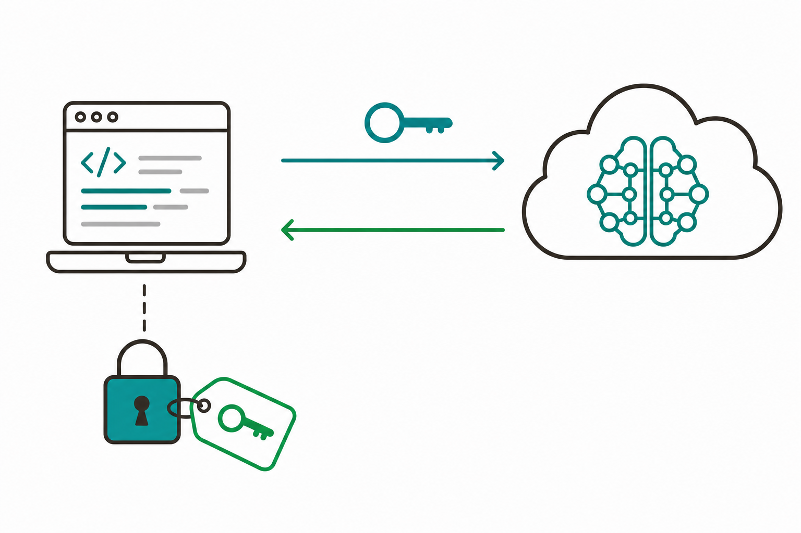
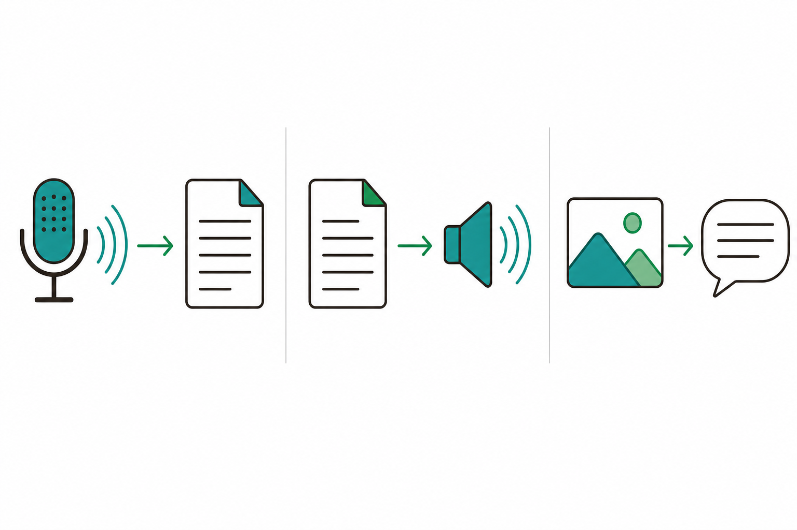
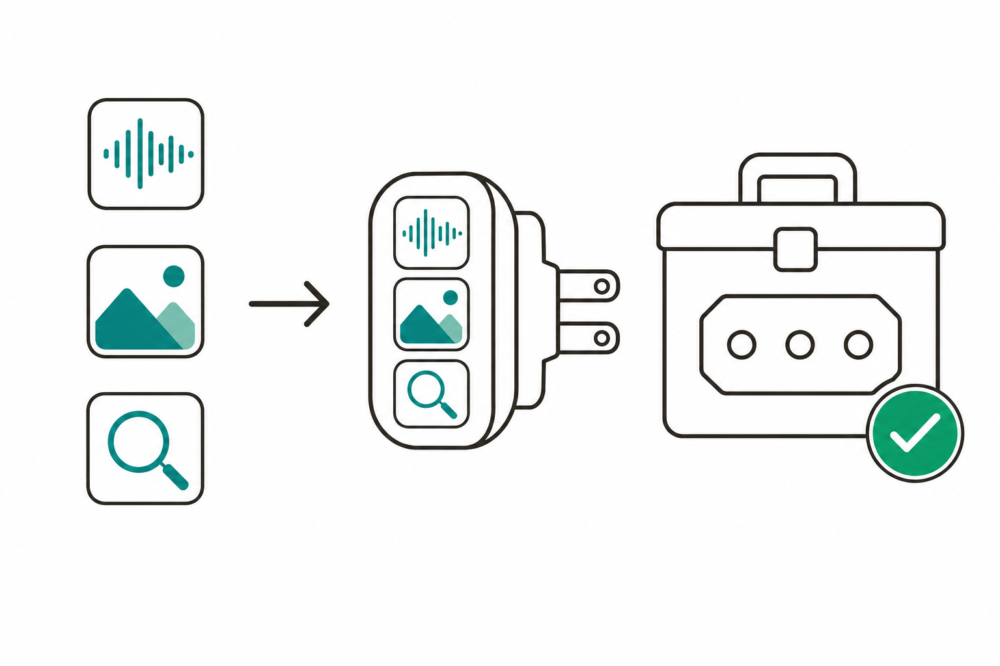
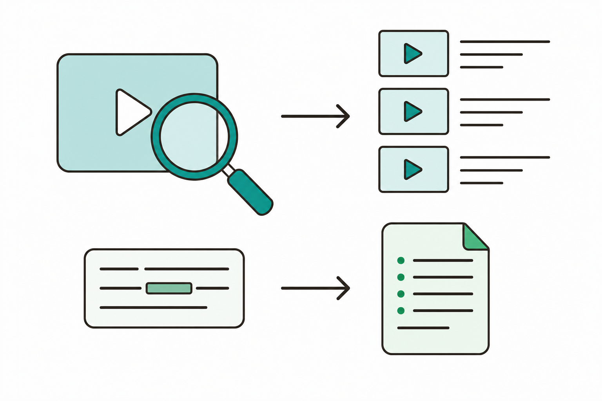

# 슬라이드 2: WHY — 텍스트를 넘으면 자동화할 수 있는 일이 커진다
<!-- 패턴: F(멀티 섹션: 골든서클 불릿 + 비교표) -->

**왜 음성·이미지·영상인가?** (골든서클: WHY → HOW → WHAT)

- **WHY**: 지금까지 자동화는 대부분 **글자(텍스트)** 중심 — 회의 **녹음**, EDA **이미지**, 참고 **영상**처럼 업무 현실은 텍스트 밖에 더 많음
- **HOW**: **Cloud LLM API**(키로 외부 AI 기능을 불러 쓰는 통로)로 STT·TTS·VLM 기능을 호출하고, **YouTube 검색**으로 영상·자막을 가져옴
- **WHAT**: 이후엔 자동화가 **음성을 글로**, **글을 음성으로**, **이미지를 설명으로** 바꾸고 **영상까지 조사** — 6회차 산출물의 쓰임이 넓어짐

| 구분 | 6회차 | 7회차(오늘) |
|------|-------|-------------|
| 다루는 자료 | 주로 텍스트 | **음성·이미지·영상**까지 |
| 새 능력의 출처 | 내가 만든 Skill·MCP | **Cloud LLM API + YouTube 검색** |
| 산출물 | Plugin으로 묶은 자동화 | **LLM API 프로그램 + 자작 MCP** |

> **ICTK 보안 메시지**: 범위가 넓어질수록 기본기가 더 중요 — **녹음·이미지 등 민감 데이터의 외부 전송**은 신중히, **API Key는 코드/파일에 그대로 적지 않기**(데이터 격리 · 사람 최종 승인)

> 노트: 골든서클로 동기 부여. WHY(텍스트 중심 자동화의 한계: 녹음·이미지·영상은 못 다룸)→HOW(Cloud LLM API로 STT/TTS/VLM 호출 + YouTube 검색)→WHAT(음성·이미지·영상까지 자동화). 'API'(키로 외부 AI 기능을 불러 쓰는 통로)는 슬라이드 3에서 본격 설명. 보안 메시지는 ICTK가 보안 IC(PUF) 기업이라 1회 명시 필수 — 민감 데이터 외부 전송 주의·API Key 비하드코딩(슬라이드 9·10에서 심화). 비교표는 6→7회차 확장 한눈에. 출처: https://code.claude.com/docs/en/mcp

---
# 슬라이드 3: LLM API란? — 키로 외부 AI 기능을 불러 쓰기
<!-- 패턴: C(플로우 + 코드 박스 + 핵심 박스) -->

**한 줄 정의**: **API = 내 프로그램이 외부 AI 기능을 불러 쓰는 약속된 창구** — **키(Key)**로 신원을 밝히고 **요청(보냄)** 하면 **응답(받음)** 이 돌아옴

**호출 흐름(좌측 플로우) — 코드는 Claude가 생성·설명**
1. **준비**: 서비스에서 발급받은 **API Key**를 **환경변수·비밀관리**에 보관(코드에 직접 X)
2. **요청**: 내 입력(음성 파일·문장·이미지)을 정해진 형식으로 **보냄**
3. **응답**: AI가 처리한 결과(텍스트·음성·설명)를 **받음**
4. **활용**: 받은 결과를 회의록·메일 등 다음 단계에 사용

**안전한 키 사용(우측 코드 박스, Claude가 만들어 줌)**
```
# ❌ 위험 — 키를 코드에 그대로 적음
api_key = "sk-실제키값..."

# ✅ 안전 — 환경변수에서 읽음(코드/파일엔 키 없음)
import os
api_key = os.environ["LLM_API_KEY"]
```



> **핵심 박스**: 비개발자도 가능 — **요청·응답을 다루는 코드는 Claude가 쓰고 설명**함. 내가 정할 것은 "어떤 입력을 넣어 무엇을 받을지". **API Key는 환경변수·비밀관리로** 보관하고 **코드·SKILL.md·커밋에 노출 금지**

> 노트: API 개념 슬라이드. 'API/키/요청/응답'을 입문자 말투로 — API는 '외부 기능을 불러 쓰는 약속된 창구', 키는 '신원증·이용권'. 흐름은 준비(키 발급·보관)→요청(입력 전송)→응답(결과 수신)→활용. 코드 박스는 키 하드코딩 금지/환경변수 사용 대조(핵심 메시지). 특정 벤더·모델명·가격은 단정 금지 — '대표적으로 서비스에서 키를 발급받아 쓴다' 수준. 키 보관은 환경변수 또는 비밀관리(secret manager)로, .env는 커밋 제외(.gitignore) — 구두 보충. ICTK: 키 유출은 곧 비용·보안 사고이므로 코드/파일/커밋 노출 금지를 강조(슬라이드 10 연결). 코드 박스 회색 배경(#F5F5F7). 출처: https://code.claude.com/docs/en/mcp

---
# 슬라이드 4: STT·TTS·VLM 한눈에 — 음성·이미지를 다루는 3가지 AI
<!-- 패턴: E(카드 그리드 3열: 색상 헤더 바 카드) · 카드 헤더 컬러 A(#3776AB)/B(#1A6E36)/D(#1A5E7E) -->

**입력과 출력이 무엇인지로 구분하면 쉬움** — 세 가지 모두 LLM API로 호출

- **[카드 ① STT] 음성 → 텍스트** (헤더 A #3776AB)
  Speech-to-Text. **녹음 파일을 받아 글로 받아써 줌**(전사)
  → 예: 회의 녹음을 텍스트로 → 회의록의 재료
- **[카드 ② TTS] 텍스트 → 음성** (헤더 B #1A6E36)
  Text-to-Speech. **문장을 받아 사람이 말하듯 읽어 줌**(음성 파일)
  → 예: 공지·요약문을 음성 안내로
- **[카드 ③ VLM] 이미지 → 설명** (헤더 D #1A5E7E)
  Vision-Language Model. **이미지를 이해해 묻는 말에 답함**
  → 예: EDA 이미지를 보고 이상 부위·내용 설명

> **요점**: 셋 다 "**입력(음성/문장/이미지)을 보내면 → 결과(텍스트/음성/설명)를 받는**" 같은 API 호출 구조 — 한 번 익히면 나머지도 같은 방식



> 노트: STT/TTS/VLM 개념 비교 슬라이드. 입력→출력 축으로 정의 — STT(Speech-to-Text, 음성→텍스트/전사), TTS(Text-to-Speech, 텍스트→음성), VLM(Vision-Language Model, 이미지 이해→설명). 모두 일반 용어로 정확히 설명하고 특정 벤더 모델명·정확도·스펙은 단정 금지(필요 시 '대표적으로'·'예시'로). 세 기능이 동일한 API 호출 구조(입력 전송→결과 수신)임을 강조해 학습 부담 경감. EDA(전자설계자동화) 이미지 분석은 ICTK 실습 맥락과 연결(슬라이드 8). 카드 헤더 컬러 A/B/D로 슬라이드 6·9·10과 중복 회피. 이미지는 개념 메타포만(스크린샷류 금지). 출처: https://code.claude.com/docs/en/mcp

---
# 슬라이드 5: 내 프로그램을 MCP 서버로 — Claude·Plugin에 연결
<!-- 패턴: C(플로우 + 코드 박스 + 핵심 박스) -->

**오늘의 핵심 패턴(4회차 재활용)**: API로 만든 프로그램을 **MCP 서버로 감싸면** Claude가 "도구함"에 넣고 부름 → 6회차 Plugin과도 연동

**전환 흐름(좌측 플로우) — 코드는 Claude가 생성·설명**
1. **프로그램**: STT/TTS/VLM·YouTube 검색 등 **기능을 먼저 완성**(API 호출)
2. **감싸기**: 그 기능을 **MCP 도구(Tool)로 노출**하는 작은 서버로 변환(Claude가 코드 작성)
3. **연결**: 데스크톱 Code 탭에 등록 → **사람 승인** 후 사용
4. **결합**: 6회차 Plugin·기존 Skill에서 이 도구를 호출해 자동화 확장

**MCP 서버가 노출하는 것(우측 코드 박스)**
```
도구(Tools)    : Claude가 호출하는 기능 (사람 승인 후 실행)
  예) transcribe_audio(녹음→텍스트)
      describe_image(이미지→설명)
      search_youtube(영상 검색)
```



> **핵심 박스**: "프로그램 만들기 → MCP로 감싸기 → 연결"은 **모든 자작 도구에 동일**하게 적용됨 — 비개발자도 가능(코드는 Claude가). 프로젝트 MCP는 **승인(approval) 후에만** 사용됨

> 노트: MCP 서버화 패턴 슬라이드(4회차 자작 MCP 개념 재활용·심화). 핵심 메시지: 완성한 프로그램을 MCP 서버로 감싸 Claude/Plugin과 연동(비개발자도 가능, 코드는 Claude가 생성·설명). MCP Tool은 "functions called by the LLM, with user approval"이라 사람 승인 후 실행됨을 강조(ICTK 안전모델). 공식 보안: "For security reasons, Claude Code prompts for approval before using project-scoped servers from .mcp.json files." 코드 박스는 노출되는 도구 예시(transcribe_audio/describe_image/search_youtube)로 STT/VLM/YouTube 실습을 미리 연결. 'MCP'(외부 도구를 잇는 표준 통로)·'Tool'은 4회차 학습 용어 재활용, SDK 등 세부는 구두 보충. 코드 박스 회색 배경(#F5F5F7). 출처: https://code.claude.com/docs/en/mcp

---
# 슬라이드 6: YouTube 검색 + 자막 검색 — 영상까지 조사하는 도구
<!-- 패턴: E(카드 그리드 2열: 색상 헤더 바 카드) · 카드 헤더 컬러 A(#3776AB)/D(#1A5E7E) -->

**영상·자막을 가져오는 프로그램을 만들고 → MCP로 감싸 정보조사에 연결**

- **[카드 ① 영상 검색] YouTube Data API** (헤더 A #3776AB)
  키워드로 **관련 영상 목록**(제목·채널·링크)을 가져오는 공개 API
  → 예: "반도체 보안" 관련 영상 상위 N개를 표로 정리
- **[카드 ② 자막 검색] 영상 자막 텍스트** (헤더 D #1A5E7E)
  영상의 **자막(스크립트)을 텍스트로** 가져와 **검색·요약**
  → 예: 긴 발표 영상에서 "PUF"가 언급된 구간만 추려 요약

> **요점**: 영상 목록은 **YouTube Data API**(영상·자막 검색에 쓰는 공개 API)로, 자막은 텍스트로 받아 **검색·요약** — 둘 다 프로그램으로 만든 뒤 **MCP 서버로 감싸** 6회차 정보조사 Plugin에 추가



> 노트: YouTube 검색·자막 검색 슬라이드. YouTube Data API는 '영상·자막 검색에 쓰는 공개 API' 수준으로만 설명(정확 쿼터·엔드포인트·요금은 단정 금지). 카드 ①(영상 검색)=키워드로 관련 영상 목록(제목·채널·링크), 카드 ②(자막 검색)=영상 자막 텍스트를 받아 특정 키워드 구간 검색·요약. 두 프로그램 모두 MCP 서버로 감싸 6회차 정보조사 Plugin에 추가하는 것이 실습(슬라이드 8). YouTube 사용은 서비스 약관·API 정책 준수, 키는 환경변수 보관 — 구두 보충. 카드 헤더 A/D로 중복 회피. 이미지는 개념 메타포만(스크린샷류 금지). 출처: https://code.claude.com/docs/en/mcp

---
# 슬라이드 7: 실습 ① — 회의록 플러그인(녹음→STT→회의록→메일)
<!-- 패턴: C(플로우 + 코드 박스 + 핵심 박스) -->

**오늘의 대표 실습 [직접 실습]**: 회의 녹음을 넣으면 **회의록을 써서 메일까지** 보내는 한 흐름

**자동화 흐름(좌측 플로우)**
1. **녹음 입력**: 회의 녹음 파일을 준비 (시작/입력)
2. **STT 전사**: STT API로 **음성을 텍스트로** 받아씀
3. **회의록 작성**: 전사 텍스트를 **요약·정리**해 표준 회의록 양식으로
4. **메일 발송**: 작성한 회의록을 관련자에게 **메일 초안→사람 확인 후 발송**

**SKILL.md 본문에 적는 작업 단계(우측 코드 박스)**
```
## 작업방법
1. 녹음 파일을 STT MCP로 전사
2. 전사문을 회의록 양식으로 요약·정리
3. 회의록 메일 초안 작성
4. 사람이 확인(diff/검토) 후 발송
```

> **핵심 박스**: 여러 단계(전사→작성→발송)를 **하나의 플러그인 레시피**로 묶음 — STT는 **MCP 도구**로, 메일 발송은 **사람 확인 후**. 녹음에 민감 정보가 있으면 외부 전송 전 한 번 더 점검

> 노트: 회의록 플러그인 실습(대표 실습, [직접 실습]). 흐름: 회의 녹음→STT 전사→회의록 작성→메일 발송. STT는 슬라이드 4·5에서 만든 STT MCP 도구를 호출, 메일 발송은 사람 확인(초안→승인) 후 진행해 ICTK 사람 최종 승인 원칙 준수. 회의 녹음은 민감 데이터일 수 있어 외부 전송 전 점검 강조(슬라이드 10 연결). 여러 단계를 Skill/Plugin 레시피로 묶는 점은 3·6회차 Compose 개념 재활용. 코드 박스는 SKILL.md 작업방법 예시(회색 배경 #F5F5F7). 메일 발송 도구는 환경에 따라 커넥터/MCP 사용 — 구두 보충. 출처: https://code.claude.com/docs/en/mcp

---
# 슬라이드 8: 실습 ②·③ — EDA 이미지 분석(VLM) · YouTube MCP 추가
<!-- 패턴: E(카드 그리드 2열: 색상 헤더 바 카드) · 카드 헤더 컬러 B(#1A6E36)/C(#C0530A) -->

**오늘의 손으로 해보기 — 나머지 2종**

- **[카드 ② EDA 이미지 분석 스킬] VLM MCP — [직접 실습]** (헤더 B #1A6E36)
  VLM API로 **EDA 이미지를 보고 설명**하는 기능을 만들고 **MCP 서버로** 감쌈
  → 예: 도면·검사 이미지를 넣으면 이상 부위·내용을 텍스트로 설명 → 보고서 재료
- **[카드 ③ 정보조사 플러그인 확장] YouTube MCP — [직접 실습]** (헤더 C #C0530A)
  6회차 **정보조사 플러그인**에 **YouTube 영상·자막 검색 MCP**를 추가
  → 예: 주제 검색 시 웹 + **관련 영상·자막 요약**까지 함께 모음

> **오늘의 산출물(하이라이트 박스)**: **LLM API 프로그램 + 자작 MCP** — STT/VLM/YouTube 기능을 MCP로 감싸 회의록·EDA·정보조사에 연결해 완성

> 노트: 실습 ②(EDA 이미지 분석 VLM MCP)·③(정보조사 플러그인에 YouTube MCP 추가) 명세. 두 카드 모두 [직접 실습] — 산출물 'LLM API 프로그램 + 자작 MCP'와 정합. 카드 ②: VLM API로 EDA(전자설계자동화) 이미지를 설명하는 기능을 MCP 서버로 전환(ICTK 도메인 맞춤). 카드 ③: 6회차 정보조사 플러그인에 슬라이드 6의 YouTube 영상·자막 검색 MCP를 추가해 웹+영상 조사로 확장. 슬라이드 7(회의록)과 합쳐 실습 3종 완성. 카드 헤더 B/C로 슬라이드 4·6·10과 중복 회피. 출처: https://code.claude.com/docs/en/mcp

---
# 슬라이드 9: 비용·키 보안·사람 검수 — API를 쓸 때 꼭 챙길 3가지
<!-- 패턴: D(표 + 상세) -->

**Cloud API는 "쓴 만큼 돈이 나가고, 키가 곧 권한"** — 편리함의 뒷면을 함께 본다

| 챙길 것 | 무엇을 | 어떻게 |
|---------|--------|--------|
| **비용** | API는 보통 **사용량만큼 과금** | 큰 파일·대량 호출 전 **규모를 가늠**하고, 불필요한 반복 호출 줄이기 |
| **키 보안** | 키 유출 = 비용·보안 사고 | **환경변수·비밀관리**에 보관, **코드/SKILL.md/커밋에 노출 금지** |
| **사람 검수** | AI 결과는 **틀릴 수 있음** | STT 전사·회의록·이미지 설명은 **사람이 확인 후** 사용·발송 |

- **STT/VLM의 한계**: 전사·이미지 설명이 **부정확할 수 있음** → 중요한 수치·이름은 원본과 대조
- **비용 가늠**: 정확한 단가·한도는 서비스마다 다르므로 **단정하지 말고** 사용 전 공식 안내를 확인

> **요점**: 자동화의 마지막 한 칸은 **사람** — 되돌리기 어려운 작업(발송·제출)일수록 **사람이 최종 승인**

> 노트: API 운영 주의 3종(비용·키 보안·사람 검수) 슬라이드. 비용은 '대체로 사용량 과금' 수준으로만(정확 단가·한도는 벤더마다 달라 단정 금지, 사용 전 공식 안내 확인 권고). 키 보안은 환경변수·비밀관리 보관 + 코드/SKILL.md/커밋 노출 금지(슬라이드 3·10 일관). 사람 검수는 STT 전사·VLM 설명이 부정확할 수 있어 중요한 수치·고유명사는 원본 대조, 발송·제출은 사람 최종 승인. 표 헤더는 옅은 파랑(#E2EEF9). 출처: https://code.claude.com/docs/en/mcp

---
# 슬라이드 10: ICTK 안전 수칙 — Cloud API는 "민감 데이터 경계선"에서
<!-- 패턴: E(카드 그리드 3열: 색상 헤더 바 카드 + 카드별 상세) · 카드 헤더 컬러 B(#1A6E36)/C(#C0530A)/E(#8B1A1A) -->

**보안 IC(PUF) 기업 ICTK의 Cloud API 안전 3원칙** — 외부로 나가는 데이터일수록 더 엄격하게

**3원칙 카드**
- **[카드 1] API Key는 비밀로** (헤더 B #1A6E36)
  키를 **코드·SKILL.md·커밋에 그대로 적지 않기** — **환경변수·비밀관리**로 보관, 유출 시 즉시 폐기·재발급
- **[카드 2] 민감 데이터 외부 전송 주의** (헤더 C #C0530A)
  회의 녹음·EDA 이미지·**ICTK 핵심 보안 자산**을 Cloud API로 보내기 전 **꼭 보내야 하는지** 점검 — 외부 전송 금지 자료는 8회차 **Local LLM**으로
- **[카드 3] 데이터 격리 · 사람 최종 승인** (헤더 E #8B1A1A)
  Claude는 **내가 고른 폴더 안에서만** 작업, MCP는 **승인 후** 사용. 발송·제출은 **diff/검토 후 사람이** 최종 승인

- **신뢰 경계**: 외부 콘텐츠(영상 자막·웹)를 가져오는 도구는 **프롬프트 인젝션**(숨은 지시문이 Claude를 속이는 공격) 위험 — 신뢰되는 도구만 연결

> 노트: ICTK 안전 수칙(7회차판). 카드 1(키 비밀): 환경변수·비밀관리 보관 + 코드/SKILL.md/커밋 노출 금지(핵심 메시지). 카드 2(민감 데이터 외부 전송 주의): 녹음·EDA 이미지·핵심 보안 자산은 Cloud 전송 전 필요성 점검, 외부 전송 금지 자료는 8회차 Local LLM으로 처리(예고 연결). 카드 3(데이터 격리·사람 최종 승인): 폴더 격리 + MCP 승인 + 발송 전 사람 검토(전 회차 일관). 공식 경고 인용 — "Verify you trust each server before connecting it. Servers that fetch external content can expose you to prompt injection risk."(MCP 페이지) — 자막·웹 가져오는 도구에 적용. 카드 헤더 B/C/E로 슬라이드 4·6·8과 중복 회피. 출처: https://code.claude.com/docs/en/mcp

---
# 슬라이드 11: 정리 · 회차 흐름 · 2주 과제 · 8회차 예고
<!-- 패턴: F(종합) -->

**오늘 배운 것**
- **Cloud LLM API = 키로 부르는 외부 AI 기능**: STT(음성→텍스트)·TTS(텍스트→음성)·VLM(이미지→설명)·YouTube(영상·자막 검색)을 호출 — 코드는 Claude가 생성·설명
- **완성한 프로그램은 MCP 서버로 감싸 연결**: 회의록·EDA·정보조사에 연동 / **API Key는 환경변수·비밀관리**, 민감 데이터 외부 전송 주의

**회차 흐름**

| 회차 | 핵심 | 한 줄 |
|------|------|-------|
| 6회차 | Plugin으로 묶어 배포 | 여러 자동화를 하나로 묶어 공유 |
| **7회차(오늘)** | **Cloud LLM API(STT·TTS·VLM) + YouTube MCP** | **음성·이미지·영상까지 자작 MCP로 연동** |
| 8회차(예고) | Local LLM 연동 | 외부 전송 없이 내 PC/온프레미스 경량 모델을 MCP로 |

**2주 과제 — 6회차 산출물에 Cloud LLM API·YouTube MCP 추가**: ① **고르기**(6회차 산출물 중 음성·이미지·영상이 도움될 곳 1개) → ② **연동**(STT/TTS/VLM 또는 YouTube 검색 MCP를 추가) → ③ **실사용·개선**(실제로 돌려보고 키 보안·비용·정확도 개선점 기록 = 8회차 Local LLM 재료)

> **8회차 예고 — Local LLM 연동**: Cloud로 보내기 어려운 **민감 데이터**를 위해, **외부 전송 없이 내 PC/온프레미스에서 도는 경량 모델**을 MCP로 연결 — 오늘의 "외부 전송 주의"를 정면으로 해결함

> 노트: 종합 정리. '오늘 배운 것'은 2불릿(Cloud LLM API 4종 호출 / MCP 서버화·키 보안)으로 축약. 회차 흐름 표(3행)로 6→7→8회차 연결. 2주 과제는 커리큘럼 명시 그대로(6회차 산출물에 Cloud LLM API 연동 + YouTube 검색 MCP 추가) ①②③ 인라인 흐름으로 압축 — 산출물·개선점이 8회차 Local LLM 재료가 됨을 명시. 8회차 예고: Local LLM(외부 전송 없이 내 PC/온프레미스 경량 모델을 MCP로)로 오늘의 '민감 데이터 외부 전송 주의'를 해결. 빌더는 표+불릿+과제+예고가 한 장에 들어가는지 §6-1·6-2 검증, 빡빡하면 '오늘 배운 것' 한 줄 더 축약. 출처: https://code.claude.com/docs/en/mcp
