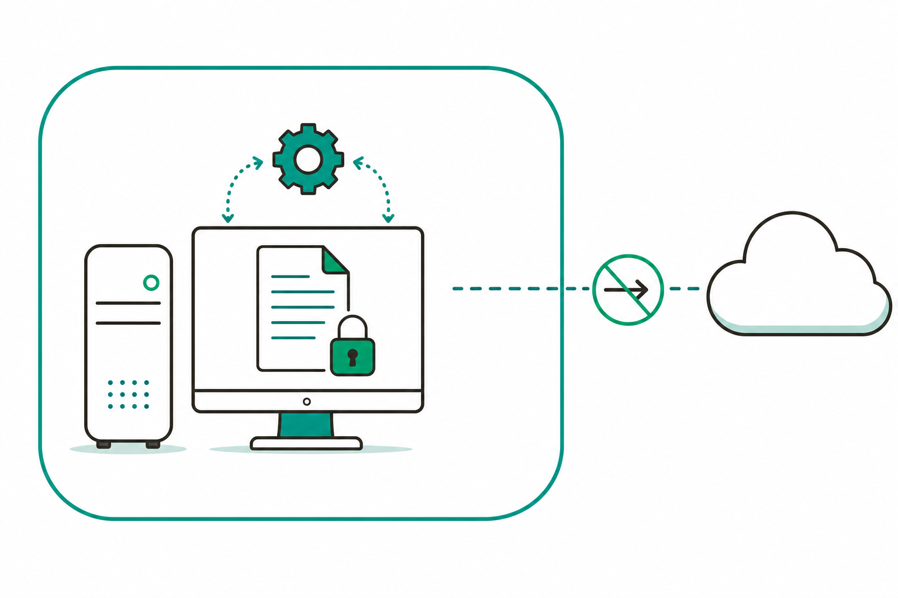
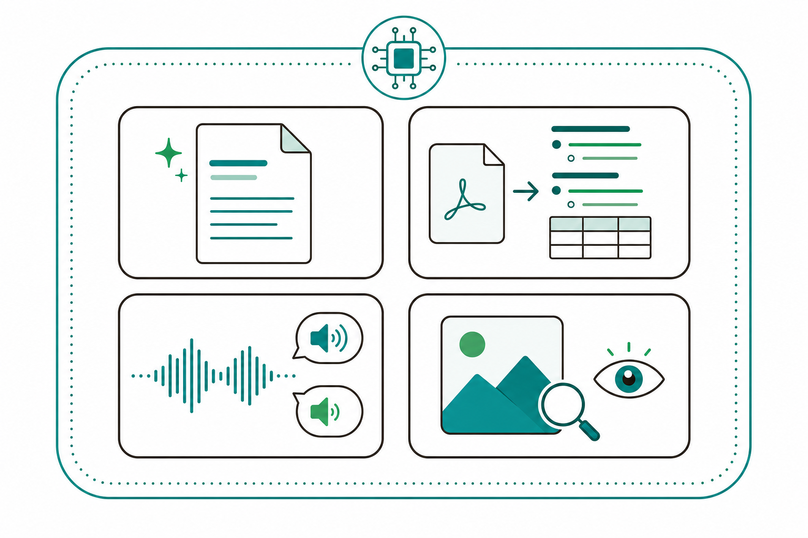
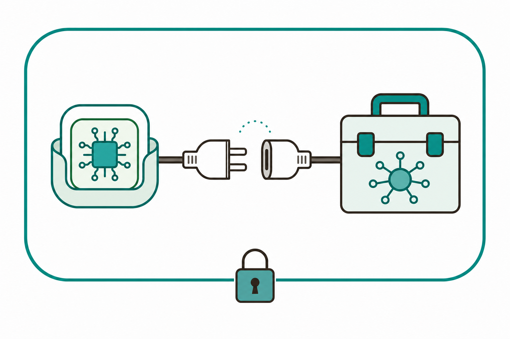

# 슬라이드 2: WHY — 민감한 데이터는 밖으로 내보내지 않는다
<!-- 패턴: F(멀티 섹션: 골든서클 불릿 + 비교표) -->

**왜 Local LLM인가?** (골든서클: WHY → HOW → WHAT)

- **WHY**: 영업비밀·설계자료·고객정보처럼 **밖으로 나가면 안 되는 데이터**가 있음 — 7회차 Cloud API는 편하지만 데이터가 외부 서버로 전송됨
- **HOW**: **Local LLM**(내 PC나 회사 서버 안에서만 도는 경량 AI 모델)으로 처리하면 데이터가 **장비 밖으로 나가지 않음**
- **WHAT**: 그 Local LLM을 **MCP 서버로 감싸** Claude에 연결 → 외부 전송 없이 문서 요약·PDF 변환·회의 받아쓰기·이미지 분석을 자동화

| 구분 | 7회차(Cloud API) | 8회차(오늘 · Local LLM) |
|------|------------------|--------------------------|
| 모델 위치 | 외부 클라우드 서버 | **내 PC / 온프레미스 서버** |
| 데이터 이동 | 처리할 데이터가 외부로 전송 | **장비 밖으로 나가지 않음(데이터 격리)** |
| 강점 | 편의·성능·최신 모델 | **데이터 격리 · 오프라인 가능 · 호출 비용 없음** |

> **ICTK 보안 메시지**: 보안 IC(PUF) 기업 ICTK에 특히 적합 — 민감 자료를 외부 클라우드에 보내지 않고 **온프레미스에서 처리**. Local LLM은 보통 **내 데이터를 학습에 쓰지 않음(비학습)**이라 데이터 주권을 지킴



> 노트: 골든서클로 동기 부여. WHY(밖으로 나가면 안 되는 민감 데이터의 존재)→HOW(Local LLM으로 장비 안에서 처리)→WHAT(MCP로 감싸 Claude에 연결, 외부 전송 없는 4종 자동화). 7회차 Cloud API와 정면 대비 — '편의·성능 vs 데이터 격리·비용'. 'Local LLM'(내 PC/회사 서버 안에서만 도는 경량 AI 모델), '온프레미스'(외부 클라우드가 아니라 우리 회사 장비 안)는 입문자 비유로 1회 풀이. 비학습은 '로컬 실행이므로 외부 학습에 데이터가 흘러가지 않는다'는 일반 원리로 설명하되 특정 제품 정책은 단정 회피. 보안 IC(PUF) 기업 ICTK 적합성은 이 회차 핵심 가치라 명시 필수. 비교표 헤더는 옅은 파랑(#E2EEF9). 출처: https://code.claude.com/docs/en/mcp

---
# 슬라이드 3: Cloud vs Local — 언제 어느 쪽? 한눈에
<!-- 패턴: D(표 + 상세) -->

**둘 다 좋은 도구 — "데이터 민감도"와 "필요한 성능"으로 고름**

| 비교 축 | **Cloud LLM (7회차)** | **Local LLM (오늘)** |
|---------|------------------------|----------------------|
| 데이터 격리 | 외부 서버로 전송됨 | **장비 밖으로 안 나감** |
| 성능·모델 크기 | 최신·대형 모델 가능 | 경량 모델 위주(용도 특화) |
| 비용 | 호출량만큼 과금 | **호출 비용 없음**(장비·전기만) |
| 인터넷 | 항상 연결 필요 | **오프라인도 가능** |
| 준비 | 키 발급하면 바로 | 모델 내려받기·장비 사양 필요 |

- **Local의 강점**: 데이터가 안 나감 · 호출 비용 없음 · 망 분리/오프라인 환경에서도 동작
- **Cloud의 강점**: 가장 크고 똑똑한 모델 · 설치·장비 부담 없음 · 빠른 시작

> **요점**: **민감 데이터 → Local**, **편의·최고 성능 → Cloud**. 슬라이드 8에서 선택 기준을 다시 정리함 — 오늘은 "민감 데이터" 쪽에 집중

> 노트: Cloud(7회차)와 Local(8회차)를 5개 축으로 대비해 의사결정 감각을 줌 — 어느 한쪽이 우월한 게 아니라 '데이터 민감도+필요 성능'으로 고른다는 균형 메시지. Local 단점(경량·장비 사양·모델 내려받기 준비)도 솔직히 표기해 과장 회피. 구체 사양·속도 수치는 장비/모델마다 달라 단정 회피('경량 모델 위주'·'장비 사양 필요'로 일반화). 선택 기준 상세는 슬라이드 8에서 재정리하므로 여기선 한 줄 요점으로 닫음(한 슬라이드 한 메시지). 표 헤더는 옅은 파랑(#E2EEF9). 출처: https://code.claude.com/docs/en/mcp

---
# 슬라이드 4: 오늘의 도구 4종 — 용도별 경량 Local LLM
<!-- 패턴: E(카드 그리드 2×2: 색상 헤더 바 카드) · 카드 헤더 컬러 A(#3776AB)/B(#1A6E36)/C(#C0530A)/D(#1A5E7E) -->

**"무거운 만능 모델 1개"가 아니라 "용도별 경량 모델 4개"** — 각각 잘하는 일이 다름

- **[카드 ① EXAONE] 문서 요약·정리** (헤더 A #3776AB)
  대표적으로 **LG가 공개한 경량 LLM 계열** — 긴 보고서·메일을 **로컬에서 요약**
- **[카드 ② Docling] PDF·문서 구조 변환** (헤더 B #1A6E36)
  PDF·문서를 **표·제목·문단 구조를 살린 텍스트(마크다운 등)**로 변환 — 후속 요약·검색의 입력 재료
- **[카드 ③ Whisper + pyannote] 받아쓰기 + 화자 분리** (헤더 C #C0530A)
  **Whisper = 음성을 텍스트로(STT)**, **pyannote = 누가 언제 말했는지(화자 분리)** — 합치면 **화자별 회의록**
- **[카드 ④ Qwen3-VL] 이미지 이해(VLM)** (헤더 D #1A5E7E)
  사진·도면·표 이미지를 **보고 설명하는 비전-언어 모델** — "이 이미지에 뭐가 있나?"에 답함

> **공통점**: 4종 모두 **로컬에서 동작 → 데이터가 외부로 안 나감**. 각각을 슬라이드 5처럼 **MCP 서버로 감싸** Claude에 연결



> 노트: 4종 대표 도구를 2×2 카드로 개요. 설명은 일반·정확하게, 정확한 버전·벤치마크·라이선스 세부는 단정 회피하고 '대표적으로'·'계열' 표현 사용 — EXAONE=LG가 공개한 경량 LLM 계열(문서 요약 예시), Docling=문서/PDF를 구조 보존 텍스트로 변환, Whisper=OpenAI의 음성인식(STT)·pyannote=화자 분리(speaker diarization), Qwen3-VL=비전-언어 모델(VLM, 이미지 이해). 핵심은 "용도별 경량 모델을 골라 로컬에서 돌린다 + 데이터가 안 나간다 + MCP로 감싼다"이지 모델 스펙 경쟁이 아님. 'STT'(음성→텍스트), '화자 분리'(누가 말했는지 구분), 'VLM'(이미지를 이해하는 모델)은 한 줄 비유 보충. 카드 헤더 컬러 A/B/C/D로 슬라이드 6·9·10과 색상 균형. 출처: https://modelcontextprotocol.io/docs/develop/build-server , https://code.claude.com/docs/en/mcp

---
# 슬라이드 5: 핵심 원리 — Local LLM을 "MCP 서버"로 감싸 연결
<!-- 패턴: C(플로우 + 코드 박스 + 핵심 박스) -->

**왜 MCP로 감싸나?** Local LLM은 그 자체로는 "혼자 도는 프로그램" — **MCP 서버로 감싸야** Claude가 자기 "도구함"에서 불러 씀

**연결 흐름(좌측 플로우) — 코드는 Claude가 생성·설명**
1. **무엇을**: "EXAONE으로 문서를 요약하는 기능을 MCP로 만들어줘"처럼 **말로** 요청
2. **생성**: Claude가 **로컬 stdio MCP 서버** 코드를 대신 작성·설명 → diff Accept로 승인
3. **연결**: 데스크톱에서 MCP로 등록 → 도구가 잘 보이는지 확인
4. **사용**: 이제 Claude가 그 도구를 호출 — **모델이 내 PC에서 돌아 데이터가 밖으로 안 나감**

**MCP 서버가 노출하는 것(우측 코드 박스)**
```
도구(Tools)    : Claude가 호출하는 기능 (사람 승인 후 실행)
              예: summarize_local(텍스트) → 요약문 반환
실행 위치       : 내 PC의 로컬 프로세스(stdio) — 외부 전송 없음
```



> **핵심 박스**: MCP 서버에는 **로컬에서 도는 종류(stdio)**가 있음 — "내 PC의 로컬 프로세스로 직접 시스템에 접근하는 맞춤 스크립트"에 적합. 즉 Local LLM을 감싸기에 딱 맞고, 데이터는 **장비 안에 머묾**

> 노트: 본 회차 핵심 원리 슬라이드. 4회차에서 배운 'MCP=Claude에 외부 도구를 잇는 표준 콘센트' + '자작 MCP 서버가 Tools/Resources/Prompts를 노출' 개념을 재활용해, Local LLM을 MCP 서버로 감싸는 흐름으로 연결. 공식 근거: MCP는 "an open source standard for AI-tool integrations"(code.claude.com/mcp), 서버는 Tools("Functions that can be called by the LLM (with user approval)")를 노출(build-server). 특히 로컬 적합성 근거 직접 인용 — "Stdio servers run as local processes on your machine. They're ideal for tools that need direct system access or custom scripts."(code.claude.com/mcp, Add a local stdio server) → Local LLM 래핑이 정확히 stdio 로컬 서버 시나리오임. build 스킬이 "remote HTTP or local stdio server"를 scaffold함도 동일 페이지에 명시. 데스크톱에선 명령 대신 프롬프트로 요청 후 diff 승인 흐름으로 서술(터미널 표현 금지). 코드 박스는 회색 배경(#F5F5F7)·개념 의사코드(실제 SDK 코드는 Claude가 생성). 'Tools는 사람 승인 후 실행'을 강조해 ICTK 안전모델과 연결. 출처: https://code.claude.com/docs/en/mcp , https://modelcontextprotocol.io/docs/develop/build-server

---
# 슬라이드 6: 실습 1 — 문서 요약(EXAONE) · PDF 변환(Docling) MCP
<!-- 패턴: E(카드 그리드 2열: 색상 헤더 바 카드) · 카드 헤더 컬러 A(#3776AB)/B(#1A6E36) -->

**오늘의 손으로 해보기 (앞 절반)** — 둘 다 **로컬 실행 → 외부 전송 없음**

- **[카드 ① 문서 요약 MCP] EXAONE — [직접 실습]** (헤더 A #3776AB)
  EXAONE을 호출하는 **문서 요약 MCP 서버**를 만들고 등록 → "이 보고서 요약해줘"로 호출
  → 긴 사내 문서를 **외부로 보내지 않고** 로컬에서 요약
- **[카드 ② PDF 변환 MCP] Docling — [직접 실습]** (헤더 B #1A6E36)
  PDF를 **구조 보존 텍스트(마크다운 등)**로 바꾸는 **변환 MCP 서버**를 만듦
  → 변환 결과를 ①의 요약 MCP에 넘기면 **"PDF → 텍스트 → 요약"** 한 줄기로 연결

> **핵심**: 코드는 **Claude가 생성·설명** — 내가 할 일은 "어떤 입력을 받아 무엇을 돌려줄지"를 **말로 정의**하는 것. 두 MCP를 이으면 작은 **로컬 문서 파이프라인** 완성

> 노트: 실습 전반부(문서 요약·PDF 변환) 2종을 카드 2열로 명세. 둘 다 [직접 실습] — 로컬 실행이라 데이터 격리 메시지와 정합. Docling→EXAONE 연결(PDF 변환 결과를 요약에 투입)로 'MCP끼리 이어 파이프라인' 감각을 줌(4회차 Skill+MCP 결합·Compose 개념 재활용). 모델·도구 세부 스펙은 단정 회피, 핵심은 '말로 정의→Claude가 코드 생성→로컬 실행'. 카드 헤더 A/B로 슬라이드 4·7·9·10과 색상 균형. 출처: https://code.claude.com/docs/en/mcp , https://modelcontextprotocol.io/docs/develop/build-server

---
# 슬라이드 7: 실습 2 — STT+화자분리(Whisper+pyannote) · 이미지 분석(Qwen3-VL) MCP
<!-- 패턴: E(카드 그리드 2열: 색상 헤더 바 카드) · 카드 헤더 컬러 C(#C0530A)/D(#1A5E7E) -->

**오늘의 손으로 해보기 (뒤 절반)** — 음성·이미지도 **로컬에서** 처리

- **[카드 ① STT + 화자 분리 MCP] Whisper + pyannote — [직접 실습]** (헤더 C #C0530A)
  녹음 파일을 **텍스트로 받아쓰고(Whisper)**, **누가 언제 말했는지 나눠(pyannote)** **화자별 회의록 MCP 서버**를 만듦
  → 회의 음성을 **외부로 보내지 않고** 화자별 정리
- **[카드 ② 이미지 분석 MCP] Qwen3-VL — [직접 실습]** (헤더 D #1A5E7E)
  도면·표·사진 이미지를 **보고 설명하는 분석 MCP 서버**를 만듦
  → "이 도면에서 핵심 부품을 짚어줘" 같은 질문에 **로컬 VLM**으로 답함

> **ICTK 포인트**: 회의 녹음·설계 도면 같은 **민감 자료**일수록 로컬 처리의 가치가 큼 — 음성·이미지 원본이 **장비 밖으로 나가지 않음**

> 노트: 실습 후반부(STT+화자분리·이미지 분석) 2종을 카드 2열로 명세. 둘 다 [직접 실습]. Whisper(STT)+pyannote(화자 분리) 결합 = 화자별 회의록, Qwen3-VL = 이미지 이해(VLM). 음성·이미지처럼 더 민감한 원본일수록 로컬 처리 가치가 크다는 ICTK 보안 포인트로 닫음. 모델 정확도·언어 지원 등 세부는 장비/버전 의존이라 단정 회피('대표적으로'). 카드 헤더 C/D로 슬라이드 4·6·9·10과 색상 균형. 출처: https://code.claude.com/docs/en/mcp , https://modelcontextprotocol.io/docs/develop/build-server

---
# 슬라이드 8: 언제 Local, 언제 Cloud? — 선택 기준
<!-- 패턴: B(좌: 선택 흐름 다이어그램 / 우: 기준 정리) -->

**섞어 쓰는 게 정답** — 한 업무 안에서도 단계별로 Local/Cloud를 나눠 쓸 수 있음

**고르는 흐름(좌측)**
1. **데이터가 민감한가?** → 예: **Local** 우선(밖으로 안 나감)
2. **인터넷·망 분리 환경인가?** → 오프라인 필요: **Local**
3. **가장 크고 똑똑한 성능이 필요한가?** → 예: **Cloud**(7회차)
4. **그 외 가벼운·반복 작업** → **Local**로 비용 절감

**기준 한눈에(우측)**
- **Local을 고르는 신호**: 민감 데이터 · 오프라인/망 분리 · 호출 비용 줄이기 · 단순·반복 작업
- **Cloud를 고르는 신호**: 최고 성능·대형 모델 · 빠른 시작(설치 부담 X) · 일회성·비민감 작업

> **요점**: "민감하면 Local, 최고 성능이면 Cloud" — **단계별 혼합**도 가능(예: 로컬에서 민감정보 가린 뒤, 비민감 부분만 Cloud로)

> 노트: 의사결정 슬라이드. 슬라이드 3 비교를 '선택 기준'으로 행동화 — 데이터 민감도→망 환경→성능 요구 순으로 분기. Local/Cloud는 배타가 아니라 한 워크플로우 안에서 단계별 혼합 가능(민감정보 마스킹 후 비민감 부분만 Cloud 등)이라는 실무 감각을 줌. 어느 쪽이 옳다는 단정 대신 '신호(signal)'로 제시해 상황 판단을 돕는 톤. 좌측 흐름은 4스텝, 우측은 신호 목록. 출처: https://code.claude.com/docs/en/mcp

---
# 슬라이드 9: ICTK 안전 수칙 — 로컬이라도 "기본기"는 그대로
<!-- 패턴: E(카드 그리드 3열: 색상 헤더 바 카드 + 카드별 상세) · 카드 헤더 컬러 B(#1A6E36)/C(#C0530A)/E(#8B1A1A) -->

**보안 IC(PUF) 기업 ICTK의 Local LLM 안전 3원칙** — "로컬이라 안전"에 방심하지 않기

**3원칙 카드**
- **[카드 1] 온프레미스 · 데이터 격리** (헤더 B #1A6E36)
  Local LLM은 **장비 안에서 처리**되어 데이터가 안 나가는 게 핵심 — 모델·도구도 **신뢰 출처(공식·사내)**에서만 받음
- **[카드 2] 비학습 · 민감정보 비기재** (헤더 C #C0530A)
  로컬 처리라 외부 학습에 데이터가 흘러가지 않음 — 단, **비밀번호·핵심 보안 자산을 MCP 설정/스크립트에 그대로 적지 말 것**(파일은 공유·커밋될 수 있음)
- **[카드 3] 사람 최종 승인** (헤더 E #8B1A1A)
  MCP 도구 실행·편집은 **diff를 보고 Accept/Reject** — Claude는 **내가 고른 폴더 안에서만** 작업

- **프롬프트 인젝션**(외부 문서·이미지 속 숨은 지시문이 Claude를 속이는 공격)은 로컬에서도 경계 — **신뢰하는 MCP 서버만** 연결

> 노트: ICTK 안전 수칙(8회차판). 이 회차 핵심 가치(온프레미스·비학습·데이터 격리)를 3원칙 카드로 정리하고 전 회차 일관 메시지(사람 최종 승인=diff Accept/Reject, 폴더 격리)와 결합. 공식 근거 — "Verify you trust each server before connecting it. Servers that fetch external content can expose you to prompt injection risk"(code.claude.com/mcp), 프로젝트 MCP는 승인 후 사용("Claude Code prompts for approval before using project-scoped servers"). '로컬이라 무조건 안전' 오해 방지: 신뢰 출처 모델·민감정보 비기재·사람 승인은 여전히 필수. 'PUF/암호 IP'는 'ICTK 핵심 보안 자산'으로 일반화. 비학습은 '로컬 실행이라 외부 학습에 흘러가지 않음'의 일반 원리로 설명하되 특정 제품 정책 단정 회피. 카드 헤더 B/C/E로 슬라이드 4·6·7과 중복 회피. 출처: https://code.claude.com/docs/en/mcp , https://modelcontextprotocol.io/docs/develop/build-server

---
# 슬라이드 10: 정리 · 회차 흐름 · 2주 과제 · 9회차 예고
<!-- 패턴: F(종합) -->

**오늘 배운 것**
- **Local LLM = 내 PC/온프레미스에서 도는 경량 모델 → 데이터가 밖으로 안 나감**: 용도별 4종(EXAONE 요약 · Docling PDF변환 · Whisper+pyannote STT+화자분리 · Qwen3-VL 이미지)
- **연결 방식 = 로컬 MCP 서버로 감싸기**: 코드는 Claude가 생성·설명 → 외부 전송 없이 자동화. **민감하면 Local, 최고 성능이면 Cloud**

**회차 흐름**

| 회차 | 핵심 | 한 줄 |
|------|------|------|
| 7회차 | Cloud LLM API · YouTube MCP | 외부 클라우드 모델을 호출(편의·성능) |
| **8회차(오늘)** | **Local LLM 연동(MCP)** | **외부 전송 없이 내 장비에서 처리** |
| 9회차(예고) | ICTK 특화 ① — 지침만의 자사 플러그인 | MCP/API 없이 순수 지침으로 자사 PoC 시작 |

**2주 과제 — 6회차 산출물에 Local LLM 연동 MCP 추가**: ① **고르기**(4종 중 내 업무에 맞는 Local LLM 1개) → ② **만들기**(그 모델을 감싼 MCP 서버를 6회차 산출물에 연결) → ③ **실사용·개선**(민감 자료로 직접 돌려보고 개선점 기록)

> **9회차 예고 — ICTK 특화 ①**: 외부 MCP/API 없이 **순수 지침만으로 자사 업무 플러그인**을 개발 — 오늘까지 익힌 외부·로컬 도구를 잠시 내려놓고, **ICTK 자사 PoC**를 시작함

> 노트: 종합 정리. '오늘 배운 것'은 2불릿(Local LLM 정의+4종 / 로컬 MCP 래핑+선택 기준)으로 축약. 회차 흐름 표(3행)로 7→8→9회차 연결 — 9회차부터 ICTK 자사 PoC(특화) 시작을 명확히. 2주 과제는 커리큘럼 명시 그대로(6회차 산출물에 Local LLM 연동 MCP 추가) ①②③ 인라인 흐름으로 압축. 9회차 예고: ICTK 특화 ①(MCP/API 없이 순수 지침만으로 자사 업무 플러그인, 자사 PoC 시작) — 외부/로컬 도구 학습에서 자사 적용으로 전환점임을 강조. 빌더는 표+불릿+과제+예고가 한 장에 들어가는지 §6-1·6-2 검증, 빡빡하면 '오늘 배운 것' 한 줄 더 축약. 총 10장(11번 예고는 본 슬라이드 9회차 예고로 흡수). 출처: https://code.claude.com/docs/en/mcp , https://code.claude.com/docs/en/desktop
