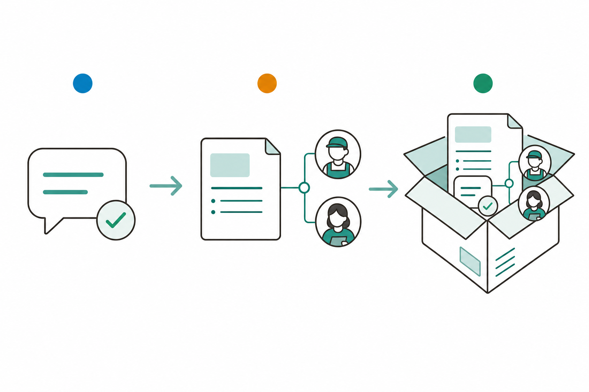

# 슬라이드 2: WHY — 배운 것을 "우리 회사 진짜 업무"에 처음 쓴다
<!-- 패턴: F(멀티 섹션: 골든서클 불릿 + 비교표) -->

**왜 지금 자사 PoC인가?** (골든서클: WHY → HOW → WHAT)

- **WHY**: 1~8회차는 **일반 예제**로 연습했음 — 이제 그 능력을 **내 책상 위 반복 업무**에 적용해야 진짜 가치가 생김
- **HOW**: 1~8회차에서 익힌 **Prompt·Skill·Agent·Plugin**을 그대로 재사용 — 새 기술을 배우는 날이 아니라 **만드는 날**
- **WHAT**: 오늘 끝에는 우리 부서가 매번 손으로 하던 업무 1건이 **동작하는 [지침만] 플러그인**으로 남음

| 구분 | 1~8회차 | 9회차(오늘) |
|------|---------|-------------|
| 다루는 업무 | 일반 예제(요약·회의록 등) | **내 소속 조직의 실제 업무 1건** |
| 목표 | 도구 사용법 학습 | **현업에 바로 쓸 PoC 제작** |
| 산출물 | 연습용 Skill·Plugin | **조별 [지침만] Skill / Skill+Agent 플러그인** |

> **오늘의 기대치**: 외부 도구·API 없이 **지침만**으로 동작하는 PoC를 만듦 — 산출물은 **조별 [지침만] 플러그인 1개(우리 업무 초안 생성용)**

> 노트: 골든서클로 동기 부여. 9회차는 새 기능 학습이 아니라 **적용/제작 워크숍**임을 도입부에서 분명히 함(강사 구두: "오늘은 배우는 날이 아니라 만드는 날"). WHY(연습→실전 가치)→HOW(1~8회차 역량 재사용)→WHAT(동작하는 PoC 1건). 비교표로 1~8회차(연습)→9회차(실전 적용) 전환을 한눈에. 기대치 박스로 '지침만·산출물=조별 플러그인 1개'를 명시해 체감 난이도와 정합. 효과·가치 수치는 본 슬라이드에서 단정하지 않음(슬라이드 5·9에서 'usecases.md 근거 방향성 기대치'로만). 출처: curriculum-plan.md 1-2절(교육 목표)·2장(학습 골격)·3-9절

---
# 슬라이드 3: 왜 [지침만]이 1번 타자인가 — 가장 안전하고 빠른 시작
<!-- 패턴: A(카드 그리드 3열) -->

**ICTK 자사 PoC의 첫 단추로 [지침만]을 고르는 4가지 이유**

**[지침만]의 강점(카드 3개 + 하단 보강)**
- **[카드 1] 외부 도구 불필요 · 비용 거의 0**
  MCP·API·웹 연동 없이 **자연어 지침만**으로 동작 — 추가 설치·연결·요금 부담이 사실상 없음
- **[카드 2] 보안 위험 최소**
  외부와 주고받는 통로가 없어 **데이터 유출 경로 자체가 적음** — 보안 IC 기업 ICTK에 가장 잘 맞는 출발점
- **[카드 3] 즉시 시작 가능**
  3·5회차에서 만든 **Skill / Skill+Agent**를 그대로 재사용 — 오늘 바로 손으로 만들 수 있음

- **공통 한계(하단)**: [지침만] 산출물은 항상 **초안**임 — 사람 검수 게이트를 반드시 거쳐 현업에 반영(슬라이드 9에서 상술)

![[지침만] 플러그인의 강점을 표현한 개념도: 외부 연결선이 없는 닫힌 작업 공간 안에서 지침 문서 하나가 업무 초안을 만들어내는 메타포](images/s3_instructions_only.png)

> 노트: [지침만] 카테고리의 특징을 4이유(외부 불필요·비용 0 / 보안 최소 / 즉시 시작 / + 한계=초안)로 정리. curriculum-plan 3-3절(3회차 [지침만] 특징: 외부 도구 불필요·비용 거의 0·즉시 시작·보안 위험 최소)과 3-9절(9회차) 일치. 보안 위험 최소가 ICTK(PUF·암호 IP 보안 기업)에 특히 잘 맞는 출발점임을 강조하되, '위험 0'이 아니라 '경로가 적다'로 정확히 표현. 카드 3은 3·5회차 산출물(Skill·Skill+Agent) 재사용을 명시해 학습 연속성 확보. 하단에 '산출물=초안, 사람 검수 필수' 한계를 미리 깔아 슬라이드 9(보안 거버넌스)로 연결. 효과 수치 임의 창작 금지 — '비용 거의 0'은 외부 API 미사용에 따른 사실적 진술. 이미지는 우측 또는 하단에 작게 배치(좌측 3카드 16pt 폭 확보). 출처: curriculum-plan.md 3-3절·3-9절, 1-4절

---
# 슬라이드 4: 개발 3단계 — 프롬프트에서 플러그인까지
<!-- 패턴: C(플로우 + 설명 + 핵심 박스) -->

**한 흐름으로 보는 [지침만] PoC 개발 3단계** — 1~8회차에서 이미 한 단계씩 해본 과정

**개발 흐름(좌측 플로우, 위→아래)**
1. **① 프롬프트 제작·테스트** (1~2회차 재사용)
   업무 지시를 5요소(역할·맥락·입력·작업방법·출력·제약)로 구조화해 **실제 입력으로 동작 확인**
2. **② 스킬 + 에이전트 전환** (3·5회차 재사용)
   잘 되는 프롬프트를 **SKILL.md로 승격**하고, 필요하면 **작성자·검토자 서브에이전트**로 역할 분리
3. **③ 플러그인 패키징** (6회차 재사용)
   완성된 Skill·Agent를 **하나의 플러그인으로 묶어** 동료가 설치·실행할 수 있게 정리

**핵심 박스**: 새로 배우는 단계는 없음 — **순서대로 이어 붙이면** 우리 업무용 플러그인이 완성됨. 막히면 "초안 → 테스트 → 개선"을 반복

> 노트: 9회차의 핵심 프로세스 슬라이드. 세부주제(① 프롬프트 제작·테스트 → ② 스킬+에이전트 전환 → ③ 플러그인 패키징)를 좌측 컬러 플로우로 시각화하되, 각 단계가 1~8회차 어느 회차의 재사용인지 괄호로 명시해 '새 기술 없음·조합만'을 강조(1~2회차=프롬프트, 3·5회차=Skill·Agent, 6회차=Plugin). 플로우 스텝은 ppt-guide §3 스텝 컬러(녹색·청색·적색 등) 적용. 핵심 박스로 '순서대로 이어 붙이기 + 초안→테스트→개선 반복'을 메시지화. 패턴 주석은 'C(플로우 + 설명 + 핵심 박스)'로, 진짜 코드블록을 쓰지 않으므로 우측은 단계별 설명 텍스트로 구성(코드 박스 슬라이드 아님). 출처: curriculum-plan.md 3-9절(세부주제: 플러그인 개발 3단계), 2장(학습 골격 단계 매핑)

---
# 슬라이드 5: 조직별 [지침만] 유즈케이스 후보
<!-- 패턴: D(표 + 상세) -->

**조별로 본인 소속(또는 관심) 조직의 [지침만] 1건을 골라 PoC로 개발**

| 조직 | [지침만] 유즈케이스 후보 | 구현 형태 |
|------|------------------------|----------|
| 영업·기술마케팅 | RFP·제안서 초안 / PUF 다국어 영업자료 변환 | Skill+Subagent(작성자·리스크 검토자) |
| PUF솔루션·SW개발 | 보안 SDK 코드리뷰 체크리스트 / 펌웨어 릴리스노트 초안 | Skill(CWE·CERT C 규칙 내장) |
| 품질·신뢰성·보안인증 | CC/FIPS 증적문서 초안 / 신뢰성 시험보고서 통합 작성 | Skill(표준 목차·필수항목 매핑) |
| 칩설계·개발 | 검증계획서·테스트시나리오 초안 / 회귀 실패 로그 Triage | Skill / Skill+Subagent(작성자·커버리지 리뷰어) |
| 경영관리·재무·IR | 이사회·경영보고서 템플릿 / 공시·계약 법무 1차 검토 체크리스트 | Skill(표준 구조·few-shot) |
| 인사·총무 | 채용공고·JD 표준 초안 / 온보딩 체크리스트·안내문 | Skill / Skill+Subagent(직군별 분기) |

> **고르는 기준**: ① **매번 양식·체크리스트가 정해진** 반복 업무 ② **외부 데이터 없이** 내가 가진 자료·지침만으로 초안이 나오는 일 ③ 효과는 PoC로 **베이스라인 측정 후** 확인(임의 단정 금지)

> 노트: curriculum-plan 3-9절 조직별 [지침만] 실습 표를 그대로 반영(영업·기술마케팅 / PUF솔루션·SW개발 / 품질·신뢰성·보안인증 / 칩설계·개발 / 경영관리·재무·IR / 인사·총무 6개 조직). 6행 표이므로 ppt-guide §3 테이블 배치 규칙상 수직 1열 배치. 수강자는 본인 소속 또는 관심 조직 1건을 선택. '고르는 기준' 박스로 [지침만]에 적합한 업무 선별 가이드 제공(정형 양식·외부 데이터 불필요·베이스라인 측정). 효과·시간절감 수치는 본 슬라이드에서 단정하지 않고 '베이스라인 측정 후 확인'으로 처리 — usecases.md 근거 방향성 기대치 원칙 준수, 임의 창작 금지. PUF·암호 IP 관련 자료(다국어 영업자료·SDK 등)는 격리 환경 처리 전제(슬라이드 9 상술). 출처: curriculum-plan.md 3-9절 실습 매핑 표(usecases.md 3장·부록 5-1 근거)

---
# 슬라이드 6: 선행 과업 — 우리 지식을 먼저 "마크다운"으로 정리
<!-- 패턴: A(카드 그리드 3열) -->

**[지침만] PoC의 재료는 "우리가 이미 가진 지식"** — 만들기 전에 1차 정리부터

**먼저 마크다운으로 모을 3가지(카드)**
- **[카드 1] 사내 지식베이스**
  업무 표준·규정·자주 묻는 질문 등 **흩어진 노하우**를 한 폴더의 마크다운 문서로 모음
- **[카드 2] 용어집(Glossary)**
  PUF·CC·FIPS·약어 등 **우리 회사·업계 용어**의 정의를 정리 — Claude가 같은 의미로 이해하게 함
- **[카드 3] 표준 템플릿**
  보고서·증적문서·체크리스트 등 **자주 쓰는 양식**을 마크다운으로 고정 — 초안 품질의 기준이 됨

- **왜 먼저 하나(하단)**: 지침만 PoC의 결과 품질은 **재료(지식·용어·양식)의 품질**에 좌우됨 — 재료가 좋아야 초안이 좋음

> 노트: usecases.md 5-2절 1단계(사내 지식베이스·용어집·표준 템플릿을 마크다운으로 1차 구축)를 9회차 선행 과업으로 반영. curriculum-plan 3-9절 '실습 운영'에 명시된 선행 과업. [지침만]은 외부에서 정보를 못 가져오므로 PoC 품질이 전적으로 입력 재료에 달려 있음을 강조('garbage in, garbage out'을 쉬운 말로). 마크다운으로 모으는 이유는 1~8회차에서 익힌 파일 읽기/쓰기 흐름과 직결(Claude가 폴더 내 마크다운을 읽어 초안 생성). 용어집은 PUF·CC·FIPS 등 ICTK 도메인 용어 정의 — 같은 단어를 같은 뜻으로 처리하게 하는 효과. 보안: 이 단계에서 영업비밀(PUF·암호 IP)이 포함된 자료는 격리 환경에서만 정리(슬라이드 9). 출처: curriculum-plan.md 3-9절 실습 운영(usecases.md 5-2 1단계)

---
# 슬라이드 7: 하네스 엔지니어링 적용 — 품질·비용·보안 점검
<!-- 패턴: E(카드 그리드 3열: 색상 헤더 바 카드) · 카드 헤더 컬러 A(#3776AB)/B(#1A6E36)/D(#1A5E7E) -->

**"하네스 엔지니어링" = PoC가 잘 돌도록 주변 환경을 다듬는 일** — 만든 뒤 한 번 더 점검

**3대 점검(색상 헤더 바 카드)**
- **[카드 ① 품질] 의도대로 나오는가** (헤더 A #3776AB)
  description에 **무엇+언제** 키워드를 잘 넣었는지, 본문 지침이 **누락 없이** 초안을 만드는지 실제 입력으로 확인
- **[카드 ② 비용] 가볍게 도는가** (헤더 B #1A6E36)
  SKILL.md 본문은 **짧게**(권장 500줄 이하) — 길수록 매번 읽어 비용이 늘기 때문. 불필요한 설명 제거
- **[카드 ③ 보안] 새는 곳은 없는가** (헤더 D #1A5E7E)
  민감정보(비밀번호·고객정보·PUF/암호 IP)를 **SKILL.md에 그대로 적지 않기** — 파일은 공유·커밋될 수 있음

- **점검 리듬(하단)**: "돌려보고 → 어긋난 곳 찾고 → 지침 고치고" 반복 — 한 번에 완성하려 하지 말 것

> 노트: 9회차 세부주제 '하네스 엔지니어링 적용'을 입문자 눈높이로 정의 — '모델 주변(지침·입력 재료·점검 절차)을 다듬어 출력 품질을 끌어올리는 일'. 품질/비용/보안 3축으로 점검표 제시: 품질은 3·5회차 description 작성 원칙(무엇+언제 키워드, 3인칭) 재사용, 비용은 3회차 본문 간결 원칙(500줄 이하·세션 내 컨텍스트 잔존→토큰 비용) 재사용, 보안은 3·4회차 안전수칙(민감정보 비기재) 재사용. 카드 헤더 컬러는 A(#3776AB)/B(#1A6E36)/D(#1A5E7E)로 슬라이드 9(B/C/E)와 중복 회피. 하단 '돌려보고→찾고→고치고' 반복은 슬라이드 4 '초안→테스트→개선'과 일관. 토큰=AI가 읽는 글자 분량은 3회차에서 학습한 개념 재활용(구두 1회 보충). 출처: curriculum-plan.md 3-9절(세부주제: 하네스 엔지니어링 적용), 3-3절(본문 간결·[지침만] 특징)

---
# 슬라이드 8: 조별 실습 진행 방식 · 역할 분담
<!-- 패턴: C(플로우 + 설명 + 핵심 박스) -->

**조별 PoC 실습은 이렇게 진행** — 한 사람이 다 하지 않고 역할을 나눔

**실습 흐름(좌측 플로우, 위→아래)**
1. **주제 선정**: 슬라이드 5 표에서 조의 [지침만] 유즈케이스 **1건 합의** + 선행 재료(슬라이드 6) 확인
2. **분담 개발**: ① **프롬프트 담당**(5요소 작성·테스트) ② **지침/템플릿 담당**(재료·용어집 정리) ③ **검토 담당**(초안 점검·개선점 기록)
3. **통합·점검**: SKILL.md(필요 시 +Agent)로 묶고 **하네스 점검(슬라이드 7)** 후 짧게 공유

**핵심 박스**: 결과물보다 **"우리 업무가 어디까지 자동화되나"를 함께 발견**하는 것이 목적 — 완벽한 PoC가 아니어도 됨. 막히면 강사·동료에게 즉시 질문

> 노트: 조별 실습 운영 방식과 역할 분담을 구체화. 3역할(프롬프트 담당 / 지침·템플릿 담당 / 검토 담당)은 5회차 작성자·검토자 역할 분리 개념과 연결되며, [지침만] PoC에서 사람이 직접 나누는 분업으로 제시(서브에이전트 자동 분업과는 별개로, 사람 협업 차원). 흐름은 슬라이드 4 개발 3단계와 슬라이드 7 하네스 점검을 실습 운영으로 엮음. 패턴 C(플로우+설명+핵심박스), 코드블록 없음. 핵심 박스로 '완벽한 PoC가 목적이 아니라 자동화 가능 범위 발견이 목적'을 명시해 입문자 부담 경감(curriculum-plan 1-3 입문자 친화). 시간 배분은 9~11회차 실습 우선 배정(curriculum-plan 2-1 주석) 반영 — 강사 구두로 보충. 출처: curriculum-plan.md 3-9절 실습 운영, 3-5절(역할 분리), 2-1절(시간 배분)

---
# 슬라이드 9: ICTK 보안 거버넌스 — PoC에도 흔들리지 않는 기본기
<!-- 패턴: E(카드 그리드 3열: 색상 헤더 바 카드 + 카드별 상세) · 카드 헤더 컬러 B(#1A6E36)/C(#C0530A)/E(#8B1A1A) -->

**보안 IC(PUF) 기업 ICTK의 PoC 4원칙** — [지침만]이라도 반드시 지키는 게이트

**4원칙(카드 3개 + 하단 1원칙)**
- **[카드 1] 데이터 격리** (헤더 B #1A6E36)
  영업비밀(PUF·암호 IP) 포함 자료는 **격리 환경에서만** 처리 — 외부로 내보내지 않음(온프레미스·비학습 전제)
- **[카드 2] 사람 검수 게이트** (헤더 C #C0530A)
  PoC 산출물은 모두 **초안** — 전문가·책임자가 **diff로 Accept/Reject** 후에만 현업 반영
- **[카드 3] 고위험 단계 제외** (헤더 E #8B1A1A)
  **테이프아웃 사인오프·인증서 발급·전표 입력** 등 되돌리기 어려운 단계는 자동화 범위에서 **의도적으로 제외**

- **[원칙 4] 정직한 측정(하단)**: 효과 수치는 **방향성 기대치**일 뿐 — PoC로 **내부 베이스라인을 측정**한 뒤 확정(임의 단정 금지)

> 노트: curriculum-plan 1-4절 보안 거버넌스 공통 전제를 9회차 [지침만] PoC에 맞춰 4원칙으로 압축. [지침만]은 외부 연동이 없어 위험이 최소이지만, ICTK는 PUF·암호 IP가 핵심 자산인 보안 IC 기업이므로 ① 데이터 격리(온프레미스·비학습) ② 사람 검수 게이트(산출물=초안, diff Accept/Reject) ③ 고위험 제외(테이프아웃 사인오프·인증서 발급·전표 입력) ④ 정직한 측정(방향성 기대치, 베이스라인 측정 후 확정)을 필수 적용. 카드 헤더 B/C/E는 슬라이드 7(A/B/D)과 중복 회피. 사람 최종 승인·diff Accept/Reject는 전 회차 일관 메시지(2~5회차 재활용). '정직한 측정'은 효과 수치 임의 창작 금지 원칙과 직결 — CLAUDE.md 정직한 보고 규칙과도 부합. 출처: curriculum-plan.md 1-4절(보안 거버넌스 공통 전제), 3-9절 ICTK 전제 반영

---
# 슬라이드 10: 정리 · 회차 흐름 · 2주 과제 · 10회차 예고
<!-- 패턴: F(종합) -->

**오늘 한 것**
- **자사 PoC 첫걸음**: 1~8회차 역량(Prompt·Skill·Agent·Plugin)을 재사용해 우리 부서의 [지침만] 업무 1건을 **동작하는 플러그인**으로 제작
- **3단계 + 점검**: ①프롬프트 ②스킬+에이전트 ③패키징으로 만들고, **하네스 점검(품질·비용·보안)** + **보안 게이트**(격리·검수·고위험 제외·정직한 측정) 적용

**회차 흐름**

| 회차 | 핵심 | 한 줄 |
|------|------|------|
| 8회차 | 파이썬 LLM API + 자작 MCP | 코드·자작 도구로 확장 |
| **9회차(오늘)** | **ICTK 특화 ① [지침만] PoC** | **배운 것을 우리 업무에 처음 적용** |
| 10회차(예고) | ICTK 특화 ② [MCP·API] | 자사 PoC에 외부 데이터·도구 연동 |

**2주 과제 — 오늘 만든 [지침만] PoC를 실전에서 단련**: ① **실행**(실제 업무 입력으로 3회 돌려보기) → ② **개선**(누락·오류 등 개선점 반영) → ③ **베이스라인 기록**(소요시간·누락 건수 측정 = 10회차 [MCP·API] 확장의 재료)

> **10회차 예고 — ICTK 특화 ② [MCP·API]**: 오늘 만든 [지침만] PoC에 **OpenDART·koreanlaw 등 외부 데이터·도구를 연동**해 자동화 범위를 넓힘 — 4·8회차 MCP 역량을 자사 업무에 적용

> 노트: 종합 정리. '오늘 한 것'은 2불릿(자사 PoC 첫걸음 / 3단계+점검+보안게이트)으로 축약. 회차 흐름 표(3행)로 8→9→10회차 연결(8회차=파이썬·자작MCP, 10회차=[MCP·API] 연동). 2주 과제는 curriculum-plan 3-9절 명시 그대로(선택한 [지침만] PoC를 실제 업무 입력으로 3회 실행·개선, 베이스라인=소요시간·누락 기록) ①②③ 인라인 흐름으로 압축 — 산출물이 10회차 [MCP·API] 확장 재료가 됨을 명시. 베이스라인 기록은 '정직한 측정' 원칙의 실천(슬라이드 9 연결). 10회차 예고: [MCP·API] 유즈케이스(OpenDART·koreanlaw 등 실재 도구 우선), 4·8회차 MCP 역량 재사용. 빌더는 표+불릿+과제+예고가 한 장에 들어가는지 ppt-guide §6-1·6-2 검증, 빡빡하면 '오늘 한 것' 한 줄 더 축약. 출처: curriculum-plan.md 3-9절(2주 과제)·3-10절(10회차)·2장(회차 로드맵)
