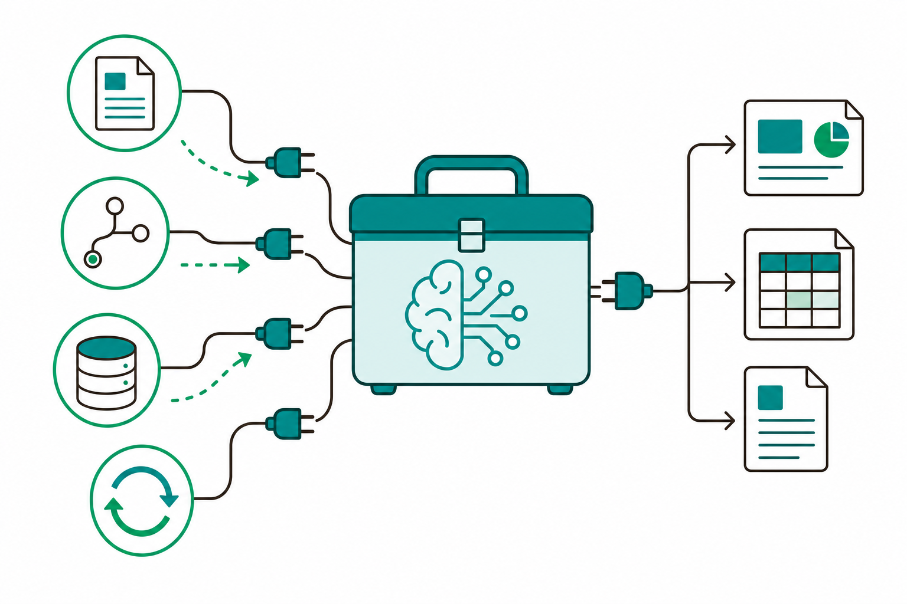
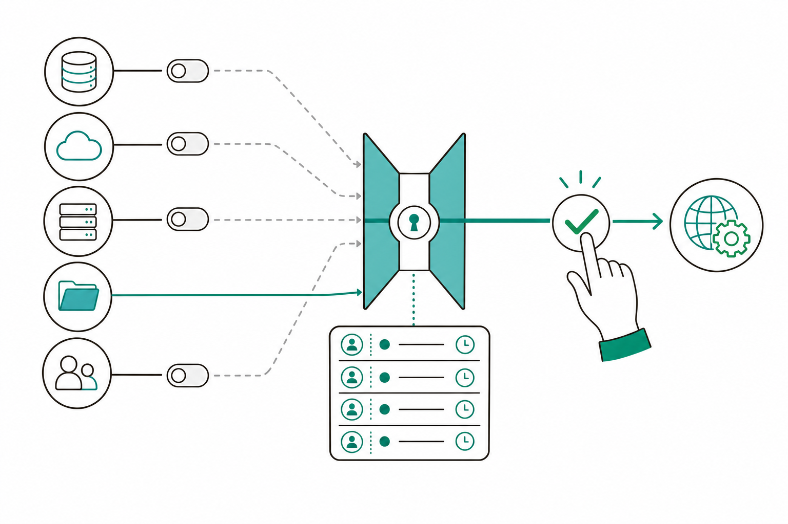

# 슬라이드 2: WHY — 지침만으로는 "최신 데이터"를 못 본다
<!-- 패턴: F(멀티 섹션: 골든서클 불릿 + 비교표) -->

**왜 [MCP·API] 연동인가?** (골든서클: WHY → HOW → WHAT)

- **WHY**: 9회차 [지침만] PoC는 **내가 붙여넣은 자료 안**에서만 동작 — 공시·시험데이터·이슈처럼 **밖에서 계속 바뀌는 정보**는 매번 사람이 찾아 붙여야 함
- **HOW**: Claude Code에 **MCP(외부 도구를 잇는 표준 통로)** 또는 **API(시스템이 주고받는 약속된 창구)** 를 연결해 데이터를 **직접 가져오게** 함
- **WHAT**: 이후엔 "최신 공시를 요약해줘" 한 마디로 **실시간 조회 → 정리 → 초안**까지 한 흐름으로 자동화

| 구분 | 9회차 [지침만] | 10회차 [MCP·API](오늘) |
|------|---------------|------------------------|
| 다루는 데이터 | 내가 붙여넣은 고정 자료 | **외부에서 실시간으로 가져온 최신 데이터** |
| 외부 시스템 | 연결 없음 | **OpenDART·GitHub·법령 등 연결** |
| 사람의 일 | 자료 수집·붙여넣기 반복 | **연결은 자동, 사람은 검토·확정에 집중** |

> **오늘의 기대치**: 9회차 PoC에 **외부 연동 1건을 추가**하거나, 본인 조직의 **[MCP·API] 1건을 신규 개발** — 산출물은 **[MCP·API] 연동 플러그인**

> 노트: 골든서클로 동기 부여. 9회차 PoC의 한계(붙여넣은 자료 내에서만 동작)를 출발점으로, 외부 연동이 더하는 가치(실시간성)를 명확히 함. 'MCP'·'API'는 슬라이드에서 한 줄 풀이 병기(MCP=외부 도구를 잇는 표준 통로, API=시스템이 주고받는 약속된 창구) — 2·4회차 학습 용어 재활용이므로 깊은 설명은 생략. 비교표는 9회차↔10회차 2열로 '데이터·외부시스템·사람의 일' 3축만. 효과·수치는 방향성으로만 두고 정량 수치는 노출하지 않음(curriculum 1-4 정직한 측정). 출처: curriculum-plan.md 3-9·3-10절

---
# 슬라이드 3: [MCP·API]가 더하는 것 — 실시간 데이터 · 외부 시스템
<!-- 패턴: B(좌: 3대 효과 카드 그리드 / 우: 개념 이미지) -->

**한 줄 정의**: **[MCP·API] 연동 = Claude Code가 외부 데이터·시스템에 직접 손을 뻗는 것** — 사람이 옮겨 나르던 일을 도구가 대신함

**무엇이 더해지나 — 3대 효과(좌측 카드 3개)**
- **[카드 1] 실시간 데이터**
  공시·시험결과·이슈·법령처럼 **계속 바뀌는 정보**를 그 자리에서 조회 — "지금 기준" 자료로 작업
- **[카드 2] 외부 시스템 연동**
  OpenDART·GitHub·Jira·법령 시스템과 **이어 붙여** 조회·요약·라벨링까지 한 흐름으로
- **[카드 3] 산출물 자동 생성**
  모은 데이터를 **pptx·xlsx·docx** 같은 실제 파일 형태로 정리 — 표·문서 초안까지 한 번에

- **쉬운 비유**: [지침만]이 '레시피'라면, [MCP·API]는 **냉장고·시장과 연결된 부엌** — 재료를 직접 가져와 요리

> 노트: 가장 중요한 개념 슬라이드. 좌측 3카드(실시간 데이터 / 외부 시스템 연동 / 산출물 자동 생성), 우측 이미지 1장으로 패턴 B 구조 일치. 도구명은 curriculum 3-10 표에 실제 등장한 것만 사용(OpenDART·GitHub·Jira·법령) — 임의 창작 금지. 'pptx·xlsx·docx'는 산출물 생성 도구로 3-10 표에 명시됨. 비유는 9회차 '레시피'에 이어 '연결된 부엌'으로 연속성 유지. 빌더는 좌측 카드 폭이 16pt 본문을 수용하는지 6-1·6-2 검증 수행. 출처: curriculum-plan.md 3-10절

---
# 슬라이드 4: 조직별 [MCP·API] 유즈케이스 · 핵심 도구
<!-- 패턴: D(표 + 상세) · 행 6개 → 수직 단일 표 -->

**내 조직은 무엇을, 어떤 도구로?** — curriculum 유즈케이스 표(실재·전례 있는 도구 중심)

| 조직 | [MCP·API] 유즈케이스(예) | 핵심 도구 |
|------|--------------------------|----------|
| 영업·기술마케팅 | 기업정보 리서치 / 산출물 생성 / 리드·미팅 협업 | OpenDART MCP · pptx·xlsx·docx · Gmail·Slack MCP |
| 경영관리·재무·IR | 공시·재무 수집·요약 / 실적·IR Deck 초안 | OpenDART MCP · pptx·xlsx |
| 품질·신뢰성·보안인증 | 시험데이터 분석·집계 / 표준·규제 변경 추적 | filesystem MCP · python_repl · brave-search |
| PUF솔루션·SW개발 | GitHub·Jira 이슈·PR 요약·라벨링 / 릴리스노트 | GitHub MCP · Jira API · GitHub Actions |
| 칩설계·개발 | 오픈소스 EDA 피드백 루프 / 버그 트래커 요약 | filesystem MCP · Bash · GitHub·Jira |
| 인사·총무 | 급여 발송 검증 / 노동법 영향 점검 보고서 | xlsx · koreanlaw MCP · Sheets |

> **고르는 법**: 본인 조직 행에서 **1건만** 선택 — 9회차에 만든 [지침만] PoC와 **이어지는 것**부터(예: 문서 초안 PoC → 거기에 공시 조회 연동)

> 노트: 패턴 D(표 + 상세). 6개 조직 행이므로 ppt-guide §5 테이블 배치 규칙에 따라 좌우 분할 없이 수직 단일 표로 배치(행 6개 이상 → 수직). 표 내용은 curriculum 3-10 표를 그대로 옮기되 입문자 가독성을 위해 유즈케이스를 2~3건으로 압축. 도구명은 표에 등장한 것만(OpenDART·pptx·xlsx·docx·Gmail·Slack·filesystem·python_repl·brave-search·GitHub·Jira·GitHub Actions·Bash·koreanlaw·Sheets) — 임의 창작 금지. 선택 가이드는 9회차 PoC 연속성 강조(curriculum 3-10 실습 운영). 개념 이미지(s4_org_tool_map)는 표가 세로로 길어 공간이 빠듯하면 생략 가능한 보조 요소이며, 넣을 경우 표 우측 또는 고르는 법 박스 옆 좁은 폭에 작게 배치(표의 12pt 이상 가독성 우선). 빌더는 행 높이를 넉넉히(0.5") 잡고 12pt 이상 폰트 확보, 하단 여백 1.0인치 미만 검증. 출처: curriculum-plan.md 3-10절

---
# 슬라이드 5: 개발 흐름 — 9회차 PoC에 연동 추가 또는 신규
<!-- 패턴: C 변형(좌: 4단계 플로우 / 우: 두 갈래 안내 / 하단: 핵심 박스) -->

**[MCP·API] 플러그인은 이렇게 만든다(GUI, 4단계)** — Code 탭에서 부탁하면 Claude가 단계별로 도와줌

**개발 흐름(좌측 플로우)**
1. **주제 선정**: 조별로 유즈케이스 1건 확정 (어떤 데이터를, 어디서, 무엇을 위해)
2. **프롬프트 제작·테스트**: 먼저 채팅에서 연동 동작을 **시험** — 잘 되면 다음 단계로
3. **스킬+에이전트 전환**: 검증된 절차를 **SKILL.md + 서브에이전트**로 승격(작성자·검토자 분리)
4. **플러그인 패키징**: 스킬·에이전트·MCP 설정을 **하나로 묶어** 팀이 설치·사용

**두 갈래(우측)**
- **(A) 연동 추가**: 9회차 [지침만] PoC에 외부 데이터 연결을 **얹기** — 가장 빠른 길
- **(B) 신규 개발**: 본인 조직의 [MCP·API] 1건을 **새로** 만들기

> **핵심 박스**: "프롬프트로 먼저 검증 → 스킬+에이전트 → 플러그인"은 5·6회차에서 익힌 흐름 그대로 — **연동(MCP·API)만 새로 끼우는 것**

> 노트: 패턴 C 변형(좌 4단계 플로우 + 우 두 갈래 안내 + 하단 핵심 박스) — 진짜 코드블록이 없으므로 'C 변형'으로 표기해 코드 슬라이드와 구분. 4단계는 curriculum 3-10 세부주제(주제 선정 / 프롬프트 제작·테스트 → 스킬+에이전트 전환 → 플러그인 패키징) 그대로. 두 갈래(A 연동 추가 / B 신규)는 3-10 실습 운영의 '9회차 PoC에 연동 추가 또는 신규 1건'을 반영. 5회차(Skill+Agent 오케스트레이터→서브에이전트)·6회차(Plugin 패키징) 연속성 강조. 플로우 스텝은 서로 다른 색상 바 사용(ppt-guide §3 패턴 C). 빌더는 4스텝+우측+핵심박스가 한 장에 들어가는지 6-1·6-2 검증. 출처: curriculum-plan.md 3-10절·3-5절·3-6절

---
# 슬라이드 6: 실재·전례 있는 도구부터 — 첫발을 안전하게
<!-- 패턴: E(카드 그리드 2×2: 색상 헤더 바 카드) · 카드 헤더 컬러 A(#3776AB)/B(#1A6E36)/C(#C0530A)/D(#1A5E7E) -->

**원칙: "도구가 실재하고 전례가 있는 것"부터 착수** — 검증된 통로로 첫 PoC의 성공 확률을 높임

- **[카드 ① OpenDART]** (헤더 A #3776AB)
  금융감독원 **공시·재무 데이터** 공개 통로 — 기업정보 리서치·공시 요약·IR Deck 초안에 사용
- **[카드 ② koreanlaw]** (헤더 B #1A6E36)
  **법령·판례 조회** 통로 — 노동법 영향 점검, 공고·계약 1차 검토에 사용
- **[카드 ③ GitHub]** (헤더 C #C0530A)
  **이슈·PR·릴리스** 연동 — PR 요약·라벨링·릴리스노트 초안에 사용
- **[카드 ④ Jira]** (헤더 D #1A5E7E)
  **이슈·결함 추적** 연동 — 결함관리·코드리뷰 요약·진행 리포트에 사용

> **권장 순서**: 공개 데이터·읽기 위주(OpenDART·koreanlaw·GitHub 조회)부터 → 쓰기·발송이 필요한 연동은 **나중에**(권한·승인 설계가 끝난 뒤)

> 노트: 패턴 E(색상 헤더 바 카드 2×2). curriculum 3-10 실습 운영의 'OpenDART·koreanlaw 등 도구가 실재하고 전례가 있는 것부터 착수' 원칙을 4개 카드로 구체화. 4개 모두 3-10 표에 실제 등장한 도구(OpenDART·koreanlaw·GitHub·Jira) — 임의 창작 금지. 각 카드는 '무엇을 주는 통로 + 어디에 쓰는지' 한 줄로 입문자 친화. 카드 헤더 컬러 A/B/C/D로 슬라이드 4·9와 중복 회피. 권장 순서는 읽기 우선→쓰기 나중으로 보안 게이트(슬라이드 7·9)와 연결. 효과·수치는 방향성으로만. 출처: curriculum-plan.md 3-10절

---
# 슬라이드 7: 권한·감사로그 설계 — 최소 권한 · 실행 이력
<!-- 패턴: C 변형(좌: 권한 흐름 / 우: 점검 항목 표 / 하단: 핵심 박스) -->

**외부에 연결할수록 "무엇을 할 수 있는지"를 좁혀야 함** — 최소 권한 + 실행 이력이 기본기

**권한 설계 흐름(좌측)**
1. **딱 필요한 도구만** 연결 — 안 쓰는 권한은 끄기(특히 쓰기·발송)
2. **읽기 우선** — 조회만으로 되는 일은 조회 권한만 부여
3. **사람 게이트** — 발송·확정 직전에 사람이 **diff를 보고 Accept/Reject**

| 점검 항목 | 무엇을 확인 |
|-----------|-------------|
| 권한 범위 | 이 PoC가 **읽기만**인가, 쓰기·발송까지인가 |
| 최소화 | 쓰지 않는 연결·권한은 **꺼져** 있는가 |
| 실행 이력 | **언제·무엇을·어떤 데이터로** 했는지 기록되는가 |
| 사람 승인 | 되돌리기 어려운 행위에 **승인 단계**가 있는가 |

> **핵심 박스**: 이 점검 항목들이 곧 **2주 과제의 "권한·감사로그 점검표"** — 오늘 설계하고, 2주간 채워서 완성

> 노트: 패턴 C 변형(좌 권한 흐름 + 우 점검 표 + 하단 핵심 박스). curriculum 1-4(최소 권한·감사로그)와 3-10(도구 권한·감사로그 점검표 작성) 직결. '감사로그=실행 이력(언제·무엇을·어떤 데이터로)'을 입문자 말로 풀이. 사람 게이트는 diff Accept/Reject(2·3회차 학습 개념 재사용). 점검 항목 4종이 곧 2주 과제 점검표임을 명시해 과제와 연결. 플로우 스텝 색상 구분(ppt-guide §3). 개념 이미지(s7_permission_audit)는 핵심 박스 하단 또는 우측 표 아래 작게 배치해 좌측 플로우·우측 표의 16pt 본문 폭을 침범하지 않게 함. 빌더는 표 행 4개로 좌우 분할 대신 우측 단일 표, 하단 여백 검증. 출처: curriculum-plan.md 1-4절·3-10절

---
# 슬라이드 8: 하네스 엔지니어링 — 비용 · 성능 · 보안의 균형
<!-- 패턴: E(카드 그리드 3열: 색상 헤더 바 카드) · 카드 헤더 컬러 A(#3776AB)/C(#C0530A)/E(#8B1A1A) -->

**하네스 엔지니어링** = 자동화가 **잘 돌아가게 둘레를 다듬는 일** (비용·속도·안전을 함께 챙김)

**3대 관점 카드**
- **[카드 1] 비용(Cost)** (헤더 A #3776AB)
  필요한 데이터만 가져오고, 본문·지침은 **짧게** — 외부 조회 횟수와 처리량을 줄이면 비용·시간이 함께 절감
- **[카드 2] 성능(Performance)** (헤더 C #C0530A)
  단계를 나누고 **검토 단계**를 두어 누락·오류를 줄임 — 한 번에 다 시키지 말고 작게 검증하며 진행
- **[카드 3] 보안(Security)** (헤더 E #8B1A1A)
  **최소 권한·민감정보 비기재·사람 승인**을 둘레에 내장 — 편리해도 보안 기본기는 고정

> **한 줄 요점**: [MCP·API]는 외부와 닿는 만큼 **둘레 설계(비용·성능·보안)** 가 결과 품질을 좌우 — 도구를 끼우는 것만큼 **둘레를 다듬는 것**이 중요

> 노트: 패턴 E(색상 헤더 바 카드 3열). '하네스 엔지니어링'을 '자동화 둘레를 다듬는 일'로 입문자 친화 풀이. 비용=조회·처리량 절감(과도한 외부 호출 방지), 성능=단계 분할·검토 게이트(5회차 다단계 품질 게이트 재사용), 보안=최소 권한·민감정보 비기재·사람 승인(1-4 보안 게이트). 효과·수치는 방향성으로만(curriculum 1-4 정직한 측정). 카드 헤더 컬러 A/C/E로 슬라이드 6·9와 중복 회피. 출처: curriculum-plan.md 1-4절·3-10절

---
# 슬라이드 9: ICTK 보안 게이트 — 연결해도 흔들리지 않는 선결 조건
<!-- 패턴: E(카드 그리드 3열: 색상 헤더 바 카드 + 카드별 상세) · 카드 헤더 컬러 B(#1A6E36)/C(#C0530A)/E(#8B1A1A) -->

**보안 IC(PUF) 기업 ICTK의 [MCP·API] 선결 조건** — 게이트를 통과해야 PoC 착수

**보안 게이트 카드**
- **[카드 1] 데이터 격리·비학습** (헤더 B #1A6E36)
  **온프레미스·격리 실행**, 외부 학습에 쓰이지 않는 **비학습(non-training)** 정책 전제 — 영업비밀(PUF·암호 IP)은 격리 환경에서만
- **[카드 2] diff 마스킹·최소 권한** (헤더 C #C0530A)
  변경·전송 내용을 **diff로 확인**하되 민감 부분은 **가림(마스킹)**, 도구 권한은 **최소화**
- **[카드 3] 제안까지만 · 사람 발송** (헤더 E #8B1A1A)
  라벨·답변·제출은 **제안(초안)까지만** — 실제 **발송·확정은 사람**이 수행

- **착수 원칙**: 게이트 충족이 **선결 조건** → 충족 후, **실재·전례 있는 도구(OpenDART·koreanlaw 등)** 부터 시작

> 노트: 패턴 E(색상 헤더 바 카드 3열). curriculum 1-4절·3-10절 ICTK 전제를 3개 게이트로 정리: ① 데이터 격리·비학습(온프레미스·non-training), ② diff 마스킹·최소 권한, ③ 제안까지만·사람 발송. '제안까지만'은 라벨·답변·제출 모두 초안 단계까지이고 발송·확정은 사람이 수행함을 강조(되돌리기 어려운 행위 사람 게이트). 착수 원칙은 게이트 선결 + 실재·전례 도구 우선(슬라이드 6 연결). 카드 헤더 컬러 B/C/E로 슬라이드 6·8과 중복 회피. PUF·암호 IP는 ICTK 핵심 보안 자산으로 명시. 출처: curriculum-plan.md 1-4절·3-10절

---
# 슬라이드 10: 정리 · 2주 과제 · 11회차 예고
<!-- 패턴: F(종합) -->

**오늘 배운 것**
- **[MCP·API] 연동 = 외부 데이터·시스템에 직접 연결**: 9회차 PoC에 실시간 연동을 더해 실전 자동화로 / 흐름은 **주제 선정 → 프롬프트 검증 → 스킬+에이전트 → 플러그인**
- **실재·전례 도구부터**(OpenDART·koreanlaw·GitHub·Jira) · **보안 게이트**(격리·비학습·diff 마스킹·최소 권한·제안까지만·사람 발송)는 선결 조건

**회차 흐름**

| 회차 | 핵심 | 한 줄 |
|------|------|------|
| 9회차 | ICTK 특화 ① [지침만] | 외부 연동 없이 지침만으로 PoC |
| **10회차(오늘)** | **ICTK 특화 ② [MCP·API]** | **외부 데이터·시스템 연동 플러그인** |
| 11회차(예고) | ICTK 특화 ③ [pw·컴퓨터유즈] + 패키징·발표 | 웹 화면 자동화 + Plugin 묶어 발표 |

> **2주 과제 — [MCP·API] PoC 다듬기 + 점검표**: ① **완성도 다듬기**(연동 동작을 실제 업무 입력으로 안정화) → ② **권한·감사로그 점검표 작성**(권한 범위·최소화·실행 이력·사람 승인 4항목 채우기) → 11회차 패키징·발표의 재료

> **11회차 예고 — [pw·컴퓨터유즈] + Plugin 패키징·발표**: Playwright·Computer Use로 **웹 화면**을 다루고, 9~11회차 PoC와 검증 워크플로우를 **하나의 Plugin으로 묶어** 팀별 현업 적용 계획을 발표

> 노트: 패턴 F(종합). '오늘 배운 것'은 2불릿으로 축약(연동 개념+흐름 / 실재 도구+보안 게이트). 회차 흐름 표는 9→10→11 3행으로 학습 연속성 표기. 2주 과제는 curriculum 3-10 '[MCP·API] PoC를 다듬고 도구 권한·감사로그 점검표 작성'을 ①②로 압축하고 슬라이드 7 점검 4항목과 연결. 11회차 예고는 3-11([pw·컴퓨터유즈]+Plugin 패키징·발표) 그대로. 'Playwright'(웹브라우저 자동 조작 도구)·'Computer Use'(화면을 보고 조작)는 4·2회차 용어 재사용, 깊은 설명은 11회차로. 빌더는 표(3행)+불릿+과제+예고가 한 장에 들어가는지 6-1·6-2 검증, 빡빡하면 '오늘 배운 것'을 한 줄 더 축약. 출처: curriculum-plan.md 3-10절·3-11절·1-4절
