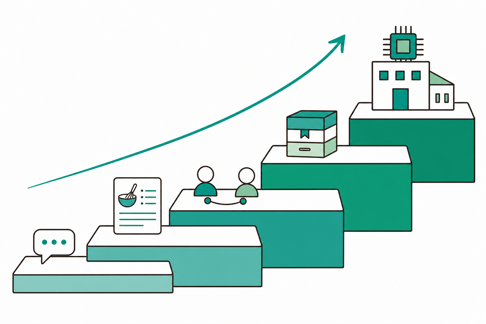
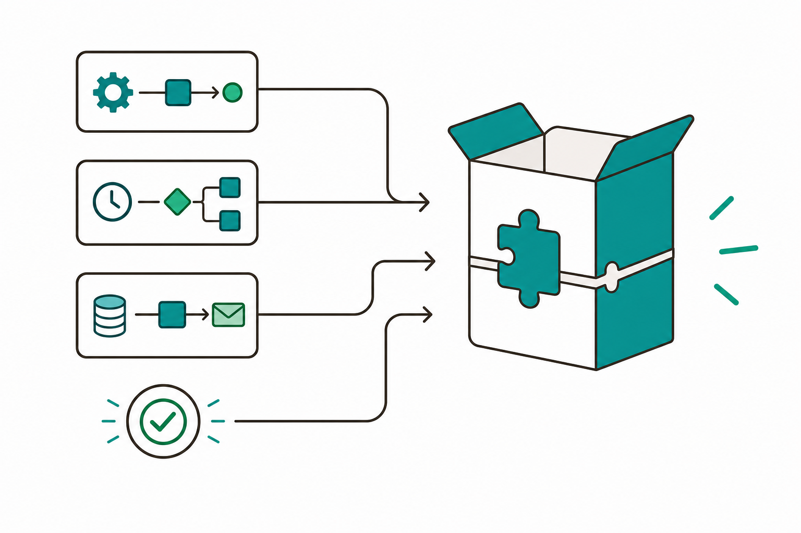

# 슬라이드 2: 전체 여정 회고 — Prompt에서 ICTK PoC까지
<!-- 패턴: F(멀티 섹션: 5단계 골격 흐름 + 회차 매핑 표) · s2 여정 로드맵 이미지 -->

**우리가 11회 33시간 동안 올라온 계단** — 단계마다 "만들 수 있는 자동화의 범위"가 넓어졌음

| 학습 골격 단계 | 회차 | 무엇을 할 수 있게 됐나 |
|----------------|:---:|------------------------|
| **① Prompt** | 1~2 | 5요소 프롬프트 / 커넥터·루틴·Computer use 맛보기 |
| **② Skill** | 3~4 | 반복 작업을 SKILL.md로 승격 / 웹 MCP·자작 MCP 결합 |
| **③ Skill+Agent** | 5 | 작성자→검토자 다단계 워크플로우 |
| **④ Plugin** | 6 | 검증된 워크플로우를 묶어 사내 표준으로 배포 |
| **확장 → ⑤ ICTK PoC** | 7~8 / **9~11** | 파이썬·LLM API·자작 MCP / **자사 실제 업무 PoC 개발·발표** |

> 노트: 캡스톤 첫 회고 슬라이드. 1회차부터 누적해온 학습 골격(Prompt→Skill→Skill+Agent→Plugin→확장→ICTK PoC)을 한눈에 정리해 "오늘이 그 정점"임을 인지시킴. 표는 curriculum-plan 2장 로드맵과 정확히 일치(회차 구간·핵심 산출물 요약). 이미지는 우측 또는 표 하단에 작게 배치해 표가 16pt 이상 가독성을 유지하도록 함(빌더 6-1·6-2 검증). 수치·회차 구간은 임의 창작 금지 — 모두 curriculum-plan·_xlsx_dump 근거. 출처: curriculum-plan.md 2장(2-0 로드맵 표), _xlsx_dump.txt '커리큘럼' 시트

---
# 슬라이드 3: [pw·컴퓨터유즈] 마무리 — "공식 길"부터, 사람이 게이트
<!-- 패턴: C 변형(좌: 우선순위 4단 플로우 / 우: 착수 전 차단 게이트 + 핵심 박스) -->

**마지막 카테고리의 철칙** — 화면을 흉내 내기 전에, 더 안전한 "공식 길"이 있는지 먼저 본다

**자동화 수단 우선순위(좌측 플로우, 위에서 아래로 — 위가 더 안전)**
1. **공식 Export·Open API** (초록) — 포털이 제공하는 내려받기·공개 API가 있으면 **무조건 우선**
2. **웹 자동 조작(Playwright MCP)** (파랑) — 구조를 읽어 조회·정리. 단 **로그인·최종 제출은 사람**
3. **Computer use(화면 직접 조작)** (빨강) — 위 두 가지가 모두 불가능할 때만 쓰는 **최후 수단**
4. **고위험 단계는 제외** (회색) — 테이프아웃 사인오프·인증서 발급·전표 입력 등은 **자동화 범위에서 의도적 제외**

**착수 전 차단 게이트(우측)** — 시작도 하기 전에 막는 3종 검토
- **약관(ToS) 위반 여부** · **로봇 정책(robots) 허용 여부** · **인증(2FA·공동인증서) 리스크**

> **핵심 박스**: 로그인·최종 제출·발급·전표 입력처럼 **되돌리기 어려운 행위는 반드시 사람이 직접** 수행. Computer use는 pw·CLI가 모두 불가능한 **잔여 범위에만**, 고위험 단계는 **아예 제외**

> 노트: curriculum-plan 3-11절 'ICTK 전제 반영'을 슬라이드 한 장으로 압축. 한 슬라이드 한 메시지: "공식 길 우선 → 사람 게이트 → Computer use는 최후 수단 → 고위험 제외". 우선순위 색상은 ppt-guide 플로우 스텝 컬러(초록 #059669·파랑 #0284C7·빨강 #DC2626·회색 비활성 #9CA3AF) 사용으로 '위가 안전, 아래로 갈수록 신중'을 시각화. 착수 전 차단 게이트(ToS·로봇정책·2FA/공동인증서)는 '시작 전에 막는다'는 점을 강조 — 일이 진행된 뒤 사고를 막기 어렵기 때문. 'Computer use'(화면을 보고 마우스·키보드를 직접 조작하는 자동화)·'Export'(포털이 제공하는 공식 내려받기)는 2회차·4회차 용어 재활용, 구두 한 줄 보충. 임의 수치·고객명 창작 금지. 출처: curriculum-plan.md 3-11절(실습 운영·ICTK 전제 반영), 1-4절(고위험 단계 제외)

---
# 슬라이드 4: 최종 패키징 — 9~11회차 PoC를 하나의 Plugin으로
<!-- 패턴: B(좌: 입력 3개→Plugin 묶음 다이어그램 / 우: 패키징 체크리스트) · s4 패키징 메타포 이미지 -->

**오늘의 핵심 산출물** — 흩어진 PoC와 검증 절차를 **하나의 설치 가능한 Plugin**으로 묶음

**무엇을 묶나(좌측 다이어그램)**
- **9회차 [지침만] PoC** + **10회차 [MCP·API] PoC** + **11회차 [pw·컴퓨터유즈] PoC**
- **+ 검증(작성→검토) 워크플로우** (5회차에서 배운 작성자→검토자 다단계)
- → **하나의 Plugin** (스킬 + 서브에이전트 + MCP 설정 묶음, 사내 표준으로 배포)

**패키징 체크리스트(우측)**
- **구성요소**: SKILL.md · 서브에이전트 · 필요한 MCP 설정이 한 폴더에
- **설치 가이드(README)**: 무엇을·어떻게 설치·실행하는지 (6회차에서 연습한 절차)
- **검증 단계 내장**: "작성→검토"로 누락·오류를 한 번 더 걸러 품질 게이트 확보

> 노트: curriculum-plan 3-11절 실습 운영의 핵심("9~11회차 PoC + 검증(작성→검토) 워크플로우를 하나의 Plugin으로 패키징") 시각화. Plugin은 6회차에서 배운 '검증된 워크플로우를 묶어 사내 표준으로 배포하는 단위'임을 재상기. 검증 워크플로우(작성자→검토자)는 5회차 산출물 재활용으로, '초안 생성 후 체크리스트 검토'를 통해 품질 게이트를 확보. 이미지는 우측 또는 하단에 작게 배치(빌더 6-1·6-2 검증). 출처: curriculum-plan.md 3-11절·3-5절(작성자→검토자)·3-6절(Plugin)

---
# 슬라이드 5: 발표 구성 — 5단계 스토리라인
<!-- 패턴: C(좌: 5스텝 발표 플로우 / 우: 단계별 말할 거리 + 핵심 박스) -->

**누구나 따라 하는 5분 발표 골격** — 문제에서 시작해 효과로 끝낸다

**발표 5단계(좌측 플로우, 색상 구분)**
1. **문제** (초록) — 현업에서 무엇이 반복·비효율인가 (예: 매번 같은 양식을 손으로 작성)
2. **해결 자동화** (파랑) — 어떤 Skill·Agent·Plugin으로 풀었나 (구성요소 한 줄)
3. **데모** (주황) — **실제로 동작하는 화면**을 보여줌 (말보다 시연)
4. **효과(베이스라인 대비)** (빨강) — 자동화 전 소요시간·누락 대비 **얼마나 줄었나** (내부 측정값)
5. **다음 단계** (보라) — 현업 확대·고도화 계획 한 줄

**단계별 말할 거리(우측)**
- 문제는 **숫자로**(주 N건·건당 N분), 효과도 **같은 잣대로** 비교
- 데모는 **준비된 입력**으로 한 번에 — 즉석 입력은 실패 위험

> **핵심 박스**: 효과는 **반드시 베이스라인 대비**로 — "빨라졌다"가 아니라 "30분→5분"처럼. 단, 측정값은 **본인 PoC로 직접 측정한 내부 수치**만 사용(외부 수치 임의 인용 금지)

> 노트: 발표 표준 구성을 5단계 스토리라인으로 제시(문제→해결 자동화→데모→효과(베이스라인 대비)→다음 단계). 색상은 ppt-guide 플로우 스텝 5색(초록·파랑·주황·빨강·보라) 적용. '베이스라인 대비'는 curriculum-plan 1-4절 '정직한 측정'·3-11절 2주 과제(베이스라인 대비 효과 측정)와 직결 — 효과는 PoC로 내부 측정한 값으로만 말하고 외부 벤치마크 수치를 성과로 둔갑시키지 않도록 구두 강조. 데모 실패 방지(준비된 입력 사용)는 실전 팁. 출처: curriculum-plan.md 3-11절(2주 과제)·1-4절(정직한 측정)

---
# 슬라이드 6: 평가 · 수료 기준 — 무엇으로 수료가 결정되나
<!-- 패턴: D(표 + 상세) · 평가 비중·수료 기준은 _xlsx_dump '평가 및 교육환경' 시트 값과 정확 일치 -->

**입문자 과정 — 시험 점수가 아니라 "실습 산출물과 적용 노력"으로 평가**

| 영역 | 비중 | 평가 방법 |
|------|:---:|-----------|
| **출석** | **30%** | 11회차 중 **80% 이상(9회차 이상)** 출석 |
| **과제 수행** | **40%** | 매 회차 2주 과제 제출·실행 기록 (**10회 과제 중 70% 이상** 제출) |
| **최종 PoC** | **30%** | 9~11회차 자사 유즈케이스 PoC 개발 + **11회차 발표** |

- **수료 기준(AND 조건, 셋 다 충족해야 수료)**: 출석 80%↑(9회차↑) **그리고** 과제 70%↑ 제출 **그리고** **최종 PoC 발표 완료**
- 최종 PoC는 **1개 이상**을 **동작하는 형태**로 구현 (Skill·Skill+Agent·Plugin 중 택1 이상)

> **가점**: 보안 거버넌스(데이터 격리·사람 최종 승인 등) 게이트를 PoC 설계서에 **명시**하면 가점

> 노트: 평가 비중·수료 기준은 _xlsx_dump '평가 및 교육환경' 시트 값과 정확 일치(출석 0.3·과제 0.4·최종PoC 0.3, 합계 1.0). 수료는 세 조건 AND(출석 80%↑=9회차↑, 과제 70%↑=10회 과제 중 7회↑ 제출, 최종 PoC 발표 완료). 임의 수치 창작 절대 금지 — 모든 값은 _xlsx_dump·curriculum-plan 4절 그대로. 가점은 보안 게이트 '명시 시'(_xlsx_dump '하네스 엔지니어링 적용 수준에 따라 가점'과 curriculum-plan 4-2 '보안 거버넌스 전제를 PoC 설계서에 명시한 경우 가점'을 입문자용으로 보안 게이트 명시 가점으로 표현). 패턴 D(표 + 상세)로 표 행 3개이므로 행 높이 넉넉히 잡아 하단 여백 보정(빌더 6-2). 출처: _xlsx_dump.txt '평가 및 교육환경' 시트, curriculum-plan.md 4-1·4-2절

---
# 슬라이드 7: 우수 플러그인 선정 관점 — 4가지 잣대
<!-- 패턴: E(카드 그리드 2×2: 색상 헤더 바 카드) · 카드 헤더 컬러 A(#3776AB)/B(#1A6E36)/C(#C0530A)/D(#1A5E7E) -->

**개인별 우수 플러그인은 이 4가지로 본다** — 화려함보다 "실제로 쓸 수 있는가"

**4가지 선정 잣대(2×2 카드)**
- **[카드 ① 실현성] 정말 동작하는가** (헤더 A #3776AB)
  데모에서 **실제로 돌아가고**, 현업 입력에 견디는가
- **[카드 ② 교육효과] 배운 걸 잘 녹였는가** (헤더 B #1A6E36)
  Skill·Agent·Plugin 등 **학습 골격을 적절히 활용**했는가
- **[카드 ③ 보안 준수] 게이트를 지켰는가** (헤더 C #C0530A)
  데이터 격리·사람 최종 승인·고위험 제외를 **설계에 반영**했는가
- **[카드 ④ 재사용성] 남도 쓸 수 있는가** (헤더 D #1A5E7E)
  README·구성요소가 정리돼 **동료가 설치·재사용** 가능한가

> 노트: 우수 플러그인 선정 4관점(실현성·교육효과·보안 준수·재사용성)을 2×2 카드로 제시. 패턴 E 색상 헤더 바 카드 사용, 헤더 컬러는 A/B/C/D로 배정해 슬라이드 간 중복 회피. '실현성=동작 여부'를 최우선에 두어 발표 슬라이드 5의 '데모(실제 동작)' 강조와 정합. '보안 준수'는 슬라이드 6의 보안 게이트 가점·슬라이드 8 거버넌스와 연결. 재사용성은 6회차 Plugin README·설치 가이드 학습과 연결. 출처: curriculum-plan.md 1-3절(차별성)·4-2절(수료 기준)·3-11절(ICTK 전제)

---
# 슬라이드 8: ICTK 보안 거버넌스 최종 점검 — 5대 기본기
<!-- 패턴: E(카드 그리드 3열 상단 + 하단 2열 보강: 색상 헤더 바 카드) · 카드 헤더 컬러 B(#1A6E36)/C(#C0530A)/D(#1A5E7E)/E(#8B1A1A)/A(#3776AB) -->

**보안 IC(PUF) 기업 ICTK** — 편리해도 흔들리지 않는, 발표 전 마지막 5대 점검

**5대 기본기 점검(카드)**
- **[카드 ① 데이터 격리]** (헤더 B #1A6E36) — 온프레미스·격리 실행·비학습(학습 안 함) 정책. PUF·암호 IP 등 핵심 자산은 격리 환경에서만 처리
- **[카드 ② 사람 최종 승인]** (헤더 C #C0530A) — 로그인·최종 제출·발급·전표 입력은 **사람이 직접** (Human-in-the-loop)
- **[카드 ③ 최소 권한]** (헤더 D #1A5E7E) — 도구 권한은 **꼭 필요한 만큼만** 부여
- **[카드 ④ 감사로그]** (헤더 E #8B1A1A) — 실행 이력을 **기록**해 추적 가능하게
- **[카드 ⑤ 고위험 제외]** (헤더 A #3776AB) — 테이프아웃 사인오프·인증서 발급·전표 입력은 **자동화 범위에서 제외**

> **한 줄 점검**: 발표할 PoC가 위 5가지 중 **무엇을 어떻게 지켰는지**를 설계서에 한 문장씩 적어두면 슬라이드 6의 **가점**으로 직결

> 노트: 9~11회차 공통 보안 전제(1-4절)를 발표 직전 최종 점검 체크리스트로 정리. 5대 기본기(데이터 격리·사람 최종 승인·최소 권한·감사로그·고위험 제외)는 curriculum-plan 1-4절과 정확히 일치. 패턴 E 색상 헤더 바 카드(상단 3 + 하단 2)로 5장 배치, 헤더 컬러 B/C/D/E/A 배정. '비학습(non-training)'은 '학습 안 함'으로 한글 병기, 'PUF·암호 IP'는 'ICTK 핵심 보안 자산'으로 일반화. 마지막 한 줄로 슬라이드 6 가점과 연결해 평가-거버넌스 일관성 확보. 출처: curriculum-plan.md 1-4절·3-11절(ICTK 전제 반영)

---
# 슬라이드 9: 30/60/90일 업무 적용 계획 템플릿
<!-- 패턴: D(표 + 상세) · 수료 후 과제(현업 적용 계획) -->

**수료가 끝이 아니라 시작** — 현업에 어떻게 녹일지 3단계로 약속

| 기간 | 목표 | 핵심 행동(예시) |
|:----:|------|-----------------|
| **30일** | **시범 적용** | 발표한 PoC/Plugin을 본인 업무에 **1건 실제 적용**, 베이스라인(소요시간·누락) 측정 |
| **60일** | **개선·확대** | 사용 중 발견한 개선점 반영, **소속 팀 동료 1~2명에게 시범 배포**·피드백 수집 |
| **90일** | **정착·공유** | 효과(베이스라인 대비)를 **정리·공유**, 차기 자동화 후보 1건 발굴 |

- **공통 원칙**: 모든 단계에서 **보안 게이트 유지**(데이터 격리·사람 최종 승인) + 효과는 **본인 측정값**으로
- **수료 후 과제**: 패키징한 Plugin을 소속 조직에 시범 배포하고 PoC 효과를 측정·공유하는 **현업 적용 계획 실행**

> 노트: curriculum-plan 3-11절 '2주 과제(수료 후)'와 _xlsx_dump 11회차 '30/60/90일 업무 적용 계획'을 실행 가능한 템플릿으로 구체화. 30(시범 적용·베이스라인 측정)→60(개선·동료 배포)→90(정착·효과 공유·차기 후보)의 점증 구조. 예시 행동은 템플릿 가이드일 뿐 구체 수치는 수강자가 본인 업무로 채움 — 임의 ICTK 수치 창작 금지. 효과 측정은 '정직한 측정'(1-4절) 원칙 유지. 패턴 D 표 3행이므로 행 높이 넉넉히(빌더 6-2). 출처: _xlsx_dump.txt '커리큘럼' 11회차(2주 과제), curriculum-plan.md 3-11절·1-4절

---
# 슬라이드 10: 마무리 — 현업에서 계속 자라는 자동화
<!-- 패턴: F(종합: 메시지 + 여정 한 줄 + 다음 한 걸음) · s10 수료/성장 메타포 이미지 -->

**축하합니다 — 여러분은 이제 "직접 자동화를 만드는 사람"입니다**

- **오늘의 결론**: 프롬프트 한 줄에서 시작해 **동작하는 Plugin**까지 만들어 발표함 — 0에서 1을 만든 경험이 가장 큰 자산
- **계속 자라게 하는 법**: ① 작게 **현업 1건 적용** → ② **개선점 기록**(다음 자동화 재료) → ③ **동료와 공유**(사내 표준으로)
- **변하지 않는 기본기**: 어떤 도구를 쓰든 **데이터 격리 · 사람 최종 승인** — ICTK의 보안이 곧 신뢰

> **다음 한 걸음**: 30/60/90일 계획을 **이번 주에 30일 항목부터** 시작. 막히면 같은 부트캠프 동료가 가장 빠른 도움임

> 노트: 캡스톤 마무리 — 회고·격려·현업 적용·지속 확장 메시지로 한 장에 정리. '0→1 경험'을 강조해 입문자의 성취감을 부각. 지속 성장 3스텝(현업 1건 적용→개선점 기록→동료 공유)은 슬라이드 9의 30/60/90 계획과 정합. 마지막까지 '데이터 격리·사람 최종 승인' 기본기를 한 번 더 못 박아 ICTK 보안 메시지로 닫음. 이미지는 하단 또는 우측에 작게 배치(빌더 6-1·6-2 검증). 스크린샷류 금지·텍스트 없는 개념 메타포. 출처: curriculum-plan.md 1-2절(교육 목표)·1-4절(보안 기본기)·3-11절(수료 후 적용 계획)
