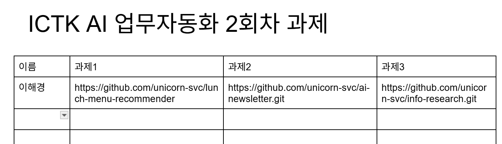

# 2회차 과제 수행 방법 안내
## 사전설치 
- 가이드: https://github.com/unicorn-plugins/npd/blob/main/resources/guides/setup/prepare.md
- AI툴 중 Claude Desktop 만 설치

---

## 과제 수행  
### 이동경로 추천 및 맛집 찾기
- 프로젝트 셋업: [가이드](00.프로젝트%20셋업%20가이드.md)
- PlayMCP 커넥터 연결 후 카카오맵 MCP를 https://playmcp.kakao.com 에서 추가
- 출발지와 목적지를 입력하면 대중교통으로 이동경로를 제공하고 목적지의 맛집을 추천
- 아래 예와 같이 출력되도록 프롬프팅 
  ```
  (입력)
  출발지: 강남역 / 목적지: 블루스퀘어 (한남동) / 이동 수단: 대중교통
  주변 검색: 맛집 / 방문 인원: 6명

  (출력)
  ## 이동 경로

  **강남역 → 블루스퀘어** (대중교통, 약 25분)
  1. 강남역 6호선 승차 → 이태원역 하차 (3정거장, 10분)
  2. 이태원역 1번 출구 도보 8분
  - 요금: 1,400원

  ## 주변 맛집 TOP 3 (블루스퀘어 반경 500m)

  | 순위 | 장소명 | 거리 | 영업시간 |
  |------|--------|------|----------|
  | 1 | 이태원 갈비집 | 150m | 11:00~22:00 |
  | 2 | 한남 브런치카페 | 230m | 09:00~21:00 |
  | 3 | 이탈리안 레스토랑 | 350m | 12:00~22:00 |
  ```   
- 원격 Git Repository 생성 후 푸시 
  예시) ORG명과 레포지토리명은 본인걸로 변경  
  ```
  ORG 'unicorn-bootcamp'에 private repository 'route-food'를 생성하고 푸시  
  ```

### 뉴스레터 받기
프로젝트 셋업: [가이드](00.프로젝트%20셋업%20가이드.md)
- 기능: 매일 아침 8시에 본인이 관심 있는 주제의 뉴스를 검색하여 지정한 메일로 발송
- 예제 참고하여 개발: https://github.com/unicorn-svc/ai-newsletter.git
  - `prompts/routine.txt`를 참고하여 본인의 프롬프트를 `prompts/routine.txt` 작성 
  - `templates/newsletter.html`, `email_sender.py`, `generate_newsletter.py`, `requirements.txt` 을 본인 프로젝트 디렉토리에 복사
  - `.env`파일을 프로젝트 루트에 생성하고 아래 예 참고하여 내용 작성  
    '# recipients'에 수신자 이메일을 줄바꿈으로 입력  
    ```
    #앱 비밀번호 생성 방법 (Gmail 기준): 
    #- https://myaccount.google.com/security 접속 → 2단계 인증 활성화 (이미 돼 있으면 skip)
    #- https://myaccount.google.com/apppasswords 접속
    #- 앱 이름 입력 (예: OSS SMTP) → 만들기 클릭
    #- 생성된 16자리 코드 (공백 제거)를 SMTP_PASSWORD로 사용

    SMTP_SERVER=smtp.gmail.com
    SMTP_PORT=587
    SMTP_USER=your gmail 
    SMTP_PASSWORD=your app password

    # recipients
    RECIPIENTS="
    hiondal@gmail.com
    happycloudtek@gmail.com
    "
    ``` 
  - Claude Code에 본인 프롬프트 파일 경로를 제공하고 프롬프트 수행에 맞게 위 4개 파일 수정 요청  
    ```
    프롬프트 `prompts/routine.txt`을 분석하고 이 프롬프트가 정상 동작하도록 아래 파일들을 수정해요.  
    수정 후 프롬프트를 실행하여 검증까지 하세요.  
    `templates/newsletter.html`, `email_sender.py`, `generate_newsletter.py`, `requirements.txt` 
    ``` 
  
- 루틴 작성
  - '로컬'에서 수행되는 루틴 생성 
  - '지침'은 'prompts/routine'을 수행하도록 작성 
  - 매일 아침 8시에 수행되도록 함 
  - 테스트 실행하여 검증  

- 원격 Git Repository 생성 후 푸시 
  예시) ORG명과 레포지토리명은 본인걸로 변경  
  ```
  ORG 'unicorn-bootcamp'에 private repository 'newsletter'를 생성하고 푸시  
  ```

### 본인 업무 수행 프롬프트 작성
- 프로젝트 셋업: [가이드](00.프로젝트%20셋업%20가이드.md)
- `prompts` 디렉토리 생성하고 하위에 본인 업무 수행 프롬프트 작성
- 프롬프트 테스트 및 개선
- 원격 Git Repository 생성 후 푸시 
  예시) ORG명과 레포지토리명은 본인걸로 변경  
  ```
  ORG 'unicorn-bootcamp'에 private repository 'security-check'를 생성하고 푸시  
  ```
  
---

## 과제 제출 방법 
- Organization에 권한 부여: [가이드](../references/GitHub멤버등록.md)

- 구글 드라이브 접근: [드라이브](https://docs.google.com/document/d/1ArN_LkSc31s-q57GfQedTakkC_pYL0rpUyeJVaGS82A/edit?usp=drive_link)

구글 드라이브 접근이 안되면 오픈 채팅방에 본인 gmail을 남기고   
드라이브 접근 권한을 신청하세요.   

- 본인 이름 입력하고 각 과제의 Git Repo 주소를 작성

