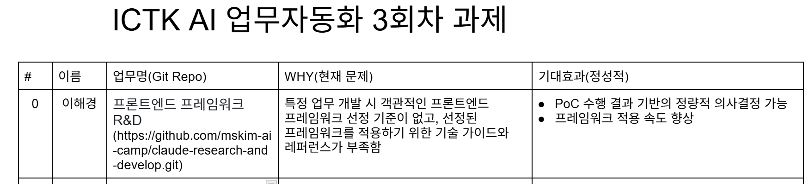
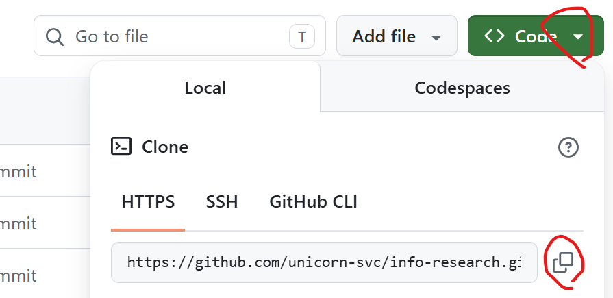

# 3회차 과제 수행 방법 안내
## 사전설치 
- 가이드: https://github.com/unicorn-plugins/npd/blob/main/resources/guides/setup/prepare.md


---

## 사전작업: prompt 작성 가이드를 유저스콥 스킬로 생성   
유저스콥의 프롬프트 개선 스킬 생성: **수업 시간에 만든 경우 스킵**
- `~/.claude/skills/prompt-enhancer/SKILL.md` 작성    
    
  ```
  ---
  description: 프롬프트를 개선하는 스킬.프롬프트에 '프롬프트 개선', '프롬프트 수정' 이라는 키워드가 있을 때 수행 
  ---

  [목표]
  사용자가 제공한 프롬프트를 프롬프트 작성 가이드에 따라 개선
  [역할]
  - 프롬프트 개선자: 세계 최고의 Anthropic에 근무하는 5년 경력의 베테랑 프롬프트 엔지니어임
  - Critic: 비판적 시각에서 작업 결과를 검토. 꼼꼼하고 냉정한 베테랑 프롬프트 엔지니어  
  [맥락]
  - 내 상황: 프롬프트 초안을 작성했고 구체성, 업무배분, 하네스 측면에서 개선하고자 함 
  - 독자: 프롬프트 사용자인 나 

  [입력]
  - 프롬프트 원문: 파일 경로나 원문 그 자체 
  - 프롬프트 작성 가이드: ~/.clude/skills/{skill-name}/references/prompt-guide.md 
  [처리]
  - 프롬프트 작성 가이드 이해 
  - 사용자에게 프롬프트 원문 요청: 
    - 파일 경로인지 원문을 붙여넣을 건지 문의 
    - 파일 경로면 AskUserQuestion 툴로 경로를 입력 받음 
    - 원문 붙여넣기면 대화상자에서 프롬프트 원문을 입력 받음 
  - 프롬프트 개선 작업 수행: 
    구체성, 업무배분, 하네스 측면 작업을 Agent를 호출하여 병렬로 수행  
    - 구체성: 
      - 모호한 표현을 구체적으로 변환. 예를 들어 숫자화 또는 측정 기준 등을 명확화 
      - 필요 시 작업을 세분화 
    - 업무배분:
      - 팀원 정보 확보: '{PRJ-DIR}'의 AGENTS.md의 '멤버' 섹션 참조 
      - 협업 패턴 확보: '{PRJ-DIR}'의 AGENTS.md의 '팀원 위임 규칙' 섹션 참조
      - 적절한 협업 패턴으로 프롬프트 원문의 '처리' 섹션이 구성되었는지 체크 및 개선 
      - 팀원의 업무 배분이 적절한지 체크 및 개선 
      - 작업 수행 시 병렬 또는 순차 처리가 적절한지 체크 및 개선  
    - 하네스:
      - 비용, 성능, 보안 측면에서 프롬프트 체크 및 개선 
  - 3가지 측면의 프롬프트 개선 결과를 취합 
  - Critic이 프롬프트 개선 결과를 비판적 시각으로 검토 
  - 검토결과를 최종 산출물 생성 

  [출력]
  - {PRJ-DIR}: 현재 프로젝트 디렉토리 
  - 개선된 프롬프트 파일: {PRJ-DIR}/prompts/{file-name}_v{N}.txt
  - {N}은 1부터 시작해서 1씩 증가    
  - 파일 경로가 아니라 프롬프트 원문을 대화창에서 제공한 경우 {file-name}은 사용자에게 문의
  
  [제약조건]
  - MUST:
    - 추가정보나 내 의사결정이 필요하면 반드시 요청 
  - MUST NOT:
    - 추측으로 생성하지 말고 프롬프트 원문과 가이드에 기반하여 작업 
  - 완료조건
    - 개선된 프롬프트 파일 생성 
    
  [예시]
  ``` 
- `~/.claude/skills/prompt-enhancer/references/prompt-guide.md` 복사  
  (기존 과제 프로젝트 디렉토리의 `references/`에서 복사) 
- Claude Code 완전 종료 후 시작 
- '/prompt-enhancer' 명령 인식되는지 테스트   

---

## 과제 수행 
### 스킬 생성 
- vscode에서 '본인 업무 프로젝트 디렉토리' 오픈  
- prompts/skill-transfer.txt 작성: 기존 프롬프트를 읽어 스킬로 변환해 주는 프롬프트 
  ```
  [목표]
  '{prompt-path}' 프롬프트를 참조하여 프로젝트 스콥으로
  '{skill-name}' 스킬 제작 
  [역할]
  당신은 페르소나 기반의 스킬 제작 전문가임
  [맥락]
  프롬프트의 재사용을 편리하게 하기 위해 스킬을 제작하고 싶음 
  [입력]
  - {prompt-path}: {사용자가 입력한 상대경로}
  - {skill-name}: {사용자가 입력한 스킬명}
  [처리] 
  - 프롬프트 경로와 스킬명을 나에게 요청: AskUserQuestion 사용  
  - 프롬프트의 내용을 이해 
  - 스킬파일 작성 
    - 허용 도구, 금지 도구를 정의 
    - 본문의 프롬프트는 'prompt-enhancer' 스킬을 이용하여 개선 
  [출력]
  - 스킬: `.claude/skills/{skill-name}/SKILL.md` 
  [제약조건]
  - MUST: 
    - Frontmatter에 name, description, 허용도구, 금지 도구 명시 
  - MUST NOT 
  - 완료조건: 스킬파일 생성 
  ``` 
  
- 대화창에서 프롬프트 'skill-transfer.txt' 수행: Model->Opus, Think Time -> 최대 또는 Ultra mode로 수행      
  - Skill로 만들 프롬프트 파일 경로 제공 
  - 결과 Skill 파일 검토: `.claude/skills/{skill-name}/SKILL.md` 

### 스킬 개선(이번 과제 핵심)    
여기가 이번 과제의 핵십입니다.   
- SKILL.md를 꼼꼼히 읽고 자신이 이해할 수 있는 표현으로 변경하세요.    
- 아래 측면에서 스킬을 개선하세요.     

```
- 구체성 개선
  - 구체적인 숫자 또는 기준이 적합한가 ?  
- 업무 배분 개선
  - 협업 패턴(계층형, 파이파라인형, 협업형, 토론형)이 적절한가 ? 
  - 각 작업에 적절한 팀원이 배치 되었는가 ?
  - 병렬 처리할 수 있는 작업은 없는가 ? 
- 실용성 개선 
  - 실제 업무에 적용했을 때 도움되는가 ? 
```

### 프로젝트 업로드   
- 원격 Git Repository 생성 후 푸시 
  프롬프트 창에서 요청   
  ```
  push
  ```

  ※ 최초 푸시면 원격 레포지토리 만들고 푸시   
  예) ORG명과 레포지토리명은 본인걸로 변경  
  ```
  ORG 'unicorn-bootcamp'에 private repository 'security-check'를 생성하고 푸시  
  ```
- 웹에서 Repository를 열고 `.claude` 하위의 Skill파일이 업로드 되었는지 확인   
  
---

## 과제 제출 방법 
- Organization에 권한 부여: [가이드](../references/GitHub멤버등록.md)

- 과제제출 드라이브 접근: [드라이브](https://docs.google.com/document/d/1iDGGnhdI2_u4he1FG1Ztasp8WvCmRPXNbgJh3u4zjUQ/edit?usp=sharing)

- 이름, 업무명, WHY, 기대효과 입력    
     

※ 참고) Repository 주소 복사  
  

**※ 주의사항**   
- 구글 드라이브 문서에 고객 정보, 회사 내부 기밀정보 등 **보안 위배/의심 정보 작성 금지**   
- Git Repository는 반드시 **Private Repository**로 만드십시오.   


