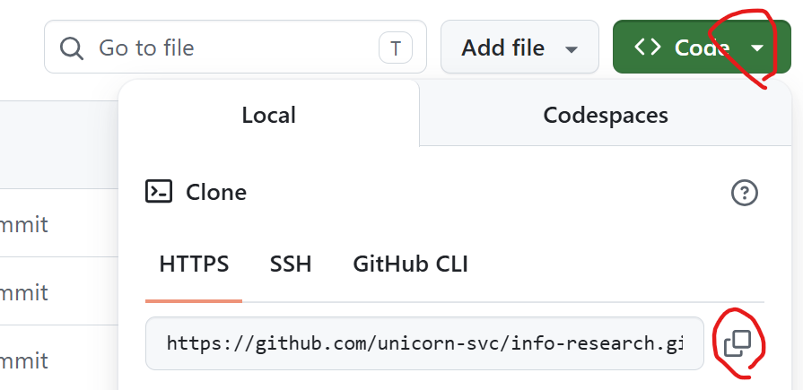

# 4회차 과제 수행 방법 안내
## 사전설치 
- 가이드: https://github.com/unicorn-plugins/npd/blob/main/resources/guides/setup/prepare.md

---

## 프로젝트 셋업 가이드  
공통지침(AGENTS.md, CLAUDE.md)가 없는 분들이 있습니다.   
아래 가이드에 따라 공통지침을 만들고 작업하세요.   
https://github.com/unicorn-campus/ai-automation/blob/main/homework/00.%ED%94%84%EB%A1%9C%EC%A0%9D%ED%8A%B8%20%EC%85%8B%EC%97%85%20%EA%B0%80%EC%9D%B4%EB%93%9C.md

---

## 과제 수행 
3회차에서 개발한 **스킬의 기능 확장을 위해 필요한 MCP 서버를 개발하여 연동**   

- MCP 서버 아이디어 추천 받기
  - Claude Code 새 대화창 클릭
  - 프로젝트 디렉토리를 본인 프로젝트 폴더로 변경
  - 아래 프롬프트로 MCP 서버 아이디어 추천 받기 
    ```
    [목표]
    스킬 기능 확장을 위한 MCP 서버 후보 추천 
    [역할]
    당신은 MCP개발에 능통한 AI앱 개발자임

    [맥락]
    - 내 상황: AI업무 자동화를 수강하는 직장인으로서 내가 개발한 스킬 확장을 위해 MCP 서버를 개발하고 연동하려고 함 
    - 독자: 나

    [입력]
    - 스킬파일: .claude/skills/{skill-name}/SKILL.md

    [처리]
    - 스킬파일 파악 및 이해 
    - MCP서버 아이디어 발산: 
      - 모든 팀원이 1개씩 병렬로 수행하여 제안  
      - 비즈니스 가치와 실현 가능성이 높은 아이디어 제안 
      - Chrome확장을 활용하여 데이터 Crawling하는 방안도 고려(인증이 필요한 경우 WebFetch는 불가)  
    - MCP서버 아이디어 정리: 클로니가 수행. 유사한 아이디어 합치기 
    - MCP서버 아이디어 추천: 
      - idea.md에 작성  
      - 스킬 파일 적용 방안 포함 
    [출력]
    - MCP서버 아이디어: mcp/idea.md
    [제약조건]
    - MUST:
      - 추가정보나 내 의사결정이 필요하면 반드시 요청 
      - 필요하다고 판단되면 공인된 관련 사이트를 웹서치
      - 신규 MCP 개발을 추천해야 함
      - (매우중요) **사용자가 이해하기 쉬운 용어 사용: 스킬 내용의 업무를 처음 접하고 MCP를 모르는 사람도 이해해야 함**
      - 스킬 파일에 적용 방안 반드시 포함  
    - MUST NOT:
      - 추측하여 생성하지 말고 Fact에 근거하여 작업
      - 기존에 있는 MCP 연결 추천 금지 
    - 완료조건
      - 모든 출력물 생성 완료 
    [예시]
    <sample>
    # 스킬 기능 확장을 위한 MCP 서버 개발 아이디어 
    ## {아이디어} {N}
    ### {아이디어 설명}
    ### 추천 이유
    - 비즈니스 가치: 
    - 실현가능성: 
    ### 스킬 파일 적용 방안 
    </sample>
    ```

- MCP 서버 개발 프롬프트 작성 
  - 추천받은 MCP 서버 중 1개 선택 
  - prompts/dev-mcp.md 파일 작성하고 MCP 서버 개발 프롬프트 제작 
  - 교육시간에 제공 받은 이미지 생성 MCP 프롬프트 참고 
    https://github.com/unicorn-campus/ai-automation/blob/main/prompts/4%ED%9A%8C%EC%B0%A8/gpt-image-mcp.md
  - MCP 서버 소스는 `mcp-servers/{MCP서버명}` 디렉토리 권장(변경해도 됨)
     
  ※ 주의: 현재 프로젝트 디렉토리에 코드 개발(위 예제는 코드를 사용자 홈에 제작하는 것임)

- MCP 서버 개발
  - 작성한 프롬프트를 실행하여 MCP 서버 개발  
  
- MCP 서버 추가 
  - Claude Code 대화창에 아래 예제와 같이 프로젝트 스콥으로 추가 
    ```
    'mcp-servers/gen-img' 디렉토리의 MCP서버를 프로젝트 스콥으로 'gen-img'라는 이름으로 추가하세요.  
    ```
  - Claude Code 완전 종료 후 재시작     

- 스킬에 MCP서버 호출하는 작업 추가: mcp/idea.md의 스킬 적용 방안 참조   

### 평가 기준     
- 비즈니스 가치: 업무에 실질적인 도움을 주어 효율성/편의성을 증대 시킴  
- MCP서버 완성도: Tools, Resource, Prompt를 모두 활용하였는가? 

### 프로젝트 업로드   
- 원격 Git Repository 생성 후 푸시 
  프롬프트 창에서 요청   
  ```
  push
  ```

  ※ 최초 푸시면 원격 레포지토리 만들고 푸시   
  예) ORG명과 레포지토리명은 본인걸로 변경  
  ```
  ORG 'unicorn-bootcamp'에 private repository 'security-check'를 생성하고 푸시  
  ```
- 웹에서 Repository를 열고 `.claude` 하위의 Skill파일이 업로드 되었는지 확인   
  
---

## 과제 제출 방법 

- Google Docs 접근: [4회차 과제 제출 문서](https://docs.google.com/spreadsheets/d/1MFFOPM_2XCoPyCvxXoOQlQExwoGGFprUSWAJ2ifpq-w/edit?usp=sharing)

- MCP서버 연동으로 좋아진 점을 As-Is와 To-Be로 나누어 작성   

> **※ 주의사항**   
> - 구글 드라이브 문서에 고객 정보, 회사 내부 기밀정보 등 **보안 위배/의심 정보 작성 금지**   
> - Git Repository는 반드시 **Private Repository**로 만드십시오.   

---
## Appendix 

※ Repository 주소 복사  
  

※ Organization에 권한 부여: [가이드](../references/GitHub멤버등록.md)


