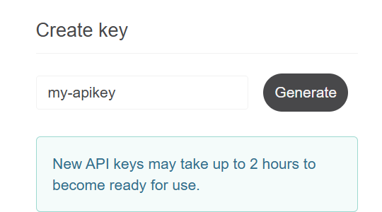

# 7회차 과제 수행 방법 안내
## 사전설치 
- 가이드: https://github.com/unicorn-plugins/npd/blob/main/resources/guides/setup/prepare.md

---

## 프로젝트 셋업 가이드  
**공통지침(AGENTS.md, CLAUDE.md)이 없는 분들**이 있습니다.   
[프로젝트 셋업 가이드](https://github.com/unicorn-campus/ai-automation/blob/main/homework/00.%ED%94%84%EB%A1%9C%EC%A0%9D%ED%8A%B8%20%EC%85%8B%EC%97%85%20%EA%B0%80%EC%9D%B4%EB%93%9C.md)에 따라 공통지침을 만들고 작업하세요.   

---

## 과제 수행 
### 프로젝트 셋업 가이드에 따라 공통지침 작성
- 새로운 프로젝트 디렉토리 작성
- 공통 지침 작성

### LLM API Key 생성
이용하고 싶은 AI 공급자의 API 키 생성.   
회원 가입 및 신용카드 등록 필요.  비용을 최소화하고 싶으면 Groq 사용.    
```
- OpenAI: https://platform.openai.com/api-keys
- Anthropic: https://platform.claude.com/settings/keys
- Google: https://aistudio.google.com/api-keys
- Groq: https://console.groq.com/keys
```

`.env`파일에 API Key와 모델명 작성
```
CLAUDE_API_KEY=sk-ant-...
CLAUDE_MODEL=

OPENAI_API_KEY=sk-proj-...
OPENAI_MODEL=

GEMINI_API_KEY=AQ.....
GEMINI_MODEL=

GROQ_API_KEY=gsk_...
GROQ_MODEL=
```

※ Model 명 찾기 페이지
```
- OpenAI GPT: https://developers.openai.com/api/docs/models
- Anthropic Claude: https://platform.claude.com/docs/en/about-claude/models
- Google Gemini: https://ai.google.dev/gemini-api/docs/models
- Groq: https://console.groq.com/
```

### Weather API와 Google Place API 생성 
API Key 생성. 약간의 API 사용료가 필요합니다.    
```
- Weather: https://home.openweathermap.org/api_keys
    

- Google Place: https://console.cloud.google.com/apis/credentials
```
※ Google Place API는 생성 절차가 복잡합니다. PlayMCP나 Chrome확장으로 Claude에 시키세요.    
```
PlayMCP나 Chrome 확장으로 Google Place API Key를 만들어 줘요.    
```

`.env` 파일에 추가   
```
OPENWEATHER_API_KEY=8c2...
GOOGLE_PLACES_API_KEY=AIz...
```

### Travel Planner 앱 개발(Cloud LLM 사용)
**1.아래 프롬프트를 완성하여 개발 요청**      
- {email}: 본인 email id로 변경: 예) hiondal@unicorn.kubepia.com
- '응답내용 요청사항'은 원하는 요구사항 추가: 관광지/음식점 별점 조건, Google 맵 링크 등  
- {LLM 제공자}은 원하는 AI 제공자명으로 변경   

```
[목표]
하루의 여행 루트를 추천해주는 앱 개발
[역할]
당신은 AI 개발 전문가임
[맥락]
- 내 상황: 여행중이고 아침에 오늘의 여행 루트를 추천받고 싶음
- 독자: 여행자

[입력]
- 외부API 공식문서
  - OpenWeatherMap: https://openweathermap.org/api
  - Google Places: https://developers.google.com/maps/documentation/places
- 외부API 사용 email: {email}

[처리] 
- 앱 개발
  - 사용자에게 여행 루트 응답을 위한 정보 받음
    - 국가, 도시, 몇박 며칠, 인원수, 예산

  - 프롬프트 작성
    - PromptTemplate 사용
    - 시스템 프롬프트와 유저 프롬프트 분리
    - load_prompt 사용
  - 모델 호출
    - {LLM 제공자}의 모델 이용
    - API Key와 모델은 '.env' 파일 참조 
    - Structured Ouput 방식 사용
    - LCEL 체인 구성
    - LCEL 체인 실행은 동기 방식 사용
  - 응답내용 요청사항
    - 날씨에 맞는 관광지 추천
    - 아침, 점심, 저녁 맛집 추천 

- 테스트 및 버그 수정 
  - 가상환경 설정하고 테스트 

- README.md 작성
  - 앱 목적 및 주요 기능
  - 디렉토리 구조
  - 가상환경 설정 방법: OS(Window, Mac)와 Shell(Powershell, GitBash)별로 나눠서 작성 
  - 라이브러리 설치 및 실행 방법

[출력]
- 프로그램: app/(소스, requirements.txt, README.md)

[제약조건]
- MUST
  - 추가 정보나 내 의사결정이 필요하면 반드시 나에게 요청 
  - LangChain 이용하여 개발
- MUST NOT
  - 추측하여 요약하지 말고 원본에 충실하게 요약 
- 완료조건
  - 모든 출력물이 생성 
  - 테스트 통과
  - 정상동작
```
  
2.프롬프트 실행하여 앱 개발 후 README.md를 보고 실행해 봄       
  
### Travel Planner 앱 개발(Local LLM 사용)
1.위 프롬프트에서 아래 부분 변경         
- 현재: 
  ```
  - {LLM 제공자}의 모델 이용
  - API Key와 모델은 '.env' 파일 참조 
  ```
- 변경:
  ```
  - gemma3:4b 모델 이용
  - AI Runtime: Ollama 
  ``` 
  
2.출력 프로그램 경로 변경: 
- app/(소스, requirements.txt, README.md) -> local-llm/(소스, requirements.txt, README.md)    
  
3.프롬프트 실행하여 앱 개발 후 README.md를 보고 실행해 봄      
  
### 클론 코딩
- Travel Planner(Cloud LLM): `app/` 디렉토리의 코드를 `app-clone/` 디렉토리에 그대로 타이핑하여 개발 및 테스트   
- Travel Planner(Cloud LLM): `local-llm/` 디렉토리의 코드를 `local-llm-clone/` 디렉토리에 그대로 타이핑하여 개발 및 테스트 

### 프로젝트 업로드   
- 원격 Git Repository 생성 후 푸시 

  예) ORG명과 레포지토리명은 본인걸로 변경  
  ```
  ORG 'unicorn-bootcamp'에 private repository 'security-check'를 생성하고 푸시  
  ```

- 두번째 푸시 부터는 아래 명령 사용    
  프롬프트 창에서 요청   
  ```
  push
  ```

---

## 과제 제출 방법 
- 실행 화면 캡처
  - Cloud LLM 이용앱은 `app-clone` 디렉토리에서, Local LLM 이용 앱은 `local-llm-clone` 디렉토리가 보이는 상태에서 실행 명령 캡처 
  - 결과 일부가 나오게 캡처하고 파일로 저장   
  - 캡처한 이미지 파일 2개를 `images` 디렉토리 만들고 그 하위에 옮김
  - 'push' 명령으로 원격 Repository에 푸시    

- Google Docs 접근하여 이름, Git Repo 주소, 느낀점/배운점 기술: [7회차 과제 제출 문서](https://docs.google.com/spreadsheets/d/1V8J_JQ_zGDPVeC9A8CaoDRmBxtG4MJAY/edit?usp=drive_link&ouid=110516422607493163049&rtpof=true&sd=true)


> **※ 주의사항**   
> - 구글 드라이브 문서에 고객 정보, 회사 내부 기밀정보 등 **보안 위배/의심 정보 작성 금지**   
> - Git Repository는 반드시 **Private Repository**로 만드십시오.   

---

## 평가 기준     
가장 빨리 올린 3명 시상 

---
  
## Appendix 

※ Repository 주소 복사  
  

※ Organization에 권한 부여: [가이드](../references/GitHub멤버등록.md)

