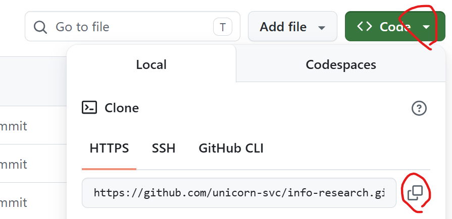

# 8회차 과제 수행 방법 안내
## 사전설치 
- 가이드: https://github.com/unicorn-plugins/npd/blob/main/resources/guides/setup/prepare.md

---

## 프로젝트 셋업 가이드  
**공통지침(AGENTS.md, CLAUDE.md)이 없는 분들**이 있습니다.   
[프로젝트 셋업 가이드](https://github.com/unicorn-campus/ai-automation/blob/main/homework/00.%ED%94%84%EB%A1%9C%EC%A0%9D%ED%8A%B8%20%EC%85%8B%EC%97%85%20%EA%B0%80%EC%9D%B4%EB%93%9C.md)에 따라 공통지침을 만들고 작업하세요.   

---

## 과제 수행 

### LLM API Key 생성
이용하고 싶은 AI 공급자의 API 키 생성.   
회원 가입 및 신용카드 등록 필요.  비용을 최소화하고 싶으면 Groq 사용.    
```
- OpenAI: https://platform.openai.com/api-keys
- Anthropic: https://platform.claude.com/settings/keys
- Google: https://aistudio.google.com/api-keys
- Groq: https://console.groq.com/keys
```

`.env`파일에 API Key와 모델명 작성
```
CLAUDE_API_KEY=sk-ant-...
CLAUDE_MODEL=

OPENAI_API_KEY=sk-proj-...
OPENAI_MODEL=

GEMINI_API_KEY=AQ.....
GEMINI_MODEL=

GROQ_API_KEY=gsk_...
GROQ_MODEL=
```

※ Model 명 찾기 페이지
```
- OpenAI GPT: https://developers.openai.com/api/docs/models
- Anthropic Claude: https://platform.claude.com/docs/en/about-claude/models
- Google Gemini: https://ai.google.dev/gemini-api/docs/models
- Groq: https://console.groq.com/
```

### 본인 플러그인을 Agentic AI 앱으로 개발 

본인이 개발한 플러그인 디렉토리에서 수행.   
팀원중에 AI개발자가 없으면 직접 또는 프롬프트를 통해 추가.    

**1.아래 프롬프트를 완성하여 프롬프트 생성**      

```
[목표]
플러그인을 Agentic AI앱으로 개발하기 위한 개발 프롬프트 생성 

[역할]
클로니가 수행 

[맥락]
- 내 상황: 개발된 플러그인을 Agentic AI앱으로 개발하고 싶음
- 독자: 나 

[입력]
- 플러그인: `.claude-plugin/*`, `skills`, `agents`
- 플러그인이 없는 경우 skills와 agents 분석 

[처리]
- 플러그인 분석. 플러그인이 없는 경우 skills와 agents 분석   
- 개발 프롬프트 생성
  - 예시와 같이 8대 섹션으로 별로 작성
  - CLI와 API로 실행할 수 있도록 작성
  - LLM 인터페이스 
    - LCEL 체인 사용하고 실행은 동기 방식인 'invoke' 사용 
    - 프롬프트는 시스템 프롬프트와 유저 프롬프트 명확히 분리
    - Output Parser 대신 Structured Output 사용
    - LLM 제공자, Model, API는 `.env` 참조
  - Workflow 구현
    - 스킬과 에이젼트를 분석하여 Workflow 구성
    - 노드 간 데이터 공유는 StateGraph의 State로 구현
    - 세션 체크포인터(중단 복구·재개)로 SqliteSaver사용

[출력]
- 프롬프트: prompts/dev-app.md

[제약조건]
- MUST
  - 추가 정보나 내 의사결정이 필요하면 반드시 나에게 요청 
  - '[예시]' 섹션의 구성과 내용을 참고하고 개발할 앱에 맞게 수정 
- MUST NOT 
  - 추측하여 작성하지 말고 플러그인 수행에 충실하게 작성   
- 완료조건 
  - 모든 출력물 생성 

[예시]
<예제프롬프트>
[목표]
하루의 여행 루트를 추천해주는 앱 개발

[역할]
당신은 LangGraph에 능통한 10년 경력의 AI 개발 전문가임

[맥락]
- 내 상황: 여행중이고 아침에 오늘의 여행 루트를 추천받고 싶음
- 독자: 여행자

[입력]
- 외부API 공식문서
  - OpenWeatherMap: https://openweathermap.org/api
  - Google Places: https://developers.google.com/maps/documentation/places
- 외부API 사용 email: hiondal@gmail.com

[처리]
- 앱 개발
  - 사용자에게 여행 루트 응답을 위한 정보 받음
    - 국가, 도시, 몇박 며칠, 인원수, 예산

  - 프롬프트 작성
    - PromptTemplate 사용
    - 시스템 프롬프트와 유저 프롬프트 분리
    - load_prompt 사용
  - 모델 호출
    - Groq의 모델 이용
    - API Key와 모델은 '.env' 파일 참조
    - Structured Ouput 방식 사용
    - LCEL 체인 구성
    - LCEL 체인 실행은 동기 방식 사용
  - 응답내용 요청사항
    - 날씨에 맞는 관광지 추천
    - 아침, 점심, 저녁 맛집 추천
    - 평점 4.0 이상 장소 우선 추천
    - 각 장소마다 Google 지도 링크 포함
  - LangGraph 이용하여 개발
    - Workflow 구성
      - 환경설정 읽기: '.env'에 읽음
      - 환경설정 검증: Groq API Key, Model명, Weather API Key, Google API Key, 사용자 email 검사. 누락 시 종료. 
      - 여행정보 입력
      - 날씨 조사, 관광지 조사, 음식점 조사: 병렬로 수행. 3개 모두 실패 시 종료
      - LLM 호출
      - 여행루트 표시
      - 사용자 승인: 승인 시 종료. 재작성 요청 시 LLM호출 노드로 이동 
    - State 정의하여 노드간 데이터 공유
    - Checkpointer 사용하여 단계별 결과 저장. Sqlite 사용. 
- 테스트 및 버그 수정
  - 가상환경 설정하고 테스트

- README.md 작성
  - 앱 목적 및 주요 기능
  - 디렉토리 구조
  - 가상환경 설정 방법: OS(Window, Mac)와 Shell(Powershell, GitBash)별로 나눠서 작성
  - 라이브러리 설치 및 실행 방법

[출력]
- 프로그램: workflow/(소스, requirements.txt, README.md)
  
[제약조건]
- MUST
  - 추가 정보나 내 의사결정이 필요하면 반드시 나에게 요청 
- MUST NOT 
  - 추측하여 개발하지 말고 지침에 충실하게 개발 
  
- 완료조건 
  - 모든 출력물 생성 
  - 테스트 통과 및 정상 수행 

</예제프롬프트>

```
  
**2.앱 개발**    
- 생성된 개발 프롬프트 검토 및 수정
- 프롬프트 실행하여 앱 개발 후 README.md를 보고 실행해 봄       
      
### 클론 코딩
선택사항

### 프로젝트 업로드   
- 원격 Git Repository 생성 후 푸시 

  예) ORG명과 레포지토리명은 본인걸로 변경  
  ```
  ORG 'unicorn-bootcamp'에 private repository 'security-check'를 생성하고 푸시  
  ```

- 두번째 푸시 부터는 아래 명령 사용    
  프롬프트 창에서 요청   
  ```
  push
  ```

---

## 과제 제출 방법 

- Google Docs 접근하여 'Agentic AI 앱 README 링크'컬럼에 README 주소 붙여넣기: [8회차 과제 제출 문서](https://docs.google.com/spreadsheets/d/1SigUF03LiXgixWSCvD8OrcU91ejJz4dq/edit?usp=drive_link&ouid=110516422607493163049&rtpof=true&sd=true)


> **※ 주의사항**   
> - 구글 드라이브 문서에 고객 정보, 회사 내부 기밀정보 등 **보안 위배/의심 정보 작성 금지**   
> - Git Repository는 반드시 **Private Repository**로 만드십시오.   

---

## 평가 기준     
- 이관 완성도: 플러그인의 내용이 개발코드로 얼마나 충실하게 구현되었는가?
- 워크플로우 완성도: 워크플로우 구성의 완성도
- 기술 활용도: LangChain, LangGraph의 기술적 요소들을 얼마나 잘 활용하였는가?

---
  
## Appendix 

※ Repository 주소 복사  
  

※ Organization에 권한 부여: [가이드](../references/GitHub멤버등록.md)

