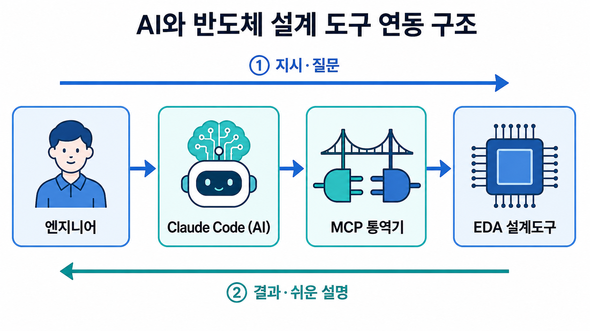
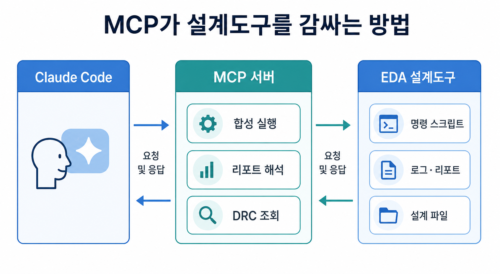
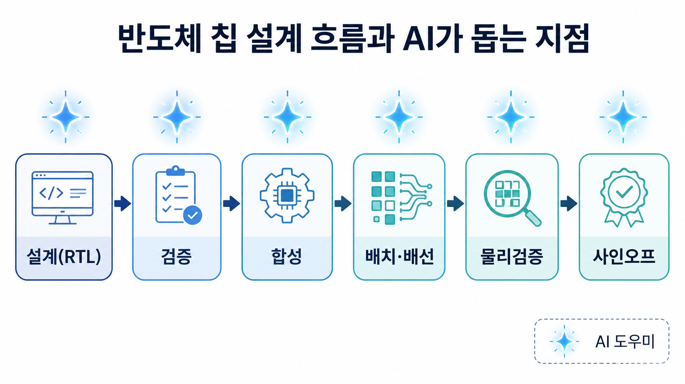
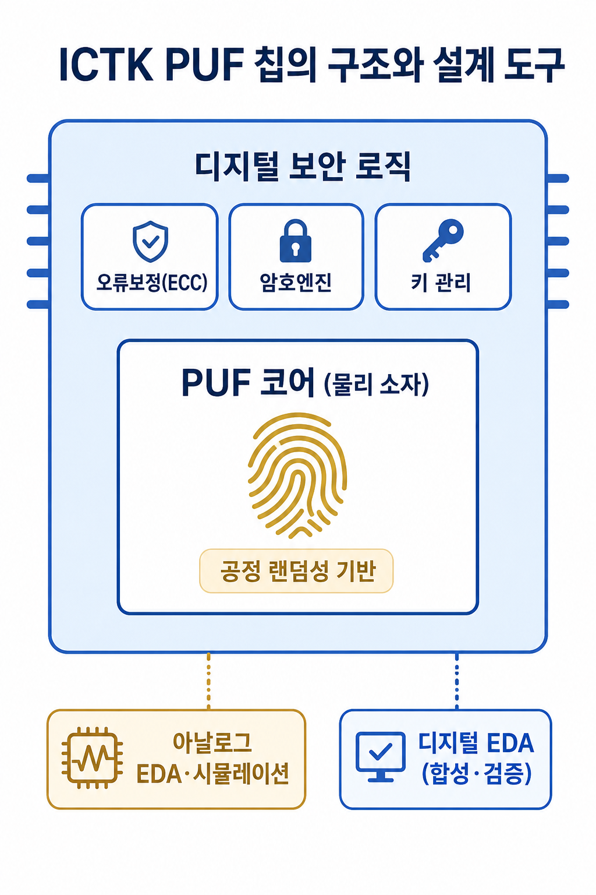
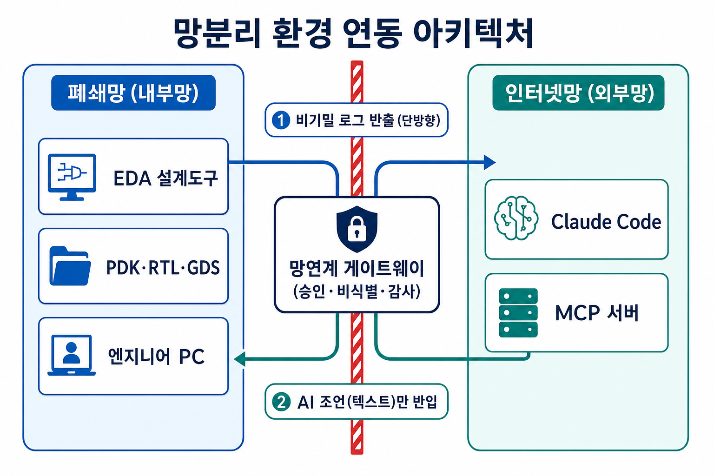
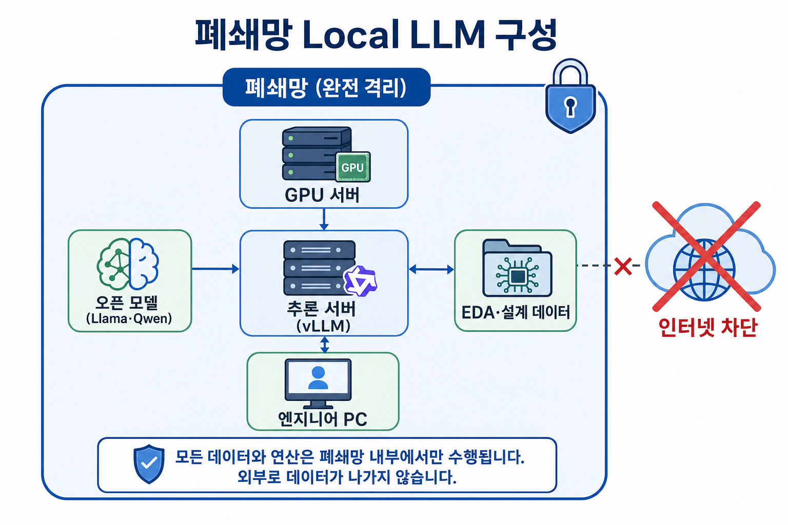
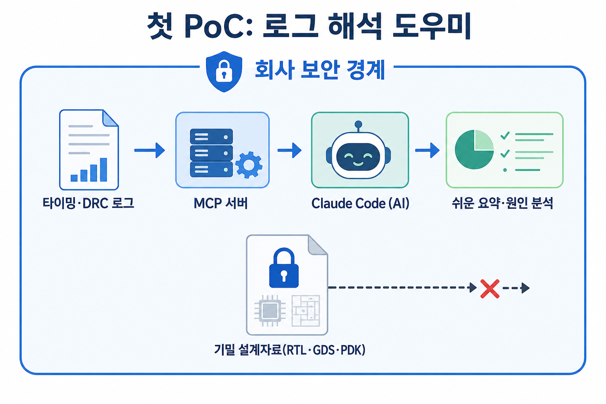

# ICTK-AI활용-쉬운안내서

**반도체 칩 설계에 AI를 활용하는 법**

ICTK PUF 칩 설계에 Claude Code(MCP·플러그인)를 적용하는 방법

— 비전공자를 위한 쉬운 안내서 —

작성일 2026-06-17

대상: 반도체·AI 비전공 실무자 및 관리자

## 한눈에 보기 (30초 요약)

이 문서는 반도체 칩을 만드는 복잡한 설계 프로그램(EDA)과 AI 비서(Claude Code)를 연결해, 엔지니어의 일을 돕는 방법을 비전공자도 이해할 수 있게 설명함.

- AI는 설계 프로그램을 대체하지 않음 — 옆에서 돕는 '비서'임.
- 연결의 핵심은 'MCP'라는 통역기와 '플러그인'이라는 업무 매뉴얼임.
- 가장 중요한 전제는 보안임 — 회사 기밀자료는 울타리 밖으로 내보내지 않음. (5~7장)
- 망분리(폐쇄망) 환경에서는 통제된 반출 또는 폐쇄망 자체 AI를 사용함. (6~7장)
## 1. 먼저, 등장인물 소개

낯선 용어가 많지만, 익숙한 것에 빗대면 쉬움. 다섯 등장인물만 알면 충분함.

### EDA / CAD — 칩을 그리고 검사하는 전문 프로그램

건물을 지을 때 설계도면 프로그램(CAD)을 쓰듯, 반도체 칩은 EDA라는 전문 프로그램으로 그리고 검사함. 반도체 분야에서는 CAD와 EDA가 사실상 같은 뜻으로 쓰임.

### PUF — 반도체의 '지문' (ICTK의 특기)

사람마다 지문이 다르듯, 칩을 만들 때 생기는 미세한 차이를 이용해 칩마다 고유한 '지문'을 만드는 기술이 PUF임. 복제가 불가능해 보안 열쇠로 쓰임. ICTK는 이 분야의 전문 기업임.

### Claude Code — 똑똑한 AI 비서

사람의 말을 이해하고, 문서를 읽고, 명령을 실행하고, 결과를 쉽게 설명해 주는 AI 도구임.

### MCP — AI와 회사 프로그램을 잇는 '통역기'

AI는 회사의 전문 프로그램(EDA)이 쓰는 언어를 바로 알지 못함. MCP는 그 사이에서 말을 옮겨 주는 통역기(어댑터)임.

### 플러그인 — AI에게 일하는 법을 가르친 '업무 매뉴얼'

'이런 상황에는 이렇게 처리하라'는 회사만의 일머리를 AI에게 묶어서 가르친 것이 플러그인임. 이 안내서를 만든 courseware도 플러그인의 한 예임.

## 2. 어떻게 연결되나

> (GROQ_API_KEY 미설정 - 이미지 설명 생략)

*그림 1. 사람의 질문이 AI·통역기를 거쳐 설계도구로 전달되고, 결과가 쉬운 설명으로 돌아옴*

연결은 네 단계로 이루어짐. ① 엔지니어가 질문·지시함 → ② Claude Code(AI)가 이를 이해함 → ③ MCP 통역기가 설계도구에 전달함 → ④ EDA 설계도구가 실제 계산·검사를 수행함. 그 결과는 반대 방향으로, 누구나 알기 쉬운 설명이 되어 다시 엔지니어에게 돌아옴.

### 왜 이런 연결이 가능한가

> (GROQ_API_KEY 미설정 - 이미지 설명 생략)

*그림 2. MCP가 설계도구를 감싸 'AI가 누를 수 있는 버튼'으로 바꿈*

모든 전문 설계도구는 세 가지 '연결 통로'를 가짐 — ① 명령 스크립트(리모컨처럼 명령을 내림), ② 로그·리포트(작업 결과 보고서), ③ 설계 파일. MCP는 이 통로를 감싸 AI가 다룰 수 있는 '도구 버튼'으로 바꿔 줌. 그래서 ICTK가 어떤 제품을 쓰든 같은 방식으로 연결할 수 있음.

## 3. 그래서 무엇을 도와주나

> (GROQ_API_KEY 미설정 - 이미지 설명 생략)

*그림 3. 반도체 설계 흐름과 AI가 돕는 지점(별 표시)*

칩 설계는 여러 단계를 거침. 각 단계에서 AI가 도울 수 있는 일은 다음과 같음.

공통점 — AI는 '읽고, 설명하고, 정리하는' 일을 잘함. 실제 계산은 설계도구가 맡음.

## 4. ICTK만의 활용 — PUF(반도체 지문)

> (GROQ_API_KEY 미설정 - 이미지 설명 생략)

*그림 4. PUF 칩의 두 부분과 각각에 맞는 설계 도구*

PUF 칩은 성격이 다른 두 부분으로 이루어짐.

- PUF 코어(물리 소자): 칩의 '지문'을 만드는 부분. 공정의 미세한 무작위성을 이용함.
- 디지털 보안 로직: 지문을 다듬고(오류보정), 암호로 보호하고, 열쇠를 관리하는 부분.
AI는 특히 PUF의 '품질 데이터 분석'에서 큰 도움을 줌. 온도·전압·노화에 따라 지문이 얼마나 안정적인지(재현성), 칩마다 충분히 다른지(고유성), 충분히 무작위인지(무작위성)를 자동으로 집계·정리해 줌.

## 5. 꼭 지켜야 할 주의점 — 특히 보안

'AI가 할 수 있다'보다 더 중요한 것이 '안전하게 한다'임. 반도체 보안 기업에는 이 장이 가장 중요함.

### ① 먼저 알아야 할 사실 — AI는 '내 PC 안'에서만 분석하지 않음

Claude Code가 파일을 '읽는' 동작은 회사 PC에서 일어남. 그러나 그 내용을 실제로 '분석·해석'하려면 외부의 AI 모델로 전송해야 함. AI 두뇌(모델)가 PC가 아니라 외부 서버에 있기 때문임. 그래서 다음 한 문장을 꼭 기억해야 함.

**AI가 무언가를 분석한다**** = 그 내용이 외부 모델로 전송된다.**

다만 회사 자료 전체가 자동으로 올라가는 것은 아님. AI가 그때그때 '읽어서 본 부분'만 전송됨. 그래도 '분석하려면 그 부분은 올라간다'는 점은 변하지 않음.

### ② 어디로, 어떻게 전송되는가 (AWS Bedrock 기준)

전송 '방식'을 통제하면 위험을 크게 줄일 수 있음. AWS Bedrock이라는 방식을 쓰면 데이터 취급이 다음과 같이 달라짐.

### ③ '인터넷 구간'은 없앨 수 있음 — 다만 경계 밖으로는 나감

기본 설정에서는 AI 호출이 공용 인터넷을 거침(암호화는 되지만 경로는 공용임). 이 인터넷 구간은 다음 방법으로 제거할 수 있음.

- VPC 전용 연결(PrivateLink): AI 호출이 공용 인터넷을 거치지 않고 AWS 내부망으로만 흐름.
- 전용선(Direct Connect): 회사와 AWS를 공용 인터넷 없이 전용 회선으로 직접 연결함.
그러나 — 인터넷을 없애도 **데이터가 회사의 물리적 울타리를 떠나 외부 클라우드(AWS)에서 처리된다는 사실은 그대로임**. 이는 완전한 망분리(에어갭)가 아님. 폐쇄망 환경은 6~7장에서 다룸.

### ④ 절대 기밀은 클라우드 대상에서 제외

특히 **PDK·GDS·전체 넷리스트**는 외부 반출이 협력 공장(foundry)과의 계약(NDA)으로 금지된 경우가 많음. 이는 암호화·전용선으로 푸는 '기술 문제'가 아니라 **계약·법무 문제**임. AWS라 하더라도 '외부로 나갔다'는 사실 자체가 계약 위반이 될 수 있음.

### ⑤ 그래서 '데이터 등급'을 먼저 나눔

어떤 장비를 쓰느냐보다 '무엇을 올리느냐'를 먼저 정해야 함. 등급별 원칙은 다음과 같음.

### ⑥ 그 밖의 기본 원칙

- AI의 답은 반드시 검증함 — 칩은 한 번 잘못 만들면 재제작 비용이 크므로, 사람과 도구가 다시 확인함.
- AI는 보조이지 결정자가 아님 — 최종 양산 승인(사인오프)은 사람이 책임지고 결정함.
- 작게 시작함 — 그래서 첫걸음을 '비기밀 로그 해석'(낮음 등급)으로 잡음. 안전하게 효과를 확인한 뒤 단계적으로 확장함.
## 6. 망분리 환경에서의 연동 아키텍처

Claude Code는 인터넷망에, EDA·설계자료는 폐쇄망(망분리)에 있는 환경에서는 둘을 직접 연결할 수 없음. '무엇을, 어느 방향으로, 어떻게 통제하느냐'를 먼저 설계해야 함.

### ① 왜 직접 연결이 안 되는가

방법은 두 방향이 있지만, 둘 다 문제가 있음.

따라서 'EDA에 Claude를 직접 연결'하는 구조는 성립하지 않음. 대신 아래 구조를 사용함.

### ② 권장 구조 — 이중 환경 + 통제된 단방향 반출

> (GROQ_API_KEY 미설정 - 이미지 설명 생략)

*그림 5. 망분리 환경 연동 아키텍처 — 위험한 방향은 막고, 안전한 방향만 활용*

핵심 원칙은 '위험한 방향(설계자산이 밖으로)은 막고, 안전한 방향(AI 조언이 안으로)만 허용'하는 것임.

②의 '망연계 솔루션(망간 자료전송)'은 한국 보안 환경의 표준 기술로, 이미 도입돼 있을 가능성이 높음. 이를 재활용하는 것이 현실적임.

**중요 — 모든 전송이 망연계를 거치므로 '실시간 대화형'이 아니라 ****'승인 기반 비동기'** 방식이 됨. 이 점을 기대치로 잡아야 함.

### ③ 무엇을, 어디서 처리하는가

## 7. 폐쇄망 Local LLM(자체 AI) 방안

절대 기밀(PDK·GDS)까지 AI로 다뤄야 한다면, 데이터가 망 밖으로 전혀 나가지 않는 '폐쇄망 내 자체 AI'가 유일한 방법임.

### ① 개념 — 폐쇄망 안에 AI를 통째로 둠

> (GROQ_API_KEY 미설정 - 이미지 설명 생략)

*그림 6. 폐쇄망 Local LLM 구성 — 데이터가 폐쇄망 안에서만 처리됨*

외부 AI에 데이터를 보내는 대신, 회사 폐쇄망 안의 서버에 AI 모델을 직접 설치해 운영함. 데이터가 망 밖으로 나가지 않으므로 절대 기밀도 다룰 수 있음.

### ② 구성 요소

- GPU 서버: AI 모델을 실행하는 하드웨어 (모델 크기에 따라 여러 대 필요).
- 오픈웨이트 모델: 무료로 내려받아 자체 설치 가능한 AI 두뇌 (Llama·Qwen·DeepSeek 등).
- 추론 서버: 모델을 서비스로 띄우는 소프트웨어 (vLLM·Ollama·TGI 등).
- 도구·MCP 연동: 폐쇄망 안에서 EDA·데이터에 연결 (외부망과 동일한 방식으로 구성).
### ③ Claude Code vs 폐쇄망 Local LLM — 역할 분담

두 방식은 경쟁이 아니라 보완 관계임. '비기밀은 외부망 Claude, 절대 기밀은 폐쇄망 Local LLM'으로 병행하는 것이 가장 완전한 형태임.

### ④ 고려사항

- 비용: GPU 서버 구입·전력·냉각, 운영 인력이 필요함.
- 성능 한계: 오픈 모델은 최신 Claude보다 성능이 낮음 — 기대치 조정이 필요함.
- 자체 관리: 모델 업데이트·보안 패치를 회사가 직접 책임짐.
- 단계적 도입: 작은 모델로 시작해 효과를 본 뒤 확장하는 것이 안전함.
## 8. 그럼 어디서부터 — 첫 걸음(PoC)

> (GROQ_API_KEY 미설정 - 이미지 설명 생략)

*그림 7. 첫 PoC '로그 해석 도우미' — 기밀자료는 회사 안에 머무름*

가장 안전하고 효과가 빠른 첫 시도는 '단방향 반출 로그 해석 도우미'임.

- 무엇을: 폐쇄망에서 추출한 비기밀 타이밍·검사 로그 요약을 망연계로 반출 → 외부망 Claude가 해석함.
- 왜 먼저: 원본 설계자료가 아니라 비식별 결과 로그만 다루므로 보안 부담이 가장 적음(등급 '낮음').
- 효과: 엔지니어가 수천 줄 로그를 직접 읽던 시간을 질문 한 번으로 줄임.
- 다음 확장: 효과 확인 후, 기밀 영역은 폐쇄망 Local LLM 트랙으로 단계적으로 확대함.
## 9. 다음 단계

이 안내서를 바탕으로 다음 중 하나를 골라 구체화할 수 있음.

- 망분리 연동 설계서 — 망연계 솔루션·승인 워크플로우·반출 데이터 등급을 ICTK 보안팀과 확정함.
- 폐쇄망 Local LLM 도입 검토서 — GPU 사양·오픈 모델 선정·예상 비용·성능 기준을 산정함.
- 첫 PoC 실행 계획서 — 단방향 반출 로그 해석의 범위·보안 전제·성공 기준을 담음.
ICTK가 실제 사용하는 EDA 제품·망연계 솔루션을 알려 주면, 그에 맞춰 더 구체적으로 설계할 수 있음.

## 부록. 용어 사전 (풀네임 포함)

이 문서에 나온 약어·전문용어를 풀네임(원어)과 함께 쉬운 뜻으로 정리함.

### 설계·반도체 용어

### AI·연동 용어

### 보안·클라우드 용어

### 망분리·자체 AI 용어

| 설계 단계 | AI가 돕는 일 | 쉬운 비유 |
| --- | --- | --- |
| 설계(RTL) | 설계 코드 검토·오류 설명 | 맞춤법·문법 검사기 |
| 검증 | 테스트 만들기·실패 원인 찾기 | 시험문제 출제·오답노트 |
| 합성·타이밍 | 속도 문제 리포트 해석 | 건강검진 결과 해설 |
| 물리검증 | 수천 줄 오류 로그 요약 | 긴 보고서 3줄 요약 |
| 문서·지식 | 설계 문서·회의록 정리 | 비서의 문서 정리 |

| 항목 | AWS Bedrock 사용 시 |
| --- | --- |
| 처리 위치 | 회사의 AWS 계정·리전(지역) 안에서 처리됨 |
| AI 제공사 전달 | Anthropic(클로드 제작사)에 전달되지 않음 — AWS가 운영 |
| AI 학습 사용 | 입력·출력을 모델 학습에 사용하지 않음 |
| 기록 보관 | AWS가 입력 내용을 따로 보관하지 않음 |

| 데이터 등급 | 예시 | 권장 처리 |
| --- | --- | --- |
| 낮음 (결과물) | 타이밍·검사 로그 요약, 비식별 메시지 | Bedrock + 전용연결로 활용 가능 |
| 민감 | 설계 코드(RTL) 일부, 내부 문서 | 최소화·건별 승인하에 제한적 활용 |
| 절대 기밀 | PDK · GDS · 전체 넷리스트 | 클라우드 반출 금지 (6~7장 참고) |

| 방향 | 방법 | 문제 |
| --- | --- | --- |
| 데이터를 밖으로 | 폐쇄망 자료를 외부망 Claude로 | 망분리 위반·기밀 유출 (PDK는 계약상 불가) |
| Claude를 안으로 | 폐쇄망에 Claude Code 설치 | Claude는 인터넷 추론 필수 → 폐쇄망서 동작 불가 |

| 단계 | 흐름 | 통제 장치 |
| --- | --- | --- |
| ① | 폐쇄망에서 비기밀 로그·질문만 추출 | 데이터 등급 분류·마스킹 |
| ② | 망연계 솔루션으로 외부망 전송 | 승인 워크플로우·비식별·감사로그·단방향 전송장비 |
| ③ | 외부망 Claude Code가 분석 | Bedrock + 전용연결 |
| ④ | 결과(텍스트 조언)만 폐쇄망 반입 | 조언은 기밀 아님 → 검토 후 반입 |

| 데이터 등급 | 처리 위치 | AI |
| --- | --- | --- |
| 낮음 (로그 요약·비식별) | 외부망 | Claude Code 가능 |
| 민감 (RTL 일부·내부 문서) | 폐쇄망 내부 권장 | 반출 시 건별 승인 |
| 절대 기밀 (PDK·GDS·넷리스트) | 폐쇄망에서만 | 외부 반출 금지 → 7장 참고 |

| 항목 | 외부망 Claude Code | 폐쇄망 Local LLM |
| --- | --- | --- |
| 다루는 데이터 | 비기밀만 | 절대 기밀 포함 가능 |
| AI 성능 | 최고 수준 | 상대적으로 낮음 |
| 인터넷 | 필요 | 불필요 (완전 격리) |
| 구축·운영 부담 | 적음 | GPU·운영 인력 부담 큼 |

| 용어 | 풀네임 (원어) | 쉬운 뜻 |
| --- | --- | --- |
| EDA | Electronic Design Automation (전자 설계 자동화) | 반도체 칩을 그리고 검사하는 전문 설계 프로그램 |
| CAD | Computer-Aided Design (컴퓨터 지원 설계) | 컴퓨터로 설계하는 도구. 반도체에선 EDA와 같은 뜻 |
| PUF | Physically Unclonable Function (물리적 복제 방지 기능) | 칩마다 다른 '지문'을 만드는 보안 기술 (ICTK 특기) |
| RTL | Register-Transfer Level (레지스터 전송 수준) | 칩의 동작을 글로 적은 설계도(설계 코드) |
| GDS | Graphic Data System (GDSII 레이아웃 포맷) | 칩의 최종 도면 파일. 외부 반출 금지 기밀 |
| DRC | Design Rule Check (설계 규칙 검사) | 도면이 공정 규칙을 지켰는지 검사하는 단계 |
| LVS | Layout Versus Schematic (레이아웃-회로도 대조) | 그린 도면과 설계 의도가 일치하는지 대조하는 검사 |
| PDK | Process Design Kit (공정 설계 키트) | 특정 공장 공정의 설계 규칙집. 외부 반출 금지 기밀 |
| 사인오프 | Sign-off (사인오프, 최종 승인) | 칩을 양산하기 전 마지막 승인 단계 |

| 용어 | 풀네임 (원어) | 쉬운 뜻 |
| --- | --- | --- |
| AI | Artificial Intelligence (인공지능) | 사람의 말을 이해하고 일을 돕는 기술 |
| LLM | Large Language Model (대규모 언어 모델) | 많은 글을 학습해 말을 이해·생성하는 AI의 두뇌 |
| Claude Code | Claude Code (클로드 코드) | Anthropic이 만든 AI 비서 도구 |
| MCP | Model Context Protocol (모델 컨텍스트 프로토콜) | AI와 회사 프로그램을 잇는 통역기(어댑터) 표준 |
| 플러그인 | Plugin (플러그인) | AI에게 회사 일하는 법을 가르친 매뉴얼 묶음 |
| PoC | Proof of Concept (개념 증명) | 작게 먼저 해 보는 시험 도입 |

| 용어 | 풀네임 (원어) | 쉬운 뜻 |
| --- | --- | --- |
| AWS | Amazon Web Services (아마존 웹 서비스) | 아마존이 제공하는 클라우드 서비스 |
| Bedrock | Amazon Bedrock (아마존 베드록) | AWS 안에서 AI 모델을 안전하게 쓰는 관리형 서비스 |
| VPC | Virtual Private Cloud (가상 사설 클라우드) | 클라우드 안에 만든 회사 전용 격리 네트워크 |
| PrivateLink | AWS PrivateLink (프라이빗링크) | 공용 인터넷을 거치지 않고 AWS 내부망으로 연결하는 방식 |
| Direct Connect | AWS Direct Connect (다이렉트 커넥트) | 회사와 AWS를 잇는 전용 회선(공용 인터넷 미사용) |
| ZDR | Zero Data Retention (제로 데이터 보관) | 입력 데이터를 저장하지 않는 운영 옵션 |
| NDA | Non-Disclosure Agreement (비밀유지계약) | 정보를 외부에 공개하지 않기로 한 계약 |
| TLS | Transport Layer Security (전송 계층 보안) | 데이터를 암호화해 주고받는 표준 |
| 에어갭 | Air-gap (망분리) | 외부망과 물리적으로 완전히 분리된 상태 |

| 용어 | 풀네임 (원어) | 쉬운 뜻 |
| --- | --- | --- |
| 망분리 | Network Separation (망분리) | 내부망과 외부망을 분리해 보안을 높이는 방식 |
| 폐쇄망 | Closed / Air-gapped Network (폐쇄망) | 인터넷과 분리된 내부 전용 네트워크 |
| 망연계 | Network Interconnection (망간 자료전송) | 분리된 두 망 사이에서 승인된 자료만 전송하는 시스템 |
| Data Diode | Data Diode (단방향 전송장비) | 한 방향으로만 데이터를 흘려보내는 보안 장비 |
| Local LLM | Local Large Language Model (자체 설치형 AI) | 회사 서버에 직접 설치해 외부 연결 없이 쓰는 AI |
| 오픈웨이트 | Open-weight Model (공개 가중치 모델) | 무료로 내려받아 자체 설치 가능한 AI 모델 |
| GPU | Graphics Processing Unit (그래픽 처리 장치) | AI 연산을 빠르게 처리하는 하드웨어 |
