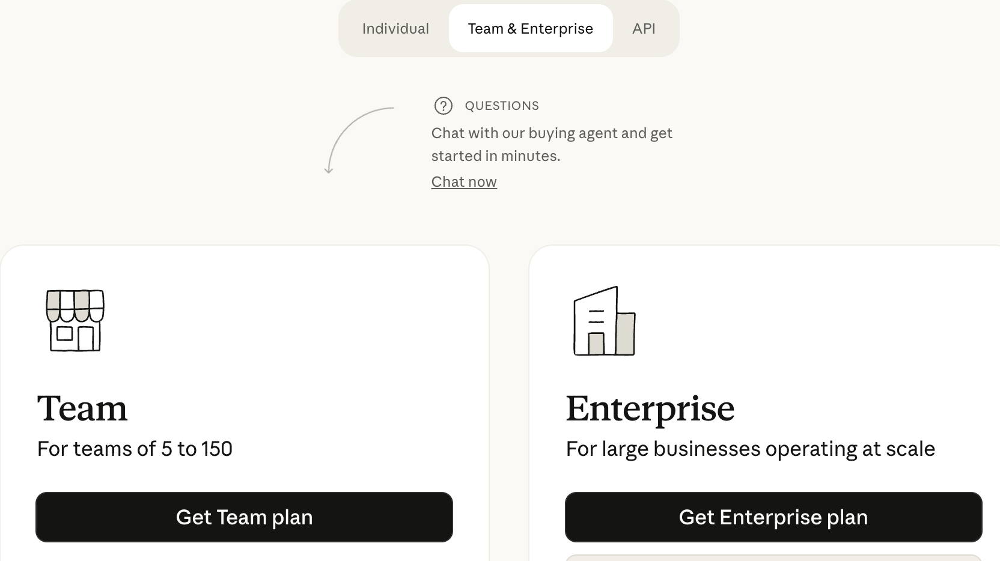
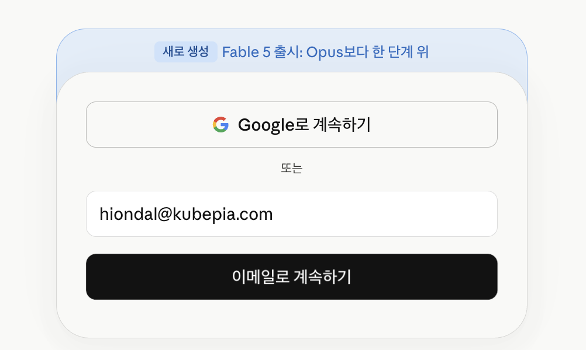
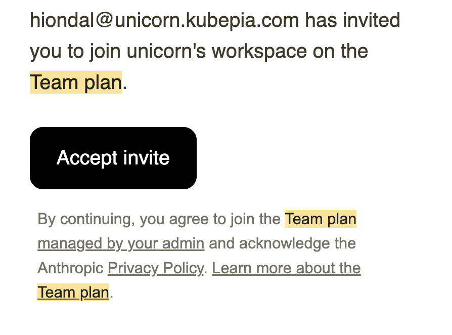
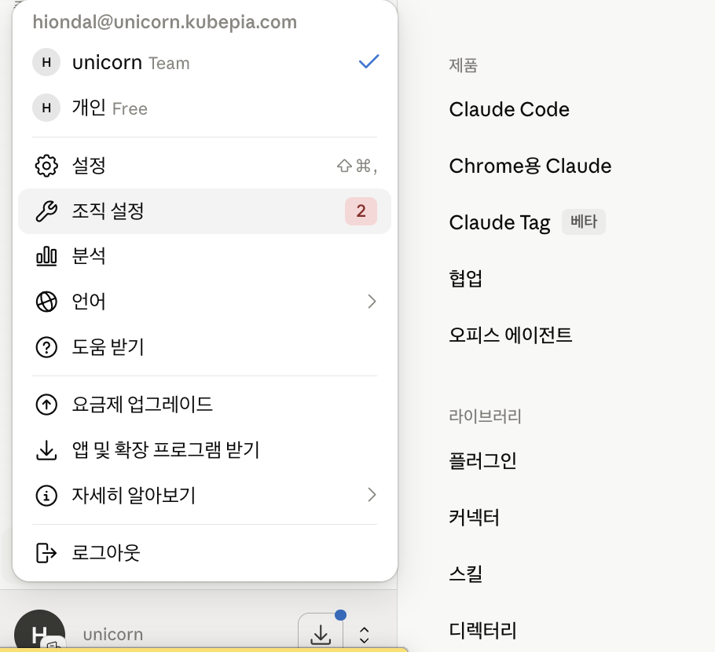
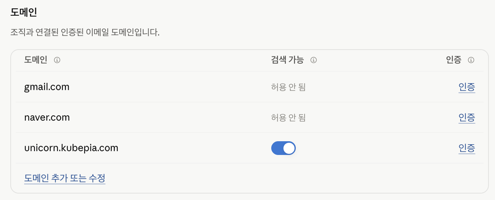
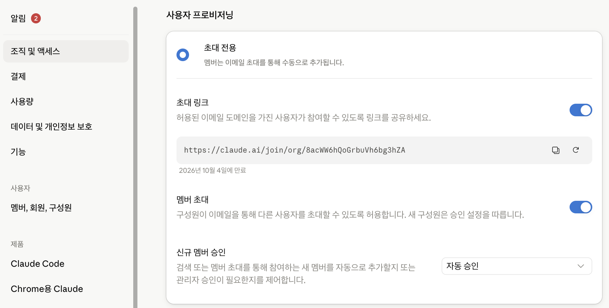
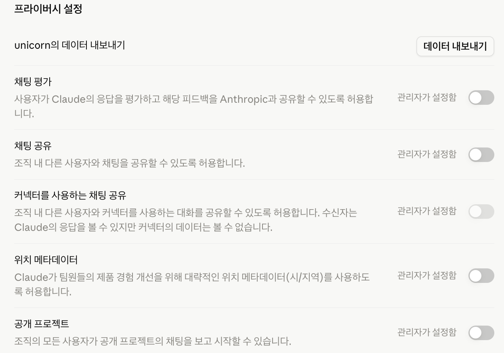

# Claude Code Admin을 위한 가이드

## Claude Code Team Plan 안내 
### Claude Team Plan 가입
- 요금제 페이지 접속   
  https://claude.com/pricing
- 팀플랜 가입
  - 'Team & Enterprise' 탭 선택 후 '[Get Team plan]' 클릭
    
  - 업무메일 입력: gmail, naver와 같은 상용메일은 안됨
    
  - 업무 메일로 발송된 메일에서 초대 승인 버튼 클릭 
    
  - 가입 절차 수행: 안내대로 아래 절차 수행
    - 결제 카드번호 등록
    - 시트(라이센스) 수 선택: 최소 5개임

### 멤버 초대 방법
- 조직 설정 클릭
  

- 멤버의 이메일 도메인 등록
  운영자가 가입할 때 사용한 메일 도메인과 다른 도메인의 멤버 초대 위해 설정   
    

- '조직 및 액세스' 설정 
      
  - 초대 링크 생성
  - 신규 멤버 승인 옵션 선택 
- 멤버에게 초대 링크 전달하여 가입하도록 안내 

### 기능 설정
- '데이터 및 개인정보 보호' 메뉴
   모든 옵션을 비활성화   
    
- '기능' 메뉴
  - 데이터 소스 -> 웹 검색: 활성화
  - 시각 자료 -> 아티팩트 커넥터 활성화 
- 'Claude Code' 메뉴
  - Claude Code > 원격제어: 활성화
- '협업' 메뉴
  - 「모든 승인 건너뛰기」 모드 허용: 활성화
  - 커넥터 도구에 “항상 허용” 허용: 활성화 
